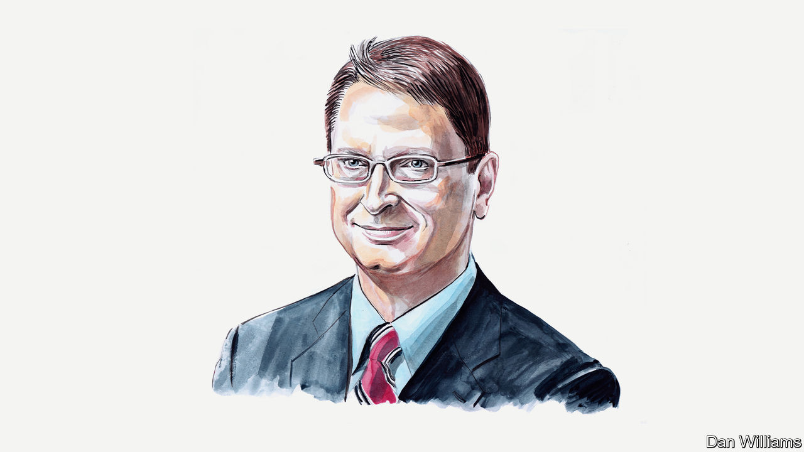

###### China’s infrastructure bank

# The AIIB’s former communications chief on why he blew the whistle 

##### China’s bid to create its own version of the World Bank is a sham, says Bob Pickard 

 

> Aug 17th 2023 


WHEN XI JINPING proposed a China-led multilateral development bank in 2013, the idea attracted much media attention. It was soon dubbed “China’s answer to the World Bank”. But when the Asian Infrastructure Investment Bank (AIIB) opened in 2016, press coverage quickly soured. Questions swirled about whether the Beijing-based bank was merely led by China or in thrall to its government. Some wondered if it would be an arm of Chinese statecraft, designed primarily to support the ballyhooed Belt and Road Initiative. Others questioned its claim to be an apolitical model of international governance, free from the clutches of the Chinese Communist Party (CCP). 

The bank asked me to join as head of communications in 2021. Having previously worked for several big communications firms, including Burson-Marsteller and Edelman, I was well placed to help the AIIB deal with its public-relations challenges.

I had concerns about whether the bank was controlled by its largest shareholder, the Chinese government. AIIB’s published governance structure, which stresses the bank’s apolitical nature, allayed my concerns. I was also reassured by the list of shareholders, which included several Western democracies, including my own country, Canada. The bank’s recruiters told me that AIIB was “world-class”, a “new kind” of multilateral development bank “for the 21st century”.

It didn’t take me long to realise that the reality did not match the messaging. Inside the bank, CCP members wield power in many key positions. Systemic surveillance breeds pervasive mutual suspicion, which smothers opinions that might differ from the party line.

I learned this during my first few weeks, when pandemic policy was discussed at an executive-committee meeting. I made what I felt was an uncontroversial comment, that there would be no stopping the Omicron variant of covid-19 in China, as elsewhere. As CCP apparatchiks looked on, I was upbraided by the AIIB’s president, Jin Liqun, who recited the party’s dogma about Mr Xi’s zero-covid policies.

On this and many other occasions, Mr Jin—himself a CCP member—would make a point of articulating Chinese government policy as if it were his own. As the bank’s official spokesperson, I advised him that he should communicate his views as the leader of a multilateral organisation, and refrain from parroting the Chinese government’s point of view.

I was taken aback when Mr Jin’s right-hand man, a CCP stalwart, told me that “your job is to tell the president what to say and how to say it” so that international audiences would not conclude that the bank represented China’s interests. I subsequently discovered that Mr Jin’s office was directly involved in crafting messaging for the domestic Chinese market—for instance statements heaping praise on Mr Xi—that differed from the bank’s messaging in English. At one point Mr Jin himself told me to be mindful of “the party radicals” (whom, it seemed, he found a constant irritant).

In my own department, a CCP member was assigned as my assistant, a role for which she was ill-suited. When I had her replaced I discovered that she had been secretly snitching directly to the most senior party member in Mr Jin’s office. This arrangement was well outside the bank’s supposed reporting lines.

In 2022 the CCP’s presence in the president’s office was bolstered by the arrival of a new colleague whose job description nobody seemed to know, except that he was, it was whispered, “the new party guy”. Not long after, Mr Jin’s office underwent a remodelling: security locks were installed, controlling the access of all AIIB staff The bank’s vice-presidents—none of them Chinese—needed to be buzzed into this inner sanctum. No reason was given for this change.

This cocooning of the president caused much grumbling. Much of the information he receives and the issues he decides are filtered through the two AIIB officials whose offices are closest physically to his, inside this bubble. Both are reportedly party stalwarts. At the AIIB, nothing Mr Jin sees, says or does—including, for example, his presence at the recent China-Central Asia Summit convened by Mr Xi—happens without their involvement and guidance.

In one small but symbolic example of the AIIB’s Sino-centricity, these advisers ordered the posting of a statement of condolence on the bank’s website when Jiang Zemin, a former Chinese president, died in November 2022. This overruled the position of my department, which pointed out that despite AIIB having Australia, Britain, Canada and New Zealand as members, there had been no such notice after Queen Elizabeth’s death in September.

A few months into my job, I was cautioned by expatriate colleagues in my own department about the CCP members inside the bank, and told not to “mess” with them. I was also warned not to trust any of the bank’s information-technology channels and told that I had “no idea” how active the everyday surveillance could be. The IT department operated as if it were part of China’s security apparatus. Once it cut off my remote internet connection when I was using a VPN while travelling in America. At the AIIB technology was often used to block communication rather than to enable it.

To get big things done in the bank, such as funding the building of a multimedia studio, the cultivation of party members was essential. I would need to court them unrelentingly, pay them courtesy calls, take them to lunch and include them whenever possible in internal communication. I was hardly alone. There was a “suck-up” ethos, particularly to members in and around the president’s office and the powerful facilities and administrative-services department.

Externally AIIB claims to be apolitical, but internally the atmosphere is anything but, and often toxic. Political strife is commonplace between departments, several of which are “led” by well-paid expatriates who serve as letterhead names and invariably rely on the connections and capability of their Chinese teams, many of which are run by CCP members close to Mr Jin.

At AIIB, obedience to the diktats of the president’s office is valued more highly than any other virtue, including independent thinking or generating ideas. In this regard, this self-styled “modern” multilateral institution functions more like a traditional Chinese bank. The mindset is more that of an imitator than an innovator: during my time at the bank the most common question asked on just about anything new was “What is the World Bank doing?”

When I first resigned in May, citing my concerns about the CCP’s influence and the potential need to share this information with my country, Mr Jin did not accept my resignation. The bank neither denied nor confirmed my allegations. I was simply informed that the president’s office did not “like” my raising that subject.

Having consulted a Canadian government official over my concerns about being stopped from leaving China or detained, I left the country in a hurry. The bank finally accepted my resignation after I arrived in Japan. Then, after I shared my views more widely, Canada suspended its membership of the bank to review its participation (a process with which I have co-operated fully).

After accepting my resignation, the bank started attacking me personally. Journalists covering the news of my departure, some of whom I had known long before I joined the bank, told me that AIIB executives were trash-talking me off-the-record. AIIB hastily announced an investigation into my accusations of a subterranean concentration of CCP power inside the bank. It quickly concluded that they were “baseless”. 

Hundreds of pro-CCP bots on Twitter targeted me with insults, accusing me of being an American agent, a white supremacist, a neo-colonialist or part of some nefarious Canadian government plot to embarrass China. When I pointed to links between the accounts targeting me and those most vocally supportive of the AIIB, the caustic tweets abruptly halted. Chinese state-affiliated media have carried several opinion columns, with messaging remarkably similar to the AIIB’s, calling my departure a “tempest in a teapot”. 

When Mr Xi proposed the AIIB, he was a relatively new leader, still seen as a potential reformer. My own country proposed a free-trade deal with China a year later. But now, after so much political interference and wolf-warrior diplomacy—not to mention revelations about China’s secret police stations abroad and its kidnapping of two of our citizens—things look different. If the AIIB were founded today, would Canada and other Western countries join? ■


