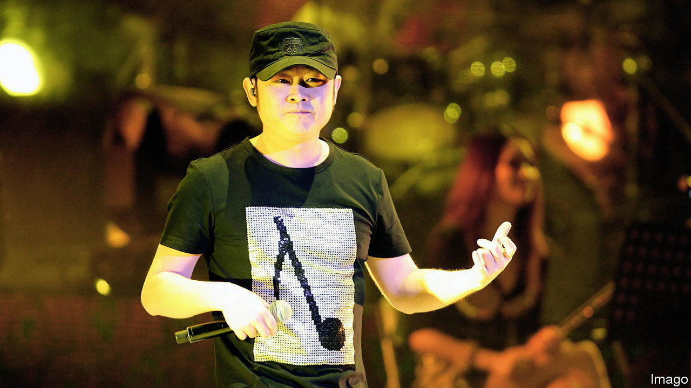

###### Loaded lyrics

# China tries to figure out whom a hit song is mocking 

##### Dao Lang is insulting someone 

 

> Aug 17th 2023 

In the story “Luocha Haishi” a Chinese merchant gets lost at sea and ends up in a faraway land. The place is called Luocha, a word that refers to demons. But its people say they value beauty above all else, including in their leaders. So the merchant is shocked to find that the leaders have goblin-like faces. The higher their rank, the uglier they get. To win their favour, the merchant smears his own face with coal. The story, written by Pu Songling, a novelist during the Qing dynasty (1644–1912), is a metaphor about hypocrisy.

It also shares its name with this summer’s hottest pop song in China. The ditty was released in July and quickly rose to the top of the country’s music platforms, inspiring hundreds of commentaries. Part of the song’s appeal is its cryptic message. The lyrics by Dao Lang, the 52-year-old singer, refer to someone as a “donkey” (slang for fool) and someone else as a “chicken” (slang for prostitute). Chinese are busy debating whom the artist is mocking.

Some clues may be found in Dao Lang’s history. Originally from the province of Sichuan, he became famous in the early 2000s for his ballads celebrating migrant life in China’s far west. His songs were popular with blue-collar workers and farmers. But in 2010 a judge on a televised singing competition criticised his work, saying it lacked “aesthetic perspective”. Dao Lang produced little for the next decade.

“Luocha Haishi” is his comeback anthem, and many listeners interpret it as an attack on his critics (Dao Lang had more than a few). Some read his reference to a brothel as an allusion to the entertainment business. 

Other theories are more convoluted, such as that Dao Lang is attacking America. One version of this idea assumes the lyrics refer to Joe Biden, transgender officials and the Five Eyes intelligence alliance comprising America, Australia, Britain, Canada and New Zealand. It seems a little far-fetched.

At the end of his song, Dao Lang throws in a tongue-twisting reference to Ludwig Wittgenstein, a 20th-century Austrian philosopher. He seems to be drawing on Wittgenstein’s ideas about how language can distort reality. Some believe the song, then, is a broader critique of society. Others say it is nonsense. Dao Lang himself isn’t talking.■


