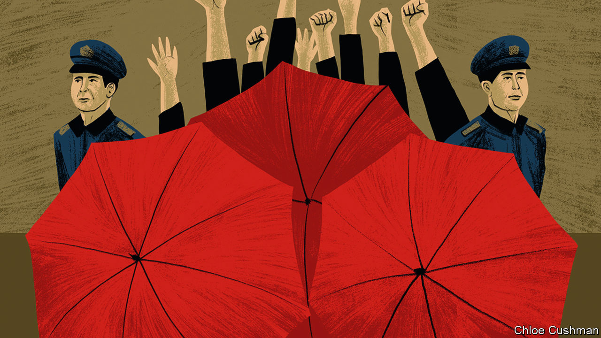

###### Chaguan

# China’s slowing economy, seen from ground level 

##### A bossy, secretive party is ill-suited to fixing a crisis of consumer confidence 

 

> Aug 17th 2023 

THE dejected, shirtless man kneeling this week outside the head office of Country Garden, a troubled Chinese property giant, might easily have gone unnoticed—if, that is, guards had not tried to hide him behind a wall of large, red umbrellas. Still more security guards held up umbrellas to conceal a woman and a teenage girl, sitting on the ground beside the family’s luggage. Others blew whistles at anyone taking pictures. 

Across the road, Chaguan, who stumbled on this quiet human drama by chance, was briefly joined by three riot police in combat boots, who glanced at the foreign reporter, then left. Asked later why this family came to Country Garden’s headquarters in the southern city of Foshan—and what happened after the trio was led into a police post—staff at the firm explain, regretfully, that colleagues who could provide an answer are on annual leave. 

As it happens, small, non-political protests are common in China, as citizens seek to embarrass companies or arms of government into addressing their grievances. Demonstrations grow more frequent in times of economic distress. In recent months, as China’s property sector has slid again into crisis, many have involved homeowners who pre-paid for apartments that have yet to be finished. In faraway Beijing, the Communist Party’s ruling Politburo has ordered developers and officials to ensure that promised homes are delivered. Meanwhile, in provincial cities and towns, persistent protesters risk police warnings or detention.

As China’s economy , all sorts of moves to hide bad news are growing obvious. The statistics bureau stopped publishing a consumer-confidence index after April numbers fell to levels last seen during the depths of the pandemic. With youth unemployment climbing remorselessly, the same bureau stopped reporting that statistic this week, saying it is reviewing how to count jobless young. Analysts face pressure to be positive. Alas, as with those clumsy, umbrella-wielding guards, such concealment only draws attention to China’s woes.

A number of grim statistics have been made public in recent weeks. These show a sharp fall in new bank loans (despite lower interest rates), disappointing retail sales and fewer property transactions. Compounding domestic gloom, exports are down, too. The common link is a collapse in demand, at home and abroad. 

Foshan, a commercial hub of 9.5m people beside the southern megapolis of Guangzhou, is a good place to see a property-driven slowdown on the ground. As well as hosting Country Garden’s head office, Foshan is China’s furniture-selling capital. Outlets include the Louvre, a gleaming mall whose tenants sell leather massage chairs or ornate desks for 30,000 yuan ($4,110) each. Salespeople talk of boom times, five or ten years back, when Chinese families invested savings in multiple properties, and needed to furnish all of them. The best customers from the richest cities, such as Beijing or Shanghai, still have money to spend. But the pandemic struck a heavy blow, notably in mid- to low-status provincial cities with an oversupply of apartments. Customers without money “don’t dare enter” the Louvre, says a woman selling hardwood tables for tea ceremonies. In the past clients bought “on impulse”. Now they compare prices on the internet first.

Beginning in the summer of 2020, after China beat back its first pandemic wave, the economy seemed to be shielded by strict zero-covid controls, recalls a woman selling furniture with a 1950s retro feel. But as the pandemic dragged on, she watched customers cancel orders and rethink home-renovation plans as their own businesses suffered. Now, post-pandemic caution “makes people spend conservatively”.

Over strong black tea, the co-owner of a small delivery company recalls how “lively” customers were in March and April, after covid controls were lifted. What he calls that spending “craze” wore off, though, and people now need to work and earn more. Delivery rates to Zhengzhou, a central city, have dropped to 1.5 yuan per kg, down from 1.8 yuan before the pandemic, he sighs.

Domestic tourism surged after the pandemic, says a worker in a warehouse filled with cheap furniture for hotels. “Everywhere is full of people, at least.” But crowds are not spending as they once did, she says. “A lot of people don’t have that much cash on hand.”

Foreigners remain a strikingly rare sight in most of China. Furniture buyers from India, Africa and Arab countries have begun returning to Foshan, but they are not seen as big-spending saviours. They want bargains, says a woman selling marble-topped tables. Indians want designs that Chinese people favoured in the 1990s, she confides, a bit witheringly. Out of her hearing moments later, an Indian trader assures Chaguan that customers in India like modern, minimalist furniture, “not this Chinese style”.

A party ill-suited to fixing this problem

It is easy for outsiders to underestimate the housing wealth of many urban Chinese. A saleswoman talks with relief of buying a flat in Foshan a decade ago when it was “cheap”. She is not wrong: local prices have almost doubled since 2013. In the 1990s tens of millions of urban Chinese bought subsidised flats from state employers for less than a fancy table costs now at the Louvre mall. Some are worth 50 times as much today. 

That same sense of security is out of reach for those yet to buy. A migrant from Jiangxi, a poor inland province, considered buying a flat in Foshan last year. The local government has reduced the minimum mortgage deposit for first-time buyers to 20%, lowering one barrier to ownership. But she is not buying now: her income is not stable and she is saving for accidents or health crises. In her early 30s, she has never known life to feel so uncertain.

Foshan reveals a China sunk in gloom. That is a puzzle for a party obsessed with control. Bad news can be censored and the unhappy hidden from view. Policies can be imposed. But no ruler can order people to feel confident and spend. ■


