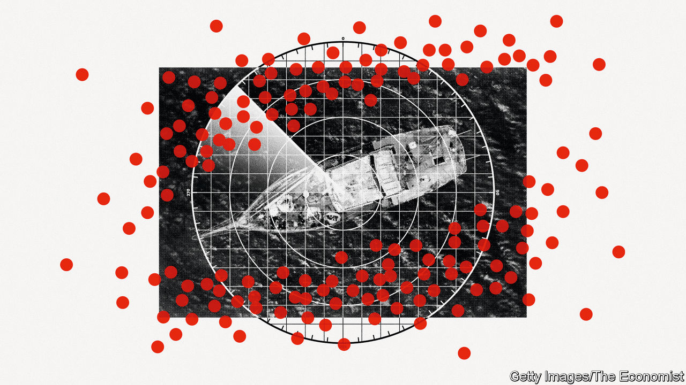
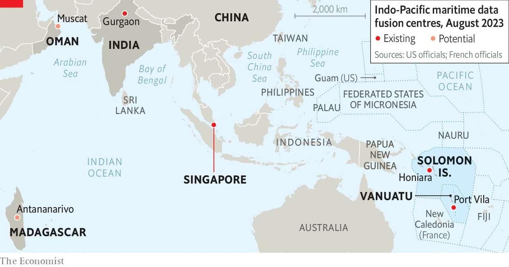

###### Squid games

# Keeping tabs on China’s murky maritime manoeuvres 

##### America and its allies are using whizzy new tools to track China’s military activity and illegal fishing 

 

> Aug 15th 2023 

IN JANUARY 2021 a fleet of Chinese fishing vessels approached the coast of Oman, apparently searching for squid. According to the ships’ automatic identification transponders, they stayed just outside Oman’s Exclusive Economic Zone (EEZ), which grants it control of fishing rights up to 200 nautical miles (370km) from its shores. But radio signals from the ships, detected by commercial satellites, told a different story. They indicated that the ships were operating within Oman’s EEZ in a suspected illegal raid on its valuable squid stocks.

That was an early demonstration of a new tool being used by  to help expose illegal or aggressive Chinese activity at sea. They are contracting private companies to provide governments across the  with near-real-time data, gathered from space, to help them monitor coastal waters and to use their limited naval and coastguard resources more effectively. 

The data is being provided as part of the Indo-Pacific Partnership for Maritime Domain Awareness, or IPMDA, which was launched in May 2022 at the second leaders’ summit of the “Quad”—a bloc comprising America, Australia, India and Japan. It is now one of the clearer examples of how that grouping is trying to add substance to its rhetoric about defending a “free and open” Indo-Pacific against Chinese military and economic coercion.

But it also highlights the sensitivities involved in a region where many countries fret about China’s military activity and illegal fishing, yet are wary of challenging it directly or being drawn into its escalating confrontation with America. The Chinese government has already indicated that it sees the IPMDA as part of an American-led effort to “build small cliques and stoke bloc confrontation” against China. 

When the Quad’s leaders met again in May 2023 they said that the IPMDA was already providing data to governments in South-East Asia and the Pacific, and would expand to the Indian Ocean in the coming months. They avoided mentioning China, emphasising instead the data’s utility in combating illegal fishing and in responding to humanitarian crises.

At a conference the next month, however, American and allied military commanders noted the programme’s strategic significance, whereby information is shared through data “fusion centres” in India, Singapore, the Solomon Islands and Vanuatu (see map). These have existed for some years, but have not shared data fast enough or in sufficient detail. Governments have also been wary of sharing classified information.

 


“The architecture’s there,” Admiral John Aquilino, head of America’s Indo-Pacific Command, told a panel session at the conference. “The sensing needs to be increased and then the sharing needs to be done” in the Indian Ocean region, he said, suggesting that a maritime security centre in Oman could be included. 

On the same panel, India’s deputy national security adviser, Vikram Misri, said that the fusion centre near Delhi had already exchanged data with more than 22 countries and hosted officers from nearly a dozen. Admiral Pierre Vandier of France called for efforts to combine military and civilian tools, and suggested incorporating another data centre in Madagascar to help cover the southern Indian Ocean.

Chinese experts, meanwhile, say the IPMDA is designed to discredit China’s maritime activities, especially those of its vast fishing fleet, which has been accused of illegal operations around Africa, South America and the Pacific islands. The Quad’s programme will soon expand to target Chinese coastguard and navy ships, predicts Hu Bo of Peking University. 

Western defence experts, too, have highlighted the IPMDA’s military applications. It “develops organisational infrastructure and surveillance practices that the Quad and its partners could repurpose for military operations, including monitoring a Chinese move against Taiwan,” the Centre for Strategic and Budgetary Assessments, a Washington-based think-tank, said in July. It suggested augmenting the programme with aerial drones.


Quad officials are reluctant to say exactly which countries see the data. But America’s vice-president, Kamala Harris, revealed that the Philippines was among them when she visited that country in November. It has been revitalising its alliance with America in recent years, largely in response to China’s efforts to enforce maritime claims in the South China Sea, which are disputed by the Philippines and four other South-East Asian countries.

One of the challenges for those countries is that Chinese coastguard and fishing vessels help enforce maritime claims but often deactivate the Automatic Identification System (AIS) transponders that broadcast their identity and location. At other times, Chinese ships transmit “spoofed” data which are inaccurate. 

Even Chinese cargo ships have become harder to track since 2021, when many stopped transmitting AIS data following passage of a law that China said was necessary to thwart foreign intelligence-gathering. However, new means of ocean surveillance are emerging. Private satellite operators now offer services including high-resolution photography, radio-frequency monitoring and synthetic-aperture radar (which generates images by bouncing microwaves off the Earth’s surface). Artificial intelligence also enables much faster analysis of such data and imagery. 

Among the IPMDA’s contractors is HawkEye 360, a Virginia-based company founded in 2015. It operates 21 low-Earth-orbit satellites monitoring the radio-frequency signals from navigation, security and communication equipment that ships can use even if AIS transponders are deactivated. That can then be cross-referenced with satellite images and other information to identify and locate ships. 

HawkEye 360 says it used its data to help identify Chinese vessels suspected of illegal fishing off Ecuador in 2020, as well as the fleet near Oman in 2021. It has also tracked Chinese coastguard vessels in disputed parts of the South China Sea. Its satellites can now cover about 10m sq km in one pass and another cluster can return to the same area within about 60 minutes, says John Serafini, the firm’s chief executive. Getting data to clients can take between a few minutes and an hour, he adds. 

The company provides the information to the American government, which then distributes it to IPMDA participants. In addition, the Australian government contracted HawkEye 360 in July to provide its data to the Pacific Islands Forum Fisheries Agency, which helps its 17 member countries manage their tuna stocks. 

That agency is based in the Solomon Islands, which caused alarm among American and allied officials in 2022 by signing a security agreement with China that they fear could lead to a Chinese military base there. China and the Solomons deny any such plans but America and Australia have since expanded their contacts with the Pacific islands and offered to boost financial and military assistance.

The hope now among Western officials is that by focusing such efforts on illegal fishing and other areas of concern to Indo-Pacific nations, they will win broader support for efforts to counter China. Whether that will alter its behaviour is another question: fishing and territorial claims are touchy issues for its leadership. But shining a light on murky maritime manoeuvres seems like a good place to start. ■


