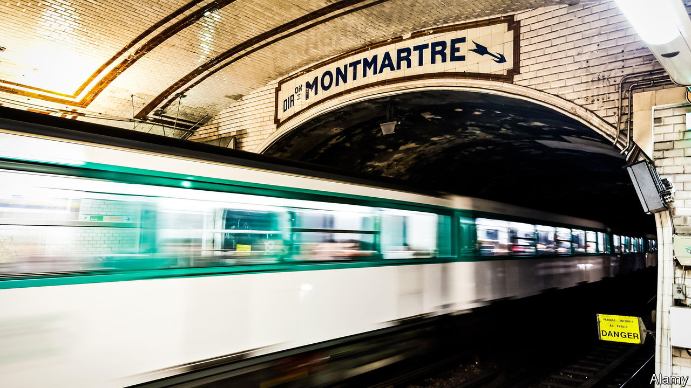

###### Travel

# A new book pays affectionate tribute to the Paris Metro 

##### “Metropolitain” is an eclectic blend of engineering and travelogue, urban planning and anecdote 

 

> Aug 16th 2023 

 By Andrew Martin. 

There is something strangely seductive about the  Metro. Its distinctive warmth. The floral Art Nouveau entrances, designed by Hector Guimard in 1900. The single word “Métropolitain” suspended at street level above descending station steps. From Serge Gainsbourg’s first hit song in 1958 about a ticket-puncher, “Le Poinçonneur des Lilas”, to François Truffaut’s film “The Last Metro” in 1980, the Paris underground and its iconography have marked modern French culture. 

“Metropolitain”,  ode to the Paris Metro, is an affectionate and welcome antidote to the prevailing grumbling about litter-strewn platforms and overcrowded carriages in Paris. So enthusiastic is his  for the French underground that he cedes to his inner railway geek. No tunnel goes unvisited, no track uninspected. Mr Martin includes six pages on Metro tickets and devotes ten chapters to individual lines of the network, starting  with Line 1. The book brims with girders and gauges, riveted copper, lateral steel guide-wheels and details on third-rail electrification. It is an eclectic blend of engineering and travelogue, urban planning and anecdote.

What shines through above all is a sense of awe. There is the wondrous quiet of the rubber-tyre-wheeled Paris Metro carriages, compared with the bone-jangling rattle of the London Tube. There is also its sheer density. The French capital’s underground has 225km of tracks, compared with 400km in London, yet serves 304 Metro stations, by the author’s count, 32 more than the Tube. 

The names of Metro stations evoke history at every turn: Pyramides and Iéna (sites of Napoleonic battles) and Montparnasse-Bienvenuë (paying tribute to the network’s chief engineer, Fulgence Bienvenuë). Even stations named after humdrum street intersections take on a lyrical quality: Marcadet Poissoniers, Maubert Mutualité. Strange things go on underground. The first recorded murder on the Metro, Mr Martin notes, took place in 1937 at the Porte de Charenton. Laetitia Toureaux, an Italian immigrant suspected of , worked in a wax factory by day and, in her free time, as a dance partner for hire at a local music hall. At one Metro stop, she was seen stepping into a carriage; at the next, she was found with a nine-inch knife in her neck. 

A literary work this is not, as Mr Martin might concede, judging by his self-deprecating style. He has ignored certain French conventions, refusing to refer to the right and  of the Seine, and makes some odd observations. “How’s that going to play out”, the author asks of gendered French, “in an increasingly androgynous world?” Nor is Mr Martin well-briefed on the politics of future urban planning in the capital. But as a sincere love letter from a Brit to a French public-transport network under strain, it is a timely reminder of what makes Metro-goers happy when they spend time underground. ■


