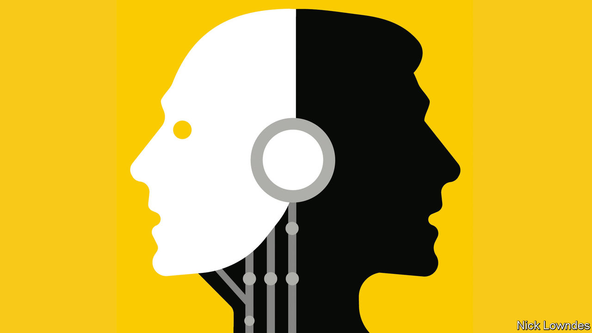

###### Johnson

# AI could make it less necessary to learn foreign languages 

##### That is good news for travellers, bad news for soulful connection 

 

> Aug 17th 2023 

On holiday, many will find themselves in places where they do not speak the language. Once upon a time, they might have carried a phrasebook. The  has made that less necessary. But most people—at least seven of the world’s eight billion—still do not speak English. That leaves options like pantomime, a willingness to be surprised by what arrives at dinner—or, increasingly, . 

More and more people are using simple, free tools, not only to decode text but also to speak. With these apps’ conversation mode, you talk into a phone and a spoken translation is heard moments later; the app can also listen for another language and produce a translation in yours.

You may still get a surprise or two. Google Translate may be the best-known name in machine translation, but it often blunders. Take “my wife is gluten-free,” the kind of thing you might say at a restaurant abroad. In French or Italian, Google Translate renders this as “my wife is without gluten”—true to the words rather than the meaning. DeepL, a rival, does better, offering various options, most of them along the correct lines.

The best tool may not be a translation app at all. Though not marketed for the purpose, ChatGPT, a  that churns out prose according to users’ prompts, is . Rather than entering an exact text to translate, users can tell ChatGPT to “write a message in Spanish to a waiter that my wife and I would like the tasting menu, but that she is gluten-free, so we would like substitutions for anything that has gluten.” And out pops a perfect paragraph, including the way Spanish-speakers actually say “my wife is gluten-free”: . It is a paraphrase rather than a translation, more like having a native-speaking dinner companion than an automated interpreter.

Travel has long been a motivator for study—unless people start to feel AI tools offer a good-enough service. Some are concerned that apps are turning language acquisition into a dwindling pursuit. , a polyglot and polymath writer, has argued that something profound will vanish when people talk through machines. He describes giving a halting, difficult speech in Mandarin, which required a lot of work but offered a sense of accomplishment at the end. Who would boast of taking a helicopter to the top of Mount Everest? 

Others are less worried. Most people do not move abroad or have the kind of sustained contact with a foreign culture that requires them to put in the work to become fluent. Nor do most people learn languages for the purpose of humanising themselves or training their brains. On their holiday, they just want a beer and the spaghetti carbonara without incident (and sometimes without gluten).

As AI translation becomes an even more popular labour-saving tool, people will split into two groups. There will be those who want to stretch their minds, immerse themselves in other cultures or force their thinking into new pathways. This lot will still take on language study, often aided by technology. Others will look at learning a new language with a mix of admiration and puzzlement, as they might with extreme endurance sports: “Good for you, if that’s your thing, but a bit painful for my taste.”

This is largely an Anglophone problem, since native English-speakers miss out on the benefits of language-learning most acutely. In many countries, including Britain and America, schools’ and universities’ foreign-language departments have been closing. (The British government recently devoted a modest fund to trying to get more secondary-school pupils to study foreign languages.) In the rest of the rich world, there is one thriving language that people still study: English. And in poorer countries, many people are multilingual as a matter of course; Africans and Indians learn languages because they are surrounded by them. 

But a focus on the learner alone misses the fundamentally social nature of language. It is a bit like analysing the benefits of close relationships to heart-health but overlooking the inherent value of those bonds themselves. When you try to ask directions in broken Japanese or mangle a joke in halting German, you are making direct contact with someone. And when you speak a language well enough to tell a story with perfect timing or put subtle shading on an argument, that connection is more profound still. The best relationships do not require an intermediary. ■


