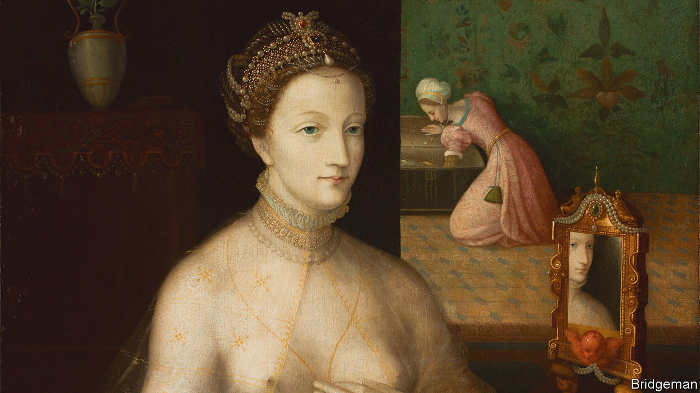

###### A mirror on our times and theirs

# Mint, wax, poisonous plants: beauty tips from Renaissance Italy 

##### A new book tells the rollicking and relatable history of cosmetics 

 

> Aug 17th 2023 

 By Jill Burke. 

Three litres of blood from a healthy red-headed man “no older than 25 or 30” could fix bad skin. Eating nettles was a trick for rosier cheeks. A paste made from marble, wheat and bryony, a poisonous plant, could whiten skin. Most beauty products in Renaissance Italy were made from ingredients that seem  to modern eyes. 

But in “How to be a Renaissance Woman”, a lively new history of beauty culture in 16th- and 17th-century Italy, make-up is a tool to understand society and the female experience. Men controlled finance and government. Women cared about their appearances because “they had to”, not because they were frivolous, argues Jill Burke, a professor at the University of Edinburgh. : an attractive appearance offered better marriage prospects and social status. 

Beauty products were no mere frippery. They could be both weapons and shields. Marriage manuals of the day recommended wife-beating, and cosmetic recipe-books shared tips on how to hide “dead blood” from blows to the face using wild mint leaves. Giovanna de Grandis, a woman from Rome, was hung alongside four other women for selling  disguised as a blemish remover that killed 46 men. (Ms Burke thinks the men may have been abusing their wives.) One dignitary guessed that 500 men could have been killed by de Grandis’s toxic mixture, their deaths mistaken for plague fatalities. 

Cosmetics are a —worth $430bn in 2022—but all too often they are dismissed as trivial. “What we do with our hair, face and body reflects and affects our social world,” Ms Burke argues. Academic purists may balk at what they perceive as a chatty “history-lite” approach, but Ms Burke draws all her conclusions from primary sources (many of which she translated from the Italian herself).

Most of her sources have not been studied in great depth before, like Giovanni Marinello’s “The Ornaments of Ladies”, published in Venice in 1562. In it “women’s bodies are presented as forever-unfinished projects”, writes Ms Burke. Marinello promised readers the kind of physique described by poets and painters, such as Titian’s female nude “Venus of Urbino”. He offered 1,400 recipes to improve imperfections such as stretch marks (ladies would “do well” to “remove this defect after the birth and make your belly look like it should”); grey hair (women with “younger husbands” might be especially concerned); and extra flab (he suggested wrapping the troublesome area in wax overnight).

Visual culture was evolving rapidly. The Renaissance era’s technologies—the full-length mirror and the printed —shaped views of femininity. So too have 21st-century innovations: social media and photo-editing apps. Social-media users see Botox-smoothed features and photoshopped bodies. In the same way, argues Ms Burke, the popularity of single-point perspective and naturalism in drawing meant Renaissance women were bombarded with “endless images of newly realistic naked goddesses being churned out in sculptures, painting and prints”.

Some women pushed back. Blond hair was idealised in art, and  was common. But as a teenager, the painter Giovanna Garzoni, famous for her meticulous flowers and insects, depicted herself in a self-promotional portrait as Apollo, the Greek god of the sun, with tousled brown hair. , who once proclaimed “as long as I live I will have control over my being”, painted herself with wayward strands of black hair framing her face In Ms Burke’s view female artists chose to present themselves like this to toy with the stereotypes that equated unruly dark hair with “interior imagination…melancholy creativity and a ‘masculine’ temperament”. Whether with a make-up brush or a paintbrush, women wanted to control how the world would see and remember them. ■


