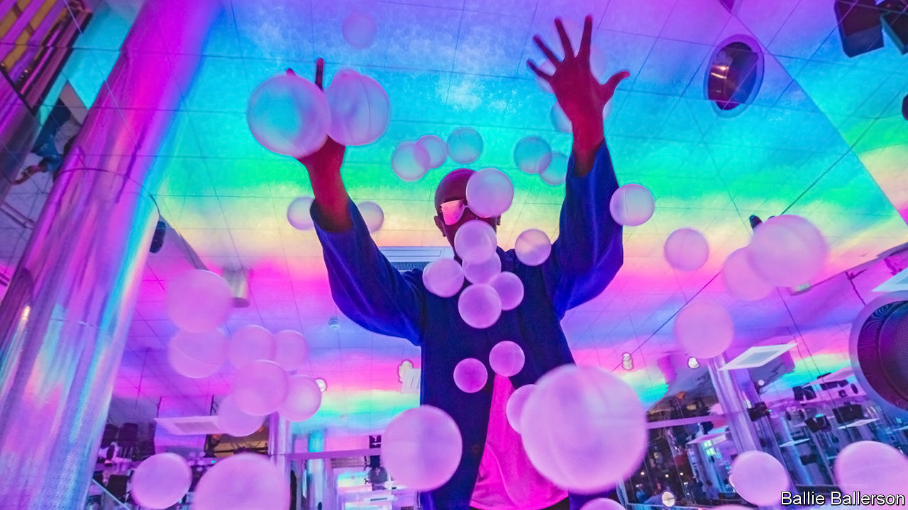

###### Meet me at the bubble pit

# The rise of “kidulting” 

##### Experiences that let adults act like children are booming 

 

> Aug 15th 2023 

A YOUNG WOMAN slides herself gleefully into a fake bathtub filled with giant plastic “bubbles”. Snack bags of popcorn are handed out inside a room designed to look and sound like the inside of a popcorn machine. Friends snap selfies amid colour-changing lights before heading to the pillow-fight section and pummelling each other with feather-filled cushions. 

Dopamine Land, a pop-up interactive museum with venues in Madrid and London, is colourful, creative and silly. Although it is family-friendly, most of the adults milling around on a recent Saturday at lunchtime have no offspring in tow. As the museum’s marketing makes clear, this is a place for the “inner child”.

Dopamine Land is just one example of a new cultural trend called “kidulting”, where adults engage in lighthearted activities traditionally designed for children. In Amsterdam, Wondr invites patrons to “dive into a sea of pink marshmallows” and “write on the walls”. The Museum of Ice Cream, a multistorey playground of pools filled with fake sundae toppings, has expanded from New York to several other American cities and Singapore. Bubble Planet, which started in Madrid, will soon have 13 cities in its orbit, including Brussels and Toronto. 

Ballie Ballerson, which operates a giant ball pit for adults in three British cities, welcomes 25,000 visitors each month. Even museums and immersive exhibitions typically aimed at actual children now host adult-only evenings. This includes KidZania, a model city in London that was (ironically) designed for children to play at grown-up activities, such as having a job. Enthusiasts say that such spaces heighten creativity, human connection and joy, triggering the pleasure-seeking chemical that Dopamine Land is named after. 

But kidulting spaces are not for everyone. Their tendency to claim the title of museum can feel spurious to people who think such institutions should impart knowledge. Art exhibitions aim to leave visitors seeing the world a bit differently, but venues like Dopamine Land try for little more than making people feel happy—and sometimes tipsy. That most attendees have smartphones glued to their hands reinforces the critique that these spaces are little more than selfie backdrops for people obsessed with their own image. 

But perhaps the shallowness of these places is entirely the point. , including stress, sadness and anger, have reached record highs, according to Gallup, a research firm that started tracking this globally in 2005. When the world feels bleak, the appeal of distraction is stronger. Meanwhile, millennials and Generation Z have found that growing up is not so easy to do. The milestones their parents achieved so effortlessly, such as  and getting married, have become expensive affairs, out of reach for many. 

This all explains the lure of kidulting. Dopamine Land—with its fancy-dress boxes, craft stations and picture-perfect backgrounds—asks nothing of its visitors. There is no information to take in, no rules to follow, no goals to achieve. It is amusing and vapid and brainless. That is what makes it such fun. ■


