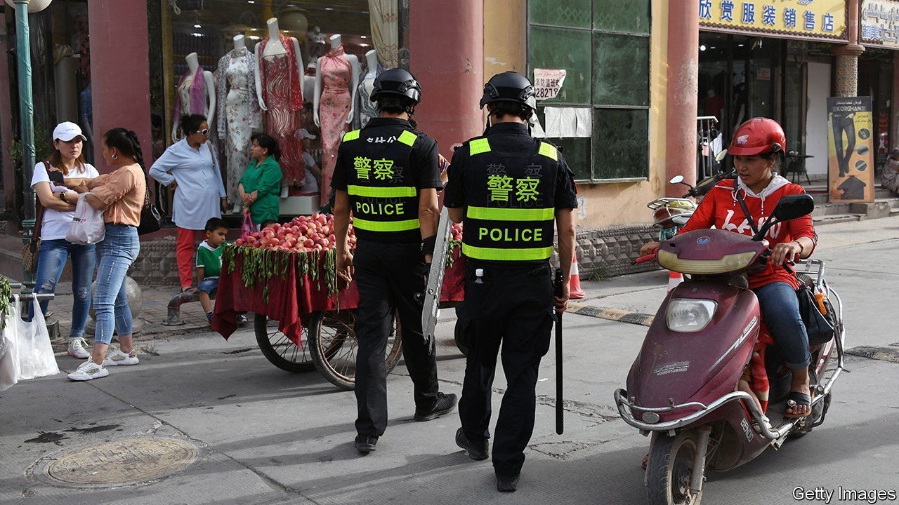

###### Uyghur memoirs

# Two accounts of surviving and escaping Chinese repression 

##### Tahir Hamut Izgil and Gulchehra Hoja describe the challenges of life outside the Uyghur camps in Xinjiang 

 

> Aug 17th 2023 

By Tahir Hamut Izgil. Translated by Joshua Freeman. 

By Gulchehra Hoja. 

TAHIR HAMUT IZGIL’S friends were shopkeepers and booksellers, lovers of Uyghur poetry who recited it to one another over lamb soup and fresh naan in teahouses and private dining rooms. Police appeared at one of their gatherings in 2016. The poets ordered , Chinese liquor meant to signal that they were good citizens—not religious separatists—and invited the officers to drink. The police collected their identity cards anyway. Later, many of those poets disappeared into a web of internment camps meant to eradicate their cultural identity and consolidate Chinese power. Only Mr Izgil escaped to tell the tale.

China’s religious persecution, detention and torture of Uyghur Muslims in Xinjiang are well-documented, deemed probable “” by the UN High Commissioner for Human Rights. News reports often focus on  from camp survivors. To grasp the Uyghur experience, however, one must also understand life outside the camps.

That is the subject of two new memoirs by Mr Izgil, a poet, and Gulchehra Hoja, a journalist, both exiles living in America. In details like the , they tell a textured story of how Uyghurs tried to survive and subvert Chinese cruelty. They portray Uyghurs not as static victims of oppression, but as individuals in a system they could choose to accept or reject. Either choice brought them suffering.

Mr Izgil’s memoir, “Waiting to Be Arrested at Night”, zooms in on the years 2014-17, when Xinjiang was transformed, step by step, into a panopticon of state control. In his youth, Mr Izgil spent three years in prison and in a labour camp as punishment for allegedly trying to take illegal materials abroad. After his release, he found work in film-making, writing poetry on the side. He became a savvy navigator of the invisible red lines in Xinjiang, negotiating with censors and throwing off local officials (often Uyghurs themselves) who harassed him.

But then  were banned; Islamic names were forbidden; butchers had their knives chained to posts. Mr Izgil and his wife were summoned to a police basement, where officers took their blood and scanned their faces and voices. He heard of mass detentions in the countryside, then saw police rounding people up in the city.

One by one, Mr Izgil’s friends vanished. He started sleeping with warm clothes by his bed and told his wife to forget him if he was taken. They fled by bribing doctors to fake a daughter’s sickness. In 2017 Mr Izgil reached America with his family. But he was dogged by grief for those they left behind who were being crushed by the government. “Night after night/one after another/I spoke the names of ants I’ve known,” he wrote in a poem. Even those who are ostensibly free are guilt-ridden. “We live with the coward’s shame hidden in that word ‘escape’,” he writes.

Ms Hoja’s memoir, “A Stone is Most Precious Where It Belongs”, begins in her childhood. Her father, a historian, warned her against trusting the Chinese system. As a teenage beauty, Ms Hoja was cast as the lead in a Chinese-made film about Amanisahan, an ancient Uyghur princess. The film-makers suggested she should marry one of their colleague’s sons. She refused, and they expelled her from the film.

Later she considered joining the police to help her brother, who had been imprisoned for burglary, from within the security apparatus. But her parents disapproved. She decided instead to start her own Uyghur children’s programme on state television. The Chinese government co-opted her show, ordering her to promote Mandarin boarding schools for Uyghur children. She coaxed crying, homesick children into lying that they were happy. “My heart clenched like a fist. I felt like an abuser coaching a victim,” she writes.

In 2001 Ms Hoja left China for the first time to visit Europe. She discovered an internet with no restrictions and devoured news about her homeland. Her bosses had promised a promotion on her return. Instead Ms Hoja moved to Washington for a job with Radio Free Asia, an American government-backed news service. She became a top investigative journalist on Xinjiang. When the camp system began, she was among the first to expose it.

The Chinese government denounced Ms Hoja as a terrorist in 2017 and later arrested 24 members of her family. Her father was ripped from a hospital bed. Her mother was chained to a drainpipe in detention. Old friends avoided her for fear of putting their families at risk.

Both Ms Hoja and Mr Izgil remain severed from their loved ones in China. It is no wonder that few Uyghurs have written memoirs like these. Their truth-telling comes at an . ■


