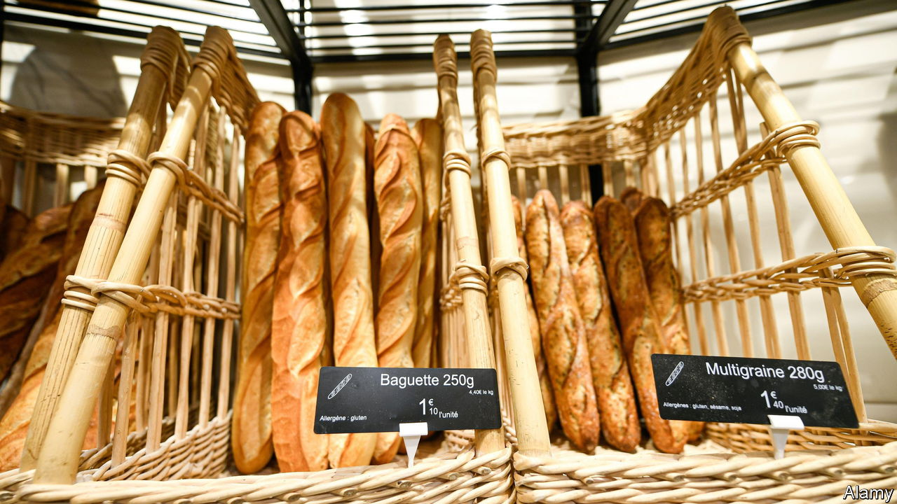

###### The booming baguette

# French bakeries are thriving in unlikely places 

##### Boulangeries are spreading out of town—and onto roundabouts 

 

> Aug 17th 2023 

On a soulless roundabout at a motorway junction, next door to a Burger King and opposite McDonald’s, stands a newcomer to the world of fast-food in France: a , or French bakery. With ample parking, the Boulangerie de l’Ovalie, just off the A7 north of Avignon, offers its car-borne customers the staple croissants and baguettes, as well as quiche and snacks. The  is traditionally a feature of the village square or high street, part of the civic density which urbanists laud in France. Yet now, it is flourishing as an out-of-town drive-in or drive-to experience.

It is an unexpected time for the baguette to boom, let alone on the country’s urban fringes. Rising energy and flour prices have pushed the price of the humble stick over the symbolic one euro in some places. Older folk still recall the time in the 1970s when it went for one French franc. Yet in 2022 more new  opened their doors in France than closed, according to Altares, a research group. Across the country 2,538 new bakeries set up shop last year. In the Paris region, the fastest growth has taken place not in the capital’s built-up walkable centre, but its low-density outer suburbs—catering to the motorist.

Marie Blachère, a chain of  installed on roundabouts and other car-accessible edge-of-town sites, now has over 700 outlets across France; 70 opened last year alone. It provides industrial-scale kitchens for artisan baguettes, made from dough prepared, kneaded and baked on the premises, a condition in France for use of the label boulangerie. With turnover of over €550m, it ranks as one of the top ten fast-food chains in France. In the city of Chartres, Cyril Avert boulangerie serves baguettes to motorists at the wheel, as a pure drive-through service. So does Jules &amp; John, in over 20 towns in France.

The drive-in or drive-to fad is not welcome news for the boulangeries on narrow town-centre streets, many of which are struggling with rising costs. But it does reflect a stubborn fact about France, which those who govern from its city centres neglect at their peril. In 2021 82% of French households owned at least one vehicle, and many in outer suburbs and semi-rural parts depend on it for work. The French remain as attached to their daily, or even twice-daily, baguette as they do to their use of the car. ■

