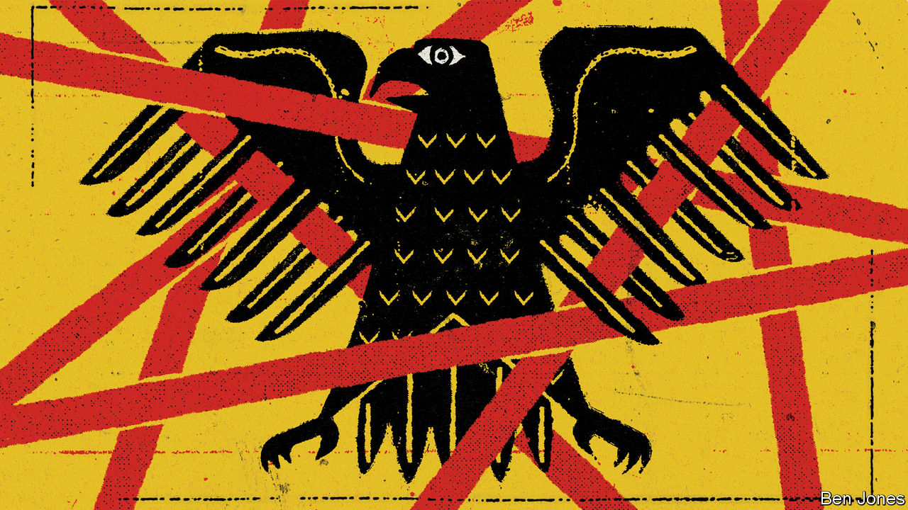
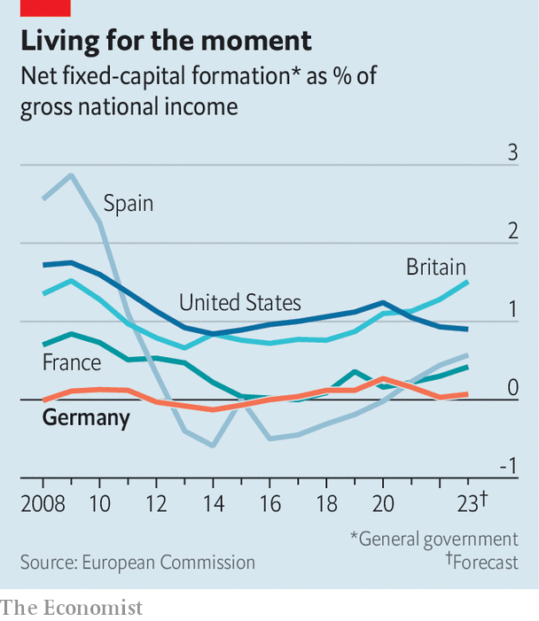

###### Germany own goals

# Germany is becoming expert at defeating itself 

##### Bureaucracy and strategic blunders are starting to pile up 

 

> Aug 17th 2023 

In “The Twelve Tasks of Asterix”, an animated film from 1976, one of the feats the diminutive Gaul must perform is to secure a government permit. To do so he must visit a vast office called The Place That Sends You Mad. In a recent open letter Wolfram Axthelm, the head of the German Wind Energy Association, likened modern Germany’s infuriating bureaucracy to Asterix’s challenge. A particular gripe was the 150-odd permits demanded by Autobahn GmbH, a state-owned firm that runs Germany’s vaunted motorways, for transporting outsize components of wind turbines, such as blades. Between byzantine rules on load dimensions, faulty software, perennial roadworks and a lack of personnel to process complaints, a backlog of some 20,000 applications has built up. A company that recently trucked a turbine from the port of Bremen to a site in the northern state of Schleswig-Holstein found that although the distance is barely 100km (62 miles), road restrictions made the journey five times that long.

Every country has bumbling officialdom. But Germany’s has an exceptional fondness for sabotaging itself. The cost of the battle between autobahns and windmills, for example, is not just economic but strategic. Last year’s abrupt halting of Russian fuel imports sent the country scrambling for power, preferably local and renewable. Olaf Scholz, the chancellor, says Germany needs to build three or four new wind turbines daily to reach its emissions-reduction targets. The current rate is just over one per day.

Other examples of German own goals abound. The government’s decision, in the midst of the energy crisis, to mothball its last three nuclear power plants has benefited neither the country’s energy consumers nor its citizens’ health, as dirty coal plants had to be fired up temporarily to meet demand. Local governments, meanwhile, have often held up permits for solar and wind installations, or the building of transmission lines to distribute power between the country’s windier north and sunnier south. 

 


The propensity for self-harm goes far beyond the energy sector. Germany’s insistence on a , or “debt brake” (which bars the federal government from net borrowing of more than 0.35% of gdp), may please finger-wagging burghers. But they perversely kept German governments from borrowing in order to invest from 2012-19, when interest rates were low. The result is overcrowded roads, a national rail operator with one of Europe’s worst records for punctuality and one of the EU’s feeblest rates of broadband internet penetration. Spending caps have also forced governments to use off-budget special funds to pay for covid-19 relief, its promised defence build-up and its climate-change goals.

Penny-pinching has embarrassed German diplomats too: the under-funded Luftwaffe has trouble maintaining the official air fleet, and has twice this summer stranded Annalena Baerbock, the foreign minister, at airports abroad. More deeply worrying is the substance of a series of decisions which the country took seemingly on autopilot, and has come to regret. For years German policymakers waved off warnings about Nord Stream 2, an $11bn pipeline that risked locking the country into dependence on Siberian natural gas. It was completed just in time for Russia’s invasion of Ukraine, has since been blown up and will probably never be used. Advice to be wary of Chinese electronics contractors was similarly ignored until this year. A recent report in , a news weekly, revealed that the cost to the national railway system alone of replacing components supplied by Huawei, a Chinese firm, could exceed €400m ($437m). 

Less obvious decisions have undermined Germany’s standing in smaller ways. Two former spy chiefs complain that excessive oversight and political squeamishness have hamstrung intelligence gathering. Germany failed until the last minute to believe that Russia would invade Ukraine; the lack of an agency specialised in electronic eavesdropping may help explain that. A recent ruling from Germany’s highest court granted foreign nationals abroad the same protections from German surveillance as German citizens in their own country. No wonder that Germany still depends on allies for intelligence. Its own services, said the former chiefs in an opinion piece in , a tabloid daily, risk becoming “toothless watchdogs with muzzles and iron chains”.

German bureaucrats do not always get things wrong, and when they do it is sometimes not their fault: as in any country, politics often trumps sound policy. Closing nuclear plants has been a holy mantra for Greens, while fiscal probity plays the same role for the pro-business Free Democrats. These are the two junior coalition parties that Mr Scholz needs to appease. Besides parties, Mr Scholz must placate Germany’s powerful states. The German press, meanwhile, excel at stirring up storms in teacups. Whipped-up angst prompts politicians to respond by over-legislating. One result is the clunky paperwork required by Germany’s hyper-vigilant data-protection laws. 

It is also true that when German governments screw up, they are more diligent than most about fixing things. Mr Scholz’s government, for instance, is at long last investing strongly in energy, transport and information infrastructure. It has quickly built up alternative sources to replace Russian fuel and has bet heavily on emerging technologies such as hydrogen. The coalition is even planning a Bureaucracy Relief Act that promises to cut red tape.

Recently Berlin has splurged some €15bn on subsidies to attract Intel and TSMC, two semiconductor makers, to build plants in former East Germany. Whether this is wise remains to be seen, but besides the strategic goals, the political logic is clear: a local economic boost may pull votes away from the far-right Alternative for Germany (AfD), which is strong there. The AfD wants to cut immigration, though German employers are desperate for workers; to weaken the EU, whose rules have underpinned German prosperity for 60 years; and to cut off military aid to Ukraine, inviting Russian armies closer to Germany. If the party gets its way, Germany may have a hat-trick of own goals in its future. ■

