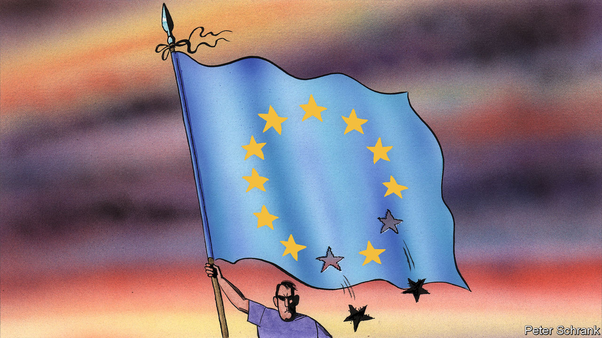

###### Charlemagne

# Having shaken off nationalism, Europe risks civilisationalism 

##### A new book decries the continent’s subtler form of chauvinism 

 

> Aug 17th 2023 

It is possible to be black and Dutch, or for a person of Moroccan descent to be unequivocally French. But is it possible to be non-white and to think of oneself as “European”? In most ways, certainly. Plenty of non-white people are born in Europe, and a citizen of any EU country is a citizen of the bloc, no matter what their ethnicity. Yet the term “European” is sometimes also used to connote whiteness: in apartheid-era South Africa, the terms were interchangeable. Those who think of Europe as a civic construction—a place underpinned by laws and values that people freely adhere to—can welcome anyone as a citizen. But of late some have tended to think of Europe in civilisational terms, an idea rooted not just in laws and institutions but in history, culture and identity. To be European in that meaning is to be  a place, to belong there, and therefore for others  to belong. That has unsettling implications for those who live in Europe yet do not look traditionally European. Might eight decades of EU integration accidentally foment a form of ugly, pan-continental bigotry?

The case that something discomfiting might be afoot is put forward by Hans Kundnani, a fellow at Chatham House, a think-tank in London. In “Eurowhiteness”, the British son of a Dutch mother and an Indian father describes his own inability (even before Brexit) to think of himself as 100% European, as many British liberals in pro-EU circles routinely do. Those who cheer the European project laud the way it consigned nationalist competition between EU members to history—forget fighting a war, being narrowly French or Swedish looks old-hat these days, at least outside football stadiums. Even the hard right seems to be stepping back from country-first nationalism. Leaving the EU was once a populist priority. Now the likes of Marine Le Pen in France and Viktor Orban in Hungary want Europeans to band together to collectively build higher fences better to keep Middle Easterners and Africans out instead. 

Surely the rout of any and all forms of nationalism (apart from the odd populist) is one of the EU’s signature achievements? Not so fast. Hannah Arendt, a German political theorist, warned in 1948 that one day people might find a way to become “as narrowly and chauvinistically European as they were formerly German, Italian, or French”. Mr Kundnani does not suggest that skinheads with tattoos of EU flags will soon start roaming the streets of Brussels and Strasbourg. But he describes what he thinks is a “civilisational turn” in Europe of late. It comes not just among the likes of Mr Orban. Emmanuel Macron, France’s president, has defended the idea of promoting European civilisation, the better to fend off rivals in China, America and beyond. When Ursula von der Leyen, the boss of the European Commission, appointed a staff member to stem migration four years ago, she named him commissioner for “Protecting Our European Way of Life” (after an uproar, he finally got a similar job “promoting” this elusive euro-lifestyle).

Mr Kundnani admits it is not easy to pin down where this civilisational turn comes from. In a sense, it is a return to Europe’s roots: the emergence of country-first nationalism from the 18th century onwards came when the continent’s common religious identity started to fade. Now it is the nation-state that is itself fading, seen as inadequate in the face of global challenges which only a united continent can tackle. (Mr Kundnani also indulges in a bit of left-wing rhetoric by pinning the blame on neoliberalism.) 

That coincided with another change. Until recently, Europe was an unabashed believer in its model, keen to export its softer version of capitalism and societal welfare. But since the euro-zone miasma in the 2010s, and after an ugly refugee crisis in 2015, its confidence has taken a knock. Europe sees itself surrounded by threats, whether from a rising China or Trumpism. Touting the idea of a civilisation capable of defending its interests is comforting stuff. Mr Macron speaks often of a “Europe that protects”. Josep Borrell, the EU’s foreign-policy chief, calls Europe a “garden” that needs to fend off the “jungle” beyond its borders.

If euro-skinheads are not the worry, what is? For one, the more politicians speak of today’s Europeans being the product of a civilisation stretching back thousands of years, the less minorities feel they belong to this particular “way of life”. More broadly, the continent’s welcome integration in recent decades has created a notable blind spot, Mr Kundnani argues. Defeating nationalism for the purposes of EU integration meant dwelling on the pinnacle of the horror it created. Thus it was the Holocaust which Europe remembered as the one thing it had to “never again” allow to happen. The role of (some) European countries in brutally colonising vast swathes of the globe was thereby swept under the carpet. 

A more perfect union

Across the world, rich white countries have had to contend with their foundational sins. In places like Australia and Canada, the shabby treatment of indigenous residents—centuries ago and today—is hotly debated. In America the divisions born of slavery mean that questions of racial justice remain central to its political discourse. In picking the Holocaust, European politicians chose a foundational sin that matched their integrationist ambitions. By highlighting the way colonial horrors were memory-holed, Mr Kundnani rightly points out that other sins were mostly ignored. The legacy of centuries of foreign misdeeds barely features in the public sphere, beyond an occasional mumbled apology. 

Individually, each European country struggles with race. Europe as a collective is a mess on the issue, riven by its member countries’ different histories of colonialism and migration. France pretends skin colour does not exist; Denmark’s “ghetto laws”, in contrast, apply ethnic discrimination. Poland expects the non-white labour migrants it imports to return home someday, echoing past delusions in Germany and the Netherlands. Hence grappling with what it means to be of Europe, to be European, will continue to be vital—even if it is uncomfortable.■


