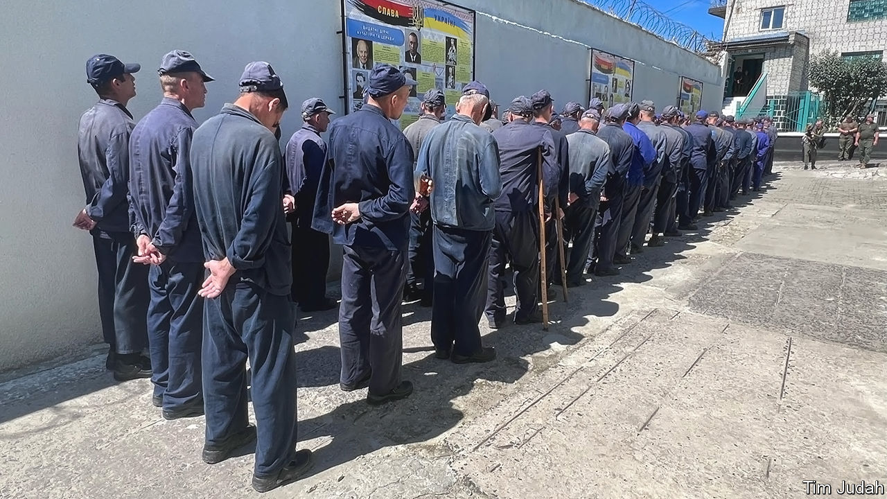

###### According to the conventions

# How Russian prisoners of war see Putin’s invasion 

##### And how they are treated by Ukraine 

 

> Aug 13th 2023 

ANDREY WAS in prison for murder in Russia’s Ivanovo region, north-east of Moscow, when army recruiters came by and offered him a good salary and a record wiped clean in exchange for six months’ service. Two weeks after arriving at the front he stepped on a mine, lost his foot and was saved by Ukrainian troops. “If I had known the consequences of joining, I would not have done it,” he says dryly. Now he is reading a crime thriller in a prisoner-of-war camp near Lviv, hoping he will be exchanged soon. 

Andrey’s chances are good. After Russian soldiers are captured, they move through a series of detention centres before arriving at this PoW camp. Visitors are asked not to reveal its exact location. Arrival here means that being exchanged is the probable next step, unless interrogation by Ukraine’s intelligence services implicates the PoW in a . Some prisoners ask the Ukrainian authorities to delay their exchange until after their military contracts have expired so that they are not compelled to fight again. A few ask not to be returned at all; but then they have to remain in custody until the war is over, unless they volunteer to fight in the  that Ukraine sponsors. 

 


The numbers of PoWs fluctuates and no official numbers are given. Achille Despres, spokesman of the International Committee of the Red Cross (ICRC), which endeavours to visit as many PoWs as possible, says that it has visited 1,500 on both sides, but knows there are “thousands more we have not had access to”. It refuses however to divulge whether one side or the other gave more access.

The Lviv camp is a model one. In accordance with the Geneva Conventions, the PoWs are not locked up in cells. Krzysztof Janowski of the UN’s Office of the High Commissioner for Human Rights (OHCHR) says that conditions in the camp have “not raised any major issues with us in the past,” and “are consistently improving over time.” As allowed by the conventions, ordinary soldiers are put to work. In one room men sit around a table sticking and glueing fancy shopping bags. They also make garden furniture. Officers are not compelled to work but they are “rare birds” here, says Petro Yatsenko, a novelist turned spokesman for Ukraine’s Co-ordination Headquarters for the Treatment of PoWs. 

According to Mr Yatsenko, the types of prisoners passing through the camp have varied. When the 2022 invasion began, the arrivals were mostly soldiers from Donetsk and Luhansk, the two territories of Ukraine which came under Russian control in 2014. In the second wave there were a lot of mercenaries from the Wagner group. Now he says, roughly one-third of the PoWs are jailbirds like Andrey, who were recruited into so-called Storm-Z penal military units, a third are men who have been mobilised, and a third are regular soldiers. 

In the Lviv camp many of the Russian PoWs look far older than their years. Many of those recruited from prison have been ill and weak and “it is very difficult to believe they can have been useful except as artillery meat,” says Mr Yatsenko. The Russian army began recruiting in prisons early in the year as its relations with the Wagner group deteriorated. But he says that it seems that Wagner had already taken the fittest prisoners. He says most Russian PoWs spend on average “months” in Ukraine, but many  have been there for more than a year. Up to a third of the Ukrainians who return have been registered as missing because Russia shares no information with Ukraine about its prisoners.

In March the OHCHR published a searing report on PoWs. Its teams had full access to detention centres in Ukraine, but none to any in Russia or the occupied territories. Its information on conditions of prisoners in Russian hands came from freed prisoners. Based on several hundred interviews it found that 92% of those who had been prisoners of the Russians claimed to have been ill-treated or tortured, whereas that figure was 49% (which is still alarmingly high) for PoWs held by Ukraine. According to Mr Despres, the moment of the highest risk of abuse comes typically “in the first hours after they have been captured.” According to Mr Janowski “on the Russian side the mistreatment continues throughout their detention.” That appears to be much less true for Russian PoWs in Ukraine. 

In the Lviv camp most of the PoWs that were asked said they had not been mistreated—but Ukrainian officials were around, if not present, at every discussion. A couple of men looked down and said this was not something they wanted to talk about. The treatment of some PoWs by both countries upon capture, including the reported summary execution of 15 Ukrainians and 25 Russian PoWs “may constitute war crimes,” says the UN report. Russian officials “essentially dismiss our findings” says Mr Janowski while the Ukrainian side has been “responsive, accepting our role as independent monitors.” Even so the report records a depressing amount of mistreatment by the Ukrainians. “The majority of tortured and ill-treated PoWs complained of beatings with rifle butts, wooden bats, sticks and fists … and being forced to kneel for hours while being questioned,” it said. It also noted a “widespread pattern” of prisoners being forced on film to shout and sing slogans, and that videos of ill treatment and humiliation were “disseminated on social media.” 

In Ukraine PoWs are allowed occasional calls home, though they are not private. When they call they can ask their family to send money so they can buy sweets, coffee and toiletries from the prison shop. “I’m alive. I am OK. I am in Ukraine. I’m in prison but they are treating me well,” said Aleksei from Lipetsk in south-western Russia, who had arrived in the camp a few hours earlier. “I have been looking for you!” said his mother. 

According to Mr Yatsenko many of the PoWs believe Russia’s propaganda line that they have been fighting a just war against “Nazis”. But at least some of these bowed and shaven-headed men have been asking why they ended up here. “I think this war is for nothing,” says Kiril, from Russia’s Tula region. “I want to go home.” ■

