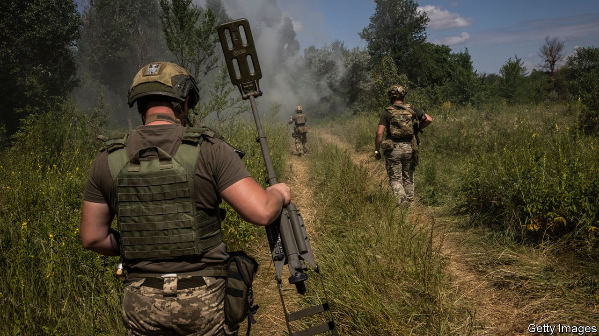
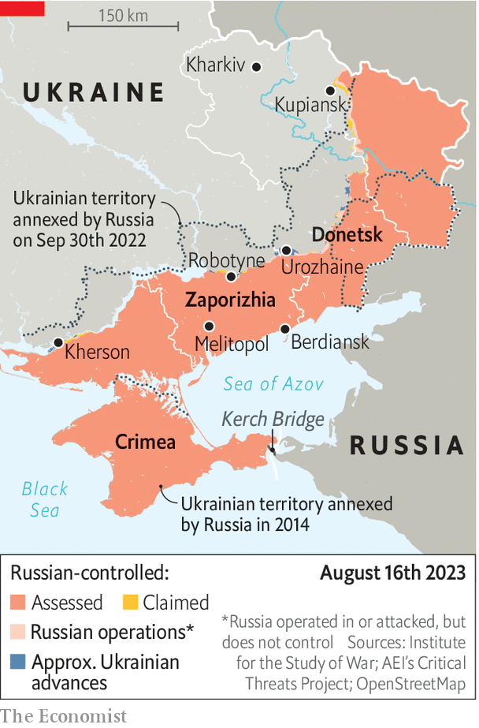

###### Metre by metre

# Ukraine’s counter-offensive is making progress, slowly 

##### Ten weeks in, the army is starting to figure out what works 

 

> Aug 16th 2023 


UKRAINE HAS tried various approaches in the  it launched on June 4th, but it is starting to figure out what works. “During the past two weeks we have seen things gradually tipping in Ukraine’s favour,” says Nico Lange, a Ukraine expert at the Munich Security Conference. The evidence from both satellite imagery and (mainly Russian) military bloggers is that slow progress is being made. Sir Lawrence Freedman, a British military strategist, agrees: “They’re doing stuff and they’re stretching the Russians.”

The successful strategy, says Ben Barry, a land-war specialist at the International Institute for Strategic Studies, a British-based think-tank, is a combination of the “deep battle and the close battle”. Ukraine is using its growing qualitative advantage in precision artillery shells to take out Russian batteries. Longer-range munitions such as HIMARS and Storm Shadow missiles are hitting logistical hubs and command centres. Tweaked S-200 missiles, normally meant for air defence, were used on August 12th to attack the Kerch Bridge, which links Crimea to Russia. 

 


Mr Lange points to Ukraine’s partial success around the village of Urozhaine in the Donetsk region, where with the help of newly-acquired cluster munitions the main Russian route of withdrawal has been turned into a deadly choke point. Alexander Khodakovsky, a Russian battalion commander in Urozhaine, complained this week via Telegram, a messaging app, that he was not getting reserve troops to stem a mounting disaster. This suggests that Russian forces in some areas are now too battered to provide reinforcements. 

When Russian forces respond with counter-attacks, says Sir Lawrence, they often run out of steam. A Russian offensive near Kupiansk in which convict soldiers are bearing the brunt of the action has so far been an exception. Though Ukrainian positions appear to be holding, Russian bombing has caused great destruction, and led to a civilian evacuation on August 10th. 

Meanwhile, grinding progress continues on the two southern axes towards the cities of Melitopol and Berdiansk. The big challenge is breaching some of the most heavily mined areas in the history of warfare. Ukraine’s defence minister, Oleksii Reznikov, claimed this week that in some parts of the frontline there are five mines per square metre. This is the main reason, says Mr Lange, that Ukraine has had to concentrate on a narrow front: it does not have the sappers or mine-clearing vehicles to attack multiple points along the line. According to the , a British newspaper, Ukraine’s 200 engineering units started the counter-offensive with about 30 troops each. But sappers, who clear mines by hand, are frequently injured or killed. An engineering brigade in one recently liberated village had only five sappers left, the paper reported. 

Mr Reznikov is pleading with allies for mine-clearing equipment and training, but no army has faced such a challenge since the second world war. Experience and kit are sparse. NATO forces became adept at dealing with IEDs in Afghanistan. But the scale in Ukraine, says Mr Barry, resembles the battle of El Alamein 80 years ago, when Erwin Rommel, the German general, laid a million mines. It took ten days for the British to get through, even with a huge advantage in artillery, control of the skies and plenty of mine-clearing tanks—none of which Ukraine has. 

Ukraine’s long-range strikes could yet pave the way for a major breach. Germany may soon help out with 400 or so Taurus cruise missiles, which would threaten more of Russian-occupied Crimea. Mr Lange says Russian assets such as self-propelled howitzers and KA-52 attack helicopters are being picked off “piece by piece”. At the start of the war Russia had about 100 KA-52s but may now have as few as 25 left. Russia seems to be placing its bets on its first line of defence holding. If the second and third ones turn out to be brittle, as some experts suspect, a push through could be decisive. ■

