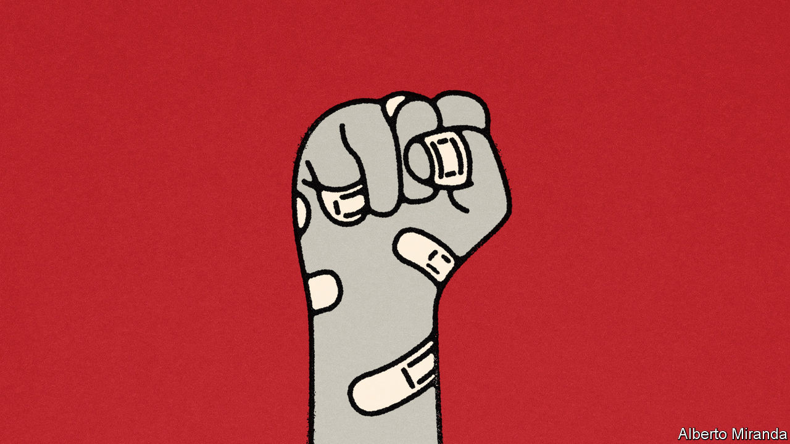

###### Free exchange

# Democracy and the price of a vote 

##### Free elections are heralded as a solution to poverty. Reality is not so simple 

 

> Aug 17th 2023 

A typical economist does not have all that much in common with a typical protester in a failing dictatorship. Dismal scientists favour cautious lessons, carefully crafted and suitably caveated, backed by decades of data and rigorous modelling. Protesters need electrifying arguments and gargantuan promises about just how good life will be as soon as their aims are achieved, since that is how you recruit people to a cause. But the two groups share at least one trait. They both tend to be ardent democrats.

Democratic institutions are good for economic growth. That is one of the few things on which, after decades of probing the link between politics and prosperity, economists agree. Dictators may be able to control the state, its resources and much of society. But countries that have long-established elections and associated institutions also tend to have trustworthy governments, competent finance ministers and reliable legal systems. In a paper published in 2019, Daron Acemoglu of the Massachusetts Institute of Technology and co-authors split countries into dictatorships and democracies. They found that 25 years after making a permanent switch from the former camp to the latter, a country’s gdp was one-fifth higher than it would otherwise have been.

The problem is that making the switch takes longer and is more expensive than often assumed. Look beyond Mr Acemoglu’s black-and-white division. Allow some countries to be more democratic than others—after all, it makes little sense to put a centuries-old democracy in the same category as one finding its feet—and a different picture emerges. In a study published last year, Nauro Campos of University College London and co-authors found that regimes face problems while trying to get rid of autocratic tendencies. On average, countries lose 20% of gdp per person in the 25 years after escaping dictatorship relative to their previous growth path, in part because many struggle with the transition to democracy. Today there are more such inbetween regimes than ever (87, according to the Economist Intelligence Unit, our sister outfit). 

Reliable institutions are a prerequisite for development, but democratic ones take a long time to build. Countries do not finish one day under a military dictator and start the next with a fully formed supreme court. Civil services that know when to leave the private sector be, legal systems that protect property rights, and thriving charities and universities take decades to develop. Investors take even longer to be convinced. Democracies spend more on health and education, which pays off, but only after decades.

More immediately, overhauling politics shakes the economy. Few autocrats are sensible technocrats, but they stick around, while democratic progress comes in fits and starts, occasionally kicking into reverse. Countries often need several new leaders and constitutions before reform sticks. There is always a risk that a democratic experiment will end in a coup, war or uprising. For businesses, making big bets on stability is often too much of a gamble. Local ones do not want to get close to politicians and anger those who will be next in charge. Foreign creditors want to lend to a government that will still be around to pay them back. 

Elections also carry costs. Autocrats fix them, which is complicated and expensive. But winning one—the task ahead of a politician in a newly democratic country—is often more expensive still. After all, influencing through persuasion (with, say, promises of shiny new sports stadiums) soaks up more money than repression. A party-run media empire will be able to spend billions of dollars. Vote-winning welfare promises will be even pricier. New democrats also tend to rely on networks of crony-capitalist allies to campaign, protect and fund them. These networks can be more sprawling than the ones that kept their predecessors in power. Neither the powerful top brass, such as generals or businessfolk, nor the voters they bring in, will be particularly keen on a pay cut.

Few candidates are really rich themselves, meaning payments often come from the state once candidates are in office. Fiscal balances fall foul of corruption, as inner circles siphon cash. The possibility of losing the next election sometimes adds urgency to such activities, rather than discouraging them. Worse, new presidents sometimes choose to, in effect, rent out parts of the government. Rather than dissolve state-run companies, they like to use board positions as rewards and dish out licences for national monopolies. The civil service changes hands. Flagship investments—planned for elsewhere—migrate to supportive regions. There is no money, expertise or time left to worry about growth. 

Stuff the ballot boxes

As costly as change is, the circumstances that provoke it are scarcely better. Mr Acemoglu finds that gdp per person tends to stop growing in the five years before a country becomes a democracy. Suharto, a former dictator in Indonesia, resigned in 1998, a year after the Asian financial crisis began. In 2011 Egypt’s Tahrir Square was filled with protesters demanding “Bread, Dignity and Freedom”. Today, once again, Egypt is brimming with political protest after years of crisis. So are Sri Lanka and Pakistan. 

There is nothing more likely to push politicians towards reform, or populations towards protest, than inflation, joblessness and falling living standards. All too often, autocrats are to blame for these problems in the first place. But swapping leaders or holding an election will not immediately fix decades of economic mismanagement. The difficulties of democratisation may also help explain why so many countries are stuck somewhere short of full democracy. Although a popular vote offers sizeable economic benefits, they take time to emerge, while the costs are more immediate. People who are no more able to make ends meet after overthrowing an autocrat, despite the grand promises they were sold by popular leaders, are more likely to turn their back on reform altogether. The path to democracy is fraught. That is why history is littered with failed experiments. ■


