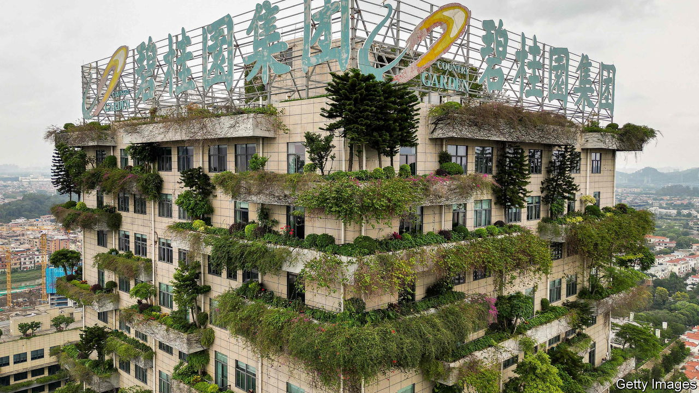

###### Homesick

# How bad could China’s property crisis get? 

##### Country Garden is on the edge of default. Here is a worst-case scenario 

 

> Aug 16th 2023 

Households across China have been thrown into panic over the past week. The company building their flats, Country Garden, missed $22.5m in coupon payments on August 6th. Now the firm, one of the world’s largest homebuilders, has until early September to make the payments or follow hundreds of other developers into default and restructuring. Trading in its bonds, which are worth just pennies on the dollar, was halted on August 14th.

Officials across the country are watching closely. Country Garden is renowned for its huge projects in China’s second- and third-tier cities. The firm’s debts are smaller than those of Evergrande, a big, heavily indebted company that defaulted in 2021. But at the start of the year Country Garden was building four times more homes than Evergrande was before it defaulted. At the rate Country Garden was delivering them in the first half of 2022, at least 144,000 buyers will not receive homes they were promised by the end of this year. A sudden debt meltdown at the firm would leave even more families out in the cold.

China’s  turns three this month, if measured by the introduction of the government’s “three red lines” policy, which sought to limit leverage. Throughout, officials have struggled to manage confidence and expectations. At the start, few observers believed Evergrande could collapse, and that the government might fail to put a stop to the pain. Until recently, most thought that Country Garden was immune to default. Since late last year officials have sought to calm the market by drawing up an informal list of healthy developers, including Country Garden, which investors could feel comfortable funding and Chinese citizens could trust. 

The calculation has changed in recent days. Country Garden’s issue is not one of over-leverage in the style of Evergrande. Instead, it is a victim of a loss of confidence among regular folk—a sign the government is losing control. After a short rebound following the lifting of covid-19 controls, the property crisis has intensified. Prices are dropping. Sales among the 100 biggest developers fell by 33% in July compared with a year earlier. Country Garden’s tumbled by 60%. The firm’s decline is forcing market-watchers to confront their deepest fears about the property sector.

One is that property supply chains collapse. Over the past three years suppliers of materials, along with the engineering and construction firms that build homes, have often not been paid on time by developers. But so far this backbone of the sector has withstood the pressure. That could change as developers grow shorter on funds. The decline in payments to suppliers is already noticeable. Between 2021 and 2022, Country Garden’s transfers to such firms fell from 285bn yuan ($44bn) to 192bn yuan, according to s&amp;p Global, a rating agency. They are all but certain to fall further this year. Although the biggest contracting firms will probably survive with help from the government, it is not hard to imagine widespread collapses among the myriad smaller engineering and materials companies that do the work on the ground. 

Another concern is that the crisis spreads to state firms. Since 2021 Chinese developers have been almost entirely shut out of international bond markets. But the onshore debt market has remained open to state-backed firms. The large Chinese investors that dominate the market have so far provided a degree of stability; they have not dumped developers’ credit as have asset managers in Hong Kong. Any change would spell trouble. And in recent weeks investors have noted pressure in the domestic bond market. Sino-Ocean, a state-owned developer, has shown signs that it may struggle to repay debts. Homebuyers have chosen state developers because they are seen as safer. If the crisis hits state firms, that notion would be shattered.

The fear that the collapse of a developer will bring down a large Chinese bank has mostly been dismissed. Banks’ exposure to developers, analysts say, is reasonable. They would survive even the fall of a firm like Country Garden. But other types of contagion cannot be ignored. If property continues to weaken, the government may ask banks to offer more loans to the industry, says Michael Chang of cgs-cimb Securities, a broker. This would lower returns and also be a poor allocation of credit at a time when China’s economy is suffering. 

No worry will loom larger in the minds of officials, however, than threats to social stability. Country Garden may have to cut prices to generate sales. This could create competition and lead to swifter price falls across the industry, pushing people to delay home purchases in the hope that prices will fall still further. During past downturns, those who bought homes too early, missing a discount, have protested and demanded a matching reduction in price.

Indeed, Country Garden’s biggest creditors are not banks or bond holders, but folk who have paid for homes upfront. Some 668bn yuan, or about half the firm’s liabilities, were put up by homebuyers. Last year thousands stopped paying their mortgages in protest at years-long delays in delivering homes. There is now the threat of much broader protests across the 300 cities in which Country Garden builds.

So far officials in Beijing have decided against direct intervention in the property market. Country Garden almost certainly has the $22.5m it needed to cover payments this month. By not paying up, its bosses are signalling a desire to eventually restructure its debts—perhaps betting that the firm is too big to fail. This puts the central government in an excruciating position. Letting Country Garden fail could lead to wider panic, more economic pain and potentially more defaults, risking contagion and social unrest. Yet stepping in with a rescue package would put officials on the hook for many more bail-outs, and prop up an unsustainable industry. ■


