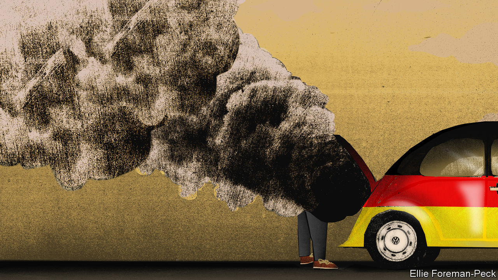
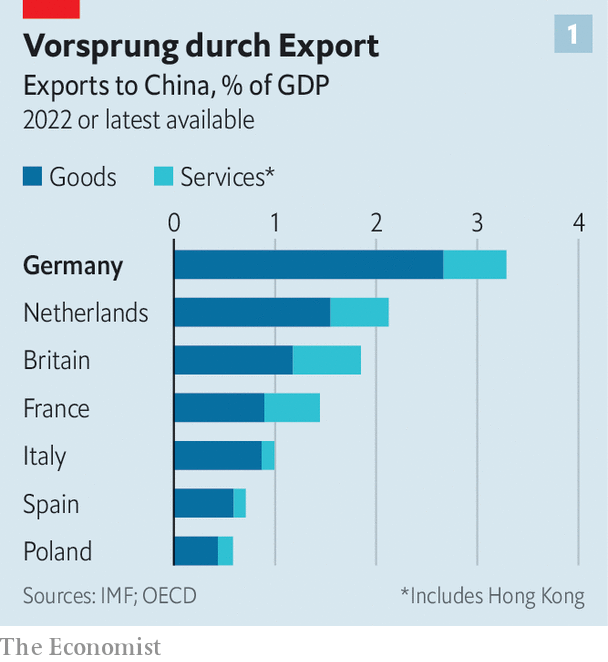
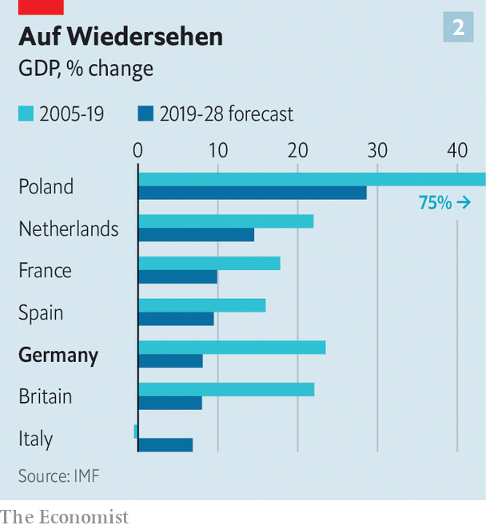
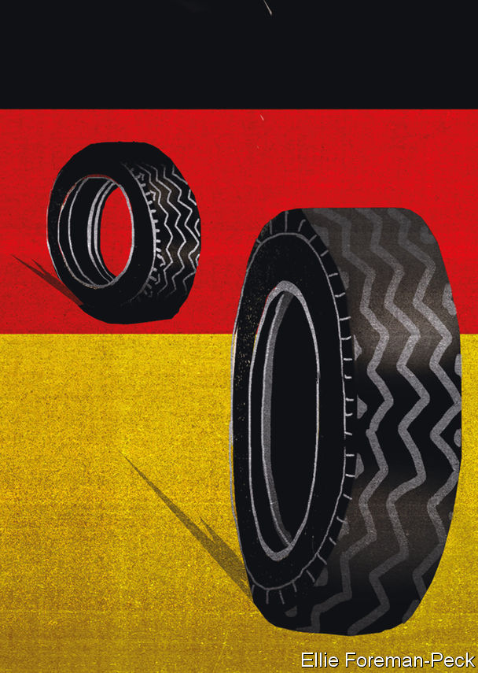

###### How the wheels came off

# The German economy: from European leader to laggard 

##### Its problems are deep-rooted, knotty and show little sign of being fixed 

 

> Aug 17th 2023 

The 2010s were Germany’s decade. A (employment miracle) that began in the 2000s reached full flower, largely unimpeded by the global financial crisis of 2007-09, as labour reforms introduced by Gerhard Schröder, chancellor from 1998 to 2005, combined with China’s demand for manufactured goods and a boom in emerging markets to add 7m jobs. From the mid-2000s to the end of the 2010s, Germany’s economy grew by 24%, compared with 22% in Britain and 18% in France. Angela Merkel, chancellor from 2005 to 2021, was lauded for her grown-up leadership. Populism of the Trump-Brexit variety was believed to be a problem for other countries. Germany’s social model, built upon close relationships between unions and employers, and its co-operative federalism, which spread growth across the country, wowed commentators, who published books with titles such as “Why the Germans Do It better”. Germany’s footballers even won the World Cup.

The 2020s are shaping up to be very different, and not just because the national football team is faltering. Alternative für Deutschland, a far-right populist party, is polling at 20%. Germans are unhappy with their government. Most worrying, Germany’s vaunted economic model and state look unable to provide the growth and public services people have come to expect. 

This is partly a story of a country uncomfortably exposed to circumstances, not least war in Europe and slowdown in China. According to imf forecasts, Germany will be the only g7 economy to contract this year. Less widely appreciated, though, is the fact that the country’s long-term prospects have dimmed. Germany is exposed to a triple whammy: its industry looks vulnerable to foreign competition and geopolitical strife; its journey to net-zero emissions will be difficult; and its workforce is unusually elderly. To make matters worse, the German state appears ill-prepared for these challenges.

 


Interest rates have risen rapidly in the euro zone, as they have across the rich world, to deal with the inflation unleashed by covid-19 and Russia’s war in Ukraine. Higher rates are starting to hurt German construction and business investment. Yet the country tends to be less sensitive to rate increases than most. Far more difficult are changes wrought by external factors. More than any other major European economy, Germany depends on China (see chart 1), meaning the Asian giant’s slower than expected recovery from zero covid is proving painful. Meanwhile, the gas-price shock of last year still reverberates—and gas futures signal that prices will remain roughly double their pre-pandemic level in the coming years. Energy-intensive industrial production has yet to recover from last year’s lows. And the country’s consumers are struggling: real wages have only just started to grow, having fallen to levels last seen in 2015. 

Ministers are mulling how to respond. The Greens, part of a coalition government with the Social Democrats and fdp, a pro-business party, want to spend €30bn ($33bn, or 0.7% of gdp) on subsidising electricity for industrial use and funding green building and social housing. “The current weakness of the construction sector could indeed be used by the public sector to build more instead,” agrees Monika Schnitzer, head of the German Council of Economic Experts, an official body. The fdp, for its part, would like to cut taxes and create incentives for the private sector to invest, such as by allowing faster depreciation of investment goods. Both plans would lead to a wider fiscal deficit, and thus involve accounting trickery to get around the country’s strict deficit limits. 

 


Whatever response politicians eventually agree upon, Germany’s problems seem likely to last for a while. The purchasing-managers’ manufacturing index is at its lowest since the early months of covid. Surveys such as the ifo index show that German business leaders are gloomy about the future. Expectations for the next six months continue to deteriorate. The imf reckons that the country’s economy will grow by only 8% between 2019 and 2028, about as fast as Britain, the other European struggler. Over the same period, France is forecast to grow by 10%, the Netherlands by 15% and America by 17% (see chart 2).

Mein Gott

The first challenge Germany faces arises from geopolitics. Both America and Europe want to re-engineer supply chains in order to be less reliant on any single non-Western supplier, in particular China. The world order that emerges will provide some benefits for Germany. Firms seeking to “re-shore” production of crucial inputs, such as semiconductors, or build factories for new products, such as electric vehicles (evs), may be lured to its shores. Tesla, an ev-maker, has already built a factory near Berlin, and plans to expand it to create Germany’s biggest car plant. Intel has agreed to create a €30bn chipmaking hub in Magdeburg, central Germany. On August 8th tsmc and three other chipmakers announced plans for a €10bn fab in Dresden. 

Yet these investments come at great expense to the German taxpayer, with politicians engaging in a global subsidy race. Germany will provide around €10bn in subsidies to Intel; another €5bn will go to tsmc and collaborators. Meanwhile, reducing trade links with countries beyond the West will hurt given Germany’s reliance on global supply chains. According to our calculations, both it and the Netherlands combined (the two countries’ figures are hard to disentangle because of a shared reliance on the port of Rotterdam) have more exposure to autocracies than any other major European economy. Annual trade with such countries is worth 10% of the two countries’ gdp, compared with 5% in France. Little surprise, then, that an imf paper from 2021 shows that Germany would suffer more than anywhere else in the oecd if trade in high-tech goods between the club’s mostly rich members and China was severely restricted.

 


Emerging Chinese rivals also pose a considerable threat, not least to carmakers. Germany’s famous old brands—bmw, Mercedes, Porsche, Volkswagen—risk being left behind as consumers switch to evs. The combined market capitalisation of the four companies is now less than half that of Tesla. Much like the German economy as a whole, their business model was working just too well to adapt. They now face growing competition from China, where exports of evs are surging. The country’s carmakers bet big on such cars in anticipation of growing demand. As a result, China sold 2.7m vehicles overseas last year, many of them under the labels of Western carmakers, up from fewer than 400,000 in 2015. Around two-fifths were electric or hybrid. Indeed, Sixt, a German car-rental firm, recently ordered 100,000 vehicles from byd, a Chinese carmaker.

 


Germany’s transition to net-zero emissions is the next difficulty for the economy. The country has already undergone one uncomfortable transition: from being a pioneer of renewable energy to a climate laggard. This has left its annual carbon footprint, of 9 tonnes a person, around 50% higher than that of France, Italy or Spain (see chart 3). Although Germany is one of the most energy-efficient countries in Europe—meaning waste is low—it consumes enormous amounts of energy owing to its large industrial base (see chart 4). Making this energy greener will require awkward trade-offs.

The original plan, dreamed up in the glorious 2010s, was to replace nuclear energy with renewables and cheap Russian gas. Neither now looks possible. Russian gas will not flow to Germany any time soon. Meanwhile, Mrs Merkel often preferred to spend on pensions, rather than on renewables. nimbyish hostility to strengthening the grid, especially in the power-hungry south, has not helped. 

Atomkraft? Nein danke

Ministers used last year’s energy crisis to pass controversial laws, watering down conservation rules, that should help speed up the introduction of renewables. A network of hydrogen pipes is also being planned. But it will still be a tall (and expensive) order to produce the green energy required. Even if hydrogen targets are met, the gas will only cover 30-50% of domestic demand by 2030, according to the government’s own forecasts. Around four to six onshore windmills a day will have to be built to meet the official target of 80% renewable electricity by 2030—something rendered supremely unlikely by local resistance, a lack of grid connections and an abundance of planning constraints.

Until the windmills are built, firms face uncertainty. In response, they may move to greener, cheaper pastures. Chemical companies, including basf and Lanxess, have already restructured their German operations, closing facilities. Other energy-intensive outfits, such as those in ceramics, glass or paper, could follow suit. The German government recently agreed to pay €2bn to ThyssenKrupp, Germany’s biggest steelmaker, to keep steel mills running, while making them greener. Intel also wants a government guarantee. The chipmaker is in negotiations with local electricity providers in Magdeburg and the federal government, seeking a fixed energy price of €100 per mwh for two decades.

 


It is not just Germany’s industrial base that will be less energetic in the future—its population will be, too. Germany is both an old country, and one old in a peculiar way (see chart 5). Its working-age population makes up 64% of the total, just as in America. Yet Germany’s median age is 45, compared with 39 across the Atlantic. Since the country’s post-second-world-war baby boom was delayed by a combination of famine, destruction and displacement, there is now a great swell of workers on the verge of retirement.

As these boomers quit the workforce, jobs will become more difficult to fill. Already, firms are struggling. Even during last year’s energy crisis, Germany’s much-lauded Mittelstand—smallish firms that are often world leaders in their niche—cited a paucity of suitable workers as their most pressing concern. Without immigration or more women and elderly folk in the workforce, the labour market will lose 7m of its 45m workers by 2035, calculates Enzo Weber of the Institute of Employment Research, a think-tank. As he notes: “The raw figures are dramatic.”

Yet making it easier for parents to work full-time would clash with Germany’s traditional family model, and schools and nurseries are already short-staffed. Once, such problems would have been circumvented by attracting workers from eastern Europe, using the lure of higher Western wages. But many economies to the east are booming, and their labour markets are also tight. Two-thirds of Polish industrial firms, for example, cite labour shortages as a factor limiting their production, compared with less than one-quarter in the euro zone. In a sign of the times, Hubertus Heil, Germany’s labour minister, recently travelled to Brazil as part of a campaign to entice health and care workers to the country. A law introduced in 2020 to welcome more workers from outside the eu had to be updated this year, in order to further lower barriers to entry, after failing to attract sufficient numbers. 

Overcoming these three challenges—geopolitics, climate change and demography—will require a nimble, digitally savvy and highly capable state. Unfortunately, Germany’s state is none of these things. The country’s success has for a long time masked the inadequacy of its institutions and administration, which is now being exposed. As Ms Schnitzer of the country’s official economic advisory council puts it: “The state is suffocating under its own rules and procedures.” 

Per Fax bitte

Take digitisation. Germans famously love to pay using cash. They complained in their thousands when Google rolled out its Street View feature, forcing the firm to turn many of the country’s houses into a blurry mess on the site. According to eu data, only Bulgarians, Italians and Romanians use digital government services less than Germans. This will be a problem as the country’s labour force shrinks, when it will become all the more important to eke every last drop of productivity from workers.

 


Even optimists are losing hope. “Artificial intelligence is often irrelevant for us, because there is no ai for a fax machine yet,” sighs Ann Cathrin Riedel, who runs next, an advocacy group that seeks to digitise public bureaucracies. She cites examples of municipalities that have to plan their school needs without knowing the number of children who will turn up because they do not have the required data. A law introduced in 2017 decreed that, by 2022, 575 services would be available in digital form. In the end, just 128 were. And many merely provided an online front-end. “Now you can digitally apply for housing benefits, but the administration prints out the page and puts it into the same folders as before,” notes Ms Riedel. 

Sclerotic bureaucracy is a problem when companies must adapt to a fast-changing global economy and the entire capital stock serving fossil fuels needs to be replaced. At the moment, it takes more than 120 days for a German firm to receive an operating licence, compared with fewer than 40 in Italy and Greece. Construction permits take more than 50% longer than the oecd average. Clinical trials are so difficult that biotech firms set up research centres abroad. Almost 70% of Germans think the state is overwhelmed. Without enormous improvements, it will become a bottleneck as the economy tries to adjust.

The problem is not a lack of funds—it is the nature of the administration itself. Observers paint a picture of a government stuffed with lawyers and unable to steer policy or even monitor consultants properly. Germany’s federal structure has created a patchwork of digital fiefs that are fiercely guarded. Olaf Scholz, the country’s Social Democrat chancellor, has so far shown little interest in deep reform of the state, and seems keener on fiscal rules than bold change. The last time Germany was in such a mess was the late 1990s, when  labelled the country the sick man of the euro. Back then, German politicians embarked on painful reforms, which ended up being assisted by favourable conditions in the global economy, not least a boom in emerging markets. There is no such boom in sight now. ■


