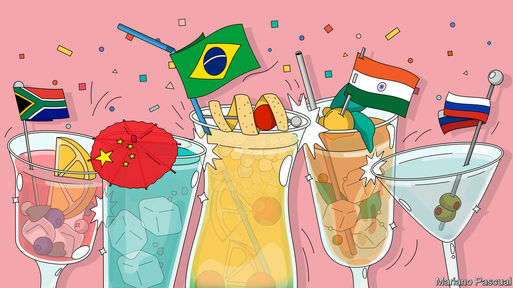
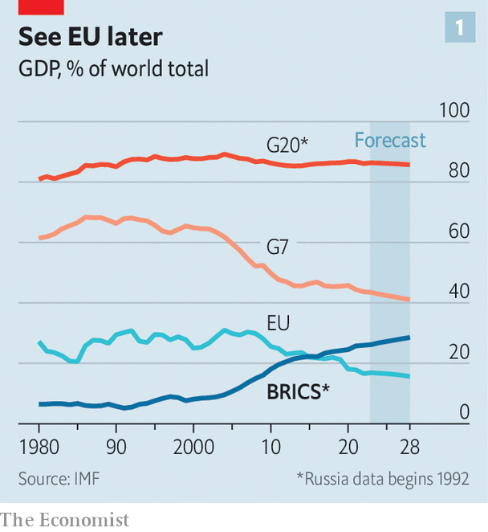
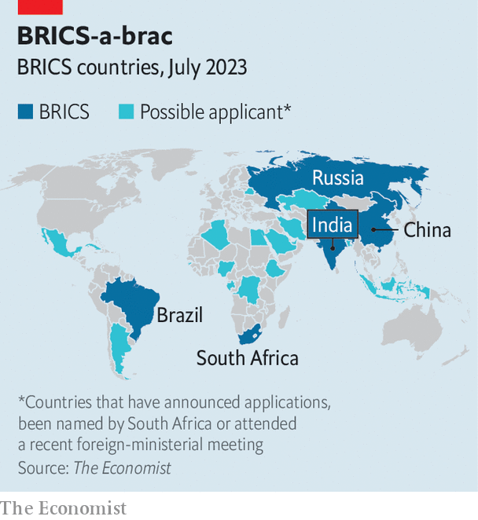
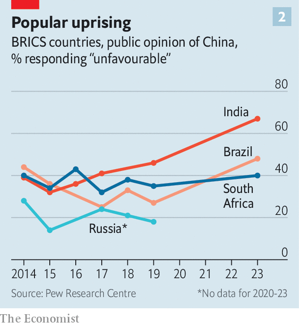

###### Is a bigger party a better one?

# The BRICS are getting together in South Africa 

##### China’s plan to expand the bloc is revealing the contradictions at its core 

 

> Aug 17th 2023 

LIKE THE iPod and MySpace, the BRICS bloc is a product of the benign optimism of the 2000s. In 2001 Goldman Sachs coined the acronym BRIC in a paper about the economic potential of Brazil, Russia, India and China. The quartet ran with the idea, holding its first summit in 2009. A year later South Africa was invited to join. Some analysts feared the BRICS might soon start to rival the G7, but the grouping quickly lost momentum. The non-Asian BRICS economies stagnated in the 2010s. At summits the bloc would issue garbled communiqués about the perfidious West—which the perfidious West would promptly ignore. The BRICS looked dead. 

And yet the bloc lives. On August 22nd the 15th BRICS summit will open in Johannesburg, a major South African city—a party for many of the biggest swing voters in geopolitics. Cyril Ramaphosa, South Africa’s president, will be joined by leaders including Narendra Modi of India, Luiz Inácio Lula da Silva of Brazil (known universally as Lula) and China’s Xi Jinping. Vladimir Putin will not be there in person. Were he to attend, then South Africa, as a member of the International Criminal Court, would be obliged to act on the arrest warrant the court issued for Russia’s president in March. And that might spoil the fun. 

The meeting will underline how the bloc has been rejuvenated by Russia’s invasion of Ukraine and rising tensions between the West and China. BRICS members, led by Beijing, are considering whether to expand and deepen the bloc. Some middle powers see the group as a possible vehicle for their interests. The bloc says that more than 40 countries have either applied to join it or have expressed an interest in doing so.

A “Big BRICS” would be a challenge for the West. But it is not a mortal threat. China’s efforts to enlarge the bloc are revealing its tensions and contradictions. A weakened Russia is going along with it, but Brazil, India and South Africa are sceptical. The BRICS are far more heterogeneous than the G7. Members differ politically, economically and militarily; expansion would make a motley crew even motlier. It would mean that although the BRICS could criticise the Western-led international order with a louder voice, they would struggle even more to articulate an alternative. 

What, then, holds the BRICS together? Like the G7, the group has no charter or formal membership criteria. Nor is its mortar the product of personal chemistry. In June at a meeting of foreign ministers in Cape Town, a kind of warm-up for the main event, your correspondent snuck into the restaurant hosting the dignitaries’ lunch. The pasta salad was not the shindig’s only sad sight. The delegations were scattered: the Chinese were too busy in meetings, the South Africans too disorganised, the Brazilians too late. Outside, Subrahmanyam Jaishankar, India’s foreign minister, held court with his officials. Inside, Sergey Lavrov, his Russian counterpart, silently nursed a glass of white wine. 

Working the room

The BRICS endure because the club serves several functions. One is to provide a platform for members to criticise, often with justification, the way institutions such as the World Bank, IMF and UN Security Council sideline the “global south”, a modish term for developing countries. In Cape Town Mr Jaishankar talked of the “concentration” of global economic power that was “leaving too many nations at the mercy of too few”. Oddly, such views have become more pointed as the BRICS’ share of world GDP has increased, from 8% in 2001 to 26% today. Over the same period the G7’s share has fallen from 65% to 43% (see chart 1). 

 


The clubbiness of the BRICS is also a source of prestige, especially for struggling members. On average the GDP of Brazil, Russia and South Africa has grown by less than 1% annually since 2013 (versus around 6% for China and India). Any investment analyst who picked them among the most promising emerging markets today would be laughed off her Zoom call. But being the only Latin American country and the only African country in the group respectively allows Brazil and South Africa to project continental influence: Mr Ramaphosa has invited an enormous number of African leaders to the Johannesburg summit.

The bloc offers support in isolated times, too. Jair Bolsonaro, Brazil’s former president, turned to the BRICS after his ally, Donald Trump, left the White House. These days Russia needs the BRICS more than ever. At the meeting of foreign ministers your correspondent tried to ask Russia’s ambassador to South Africa what the bloc’s purpose was for his country. “To make more friends,” he grunted.

He will have them, if China gets its way. Beijing wants to admit more countries from the global south. The reasoning is almost Newtonian: America’s rallying of Western allies is prompting China into seeking an equal and opposite reaction via the BRICS. Viewed from China, there is no other bloc that could be a counterweight to the G7. The Shanghai Co-operation Organisation is too Eurasian. The G20 is too dominated by its Western members. The BRICS represent the best party going. A Chinese official contrasts Beijing’s desire for a “big family” of the BRICS countries with the West’s “small circle”. 

Supersize Xi

It is not the first time that Beijing has sought a bigger crowd. It championed South Africa’s admission. Since then it has repeatedly raised the idea of adding more members, especially after Russia’s invasion of Ukraine. Though the BRICS say their decisions are based on consensus, China is hard to ignore. Its share of the BRICS output was 47% in 2001; today it is 70%. In 2022 it accounted for 69% of all trade by the group (the sum of members’ imports and exports), up from 55% in 2001. 

 


The bloc has not released an official list of applicants. But, as part of a thought experiment,  counted 18 countries that are possible candidates, based on their meeting at least one of three criteria as of the end of July (see map). First, the country is on record as saying it has applied. Second, South African officials have named the country as an applicant. Third, the country’s foreign minister attended the Cape Town meeting as a “friend” of the bloc, either in person or virtually. 

The guest list includes some increasingly assertive geopolitical swingers. For Saudi Arabia and the United Arab Emirates (UAE), joining the BRICS would fit with their efforts to recalibrate their relationship with America, their long-time ally, and to draw closer to China. Bangladesh and Indonesia, like India, are populous Asian democracies that claim to be non-aligned—and that might also like some protection from Western criticism of their human-rights records. Argentina, Ethiopia, Mexico and Nigeria are all among the largest countries on their continents.

In the unlikely event that all 18 were admitted it would challenge the world’s best Scrabble player to come up with a new acronym. It would also increase the population of the BRICS countries from 3.2bn (41% as a share of the world’s) to 4.6bn (58%), versus 10% for the G7 members. The Big BRICS share of world GDP would rise to 34%, still behind the G7’s but twice the share of the EU. It would raise the bloc’s share of world trade from 18% to 27%. China would still be the life, soul and wallet of the party, however. It would account for 55% of the 23 countries’ output (for reference, America has 58% of the G7). China’s share of the Big BRICS’ global trade would still be about half (46%). 

Even as the bloc debates expansion, it is deepening its existing relationships. On top of the annual summit of bigwigs there is an increasingly long list of meetings involving academics, firms, ministers, ruling parties and think-tanks from BRICS members and countries friendly to them. Some of these might look like excuses for per-diems. Last month a meeting of the “BRICS youth summit” was hosted by South Africa’s 74-year-old youth minister. Russia says it will host a “BRICS Games” before the Paris Olympics next year. But the importance of the connections to officials should not be overlooked, argues Oliver Stuenkel of the Getulio Vargas Foundation, a Brazilian think-tank. “These meetings are often dull but they allow bureaucrats to globalise their network.”

The BRICS bloc also has more serious endeavours. It has established two financial institutions, which the Russian finance minister once reportedly described as a mini-IMF and a mini-World Bank. The former is the Contingent Reserve Arrangement (CRA), which was agreed to at the BRICS summit in 2014. It is an as yet untested series of swap lines for central banks to get hard currency if they have balance-of-payments problems.

The mini-World Bank is the New Development Bank (NDB). Since its establishment in 2015 it has lent $33bn for almost 100 projects. Three new members have joined in the past three years: Bangladesh, Egypt and the UAE. Uruguay is set to be admitted soon. (A state does not need to be a member of the BRICS to join the bank.) 

The possibility of expanding and deepening the grouping is seen by members as proof of its strength. Yet these efforts also highlight divisions among the gang. Economically and politically the BRICS are a mess—adding more members or functions would only emphasise that fact. 

Start with the economic differences. The GDP per person of the poorest member, India, is roughly a fifth of that of China and Russia. The latter pair run current-account surpluses, the others deficits. Russia, an important member of the OPEC+ cartel, and Brazil are net oil exporters; the other three depend on imports. China actively manages the exchange rate of its currency; the other four intervene less often. And so on. 

All of this complicates the bloc’s attempt to change the global economic order. A common BRICS reserve currency—something Mr Putin claimed the bloc was working on a year ago—would collapse on first contact with reality; no member would give up the power held by their central bank. Members regularly guard their own power at economic institutions. South Africa’s efforts to have more African representation on the IMF board have been rejected. China has around 40% of the voting rights at the CRA, in line with its capital contribution, and insisted on a limit to what any country can receive in the absence of an IMF programme. 

The NDB has had a slow start. Its total lending since 2015 is a third of what the World Bank Group committed in 2021 alone. The World Bank is more transparent and accountable than the NDB, notes Daniel Bradlow of the University of Pretoria in South Africa. That the NDB mostly issues loans in US dollars or euros somewhat undermines its members’ claim to be trying to reduce the power of the greenback. A rule ensures that the five original members retain 55% of voting rights, belying their criticisms of uneven decision-making power at the World Bank and the IMF. “That does not suggest a truly progressive global-south bank,” says Mr Bradlow.

Politically, too, they are an eclectic bunch. Russia and China are autocracies that disdain liberal freedoms. Brazil, India and South Africa are by contrast raucous, if flawed, democracies. 

 


The trio have more reason to be wary of public opinion as a result. A poll published on July 27th by the Pew Research Centre, a think-tank based in Washington, DC, found that negative views towards China have become more common since 2019—and not just in the West. In South Africa 40% of respondents had an unfavourable view of China, up from 35% four years ago. In Brazil and India unfavourable sentiment reached the highest levels since polling began in 2010 and 2013 respectively. In Brazil the share rose from 27% to 48%; in India from 46% to 67% (see chart 2). 

The democracies are also keener than the autocracies on genuinely “non-aligned” foreign policies—they want to stay swingers. Take South Africa. It has angered the West by, among other things, hosting a naval exercise with China and Russia on the first anniversary of the war in Ukraine. It has government ministers who get dewy-eyed at the very mention of the Soviet Union. 

But Mr Ramaphosa is wary of pushing the West too far. Several of South Africa’s main sources of foreign direct investment (FDI) are Western powers, and it hosts drills with NATO countries, too. He wants to keep South Africa’s preferential trade terms with America, which some in Congress have said should be rescinded in light of his government’s drift towards Russia. 

Lula also has a more subtle approach than his peers in Beijing and Moscow. He would like to reduce what he sees as America’s hegemonic role in the world; hence his enthusiasm for the BRICS, which he helped establish during his first period in office in the 2000s. At the same time he understands the need for good relations with the West, which is its main source of FDI and arms. And although India continues to buy arms from Russia, it is diversifying its military ties and buying more from America and France. 

Russia’s invasion of Ukraine has entrenched diplomatic faultlines in other ways. The bloc’s strong emphasis on sovereignty—originally a way to draw an implicit contrast with an interventionist West—looks hollow when Russia invades its neighbour. Neither China nor Russia supports the others’ proposed reforms of the UN Security Council, of which they are both permanent members. 

 


Another political division relates to the value of keeping the BRICS an exclusive affair. Though Lula is more sympathetic to the idea of welcoming like-minded Latin American leaders to the club, such as Argentina’s Alberto Fernández (with whom he is personally close), diplomatic types are more sceptical. Mauro Vieira, Brazil’s foreign minister and a career diplomat, has spoken of the need to protect the BRICS “brand”. South Africa likes being the only African representative in the bloc. China would be emboldened by a bigger BRICS; others would feel enfeebled. 

All these differences are coming to the fore because of expansion talk. “We do not want to dilute control of the BRICS from the original five,” says a South African official. South Africa instead hopes for a compromise whereby joiners are given second-class status, mere B-listers at the party. The details need to be worked out—something which may happen at the summit.

Warring parties

The critical dissenting voice is likely to be India’s, given its growing economic and geopolitical importance. In the early days of the bloc “India thought that with the help of Russia it could manage China better,” says Harsh Pant of the Observer Research Foundation, a think-tank in Delhi. That is harder now Russia is beholden to China. And India frets about some of the wannabes, such as Cuba and Belarus. Delhi fears these would be mini-Russias, repeating Beijing’s talking points. 

India sees itself as a rival to China for leadership of the global south. It has used its presidency of the G20 this year to amplify the concerns of developing countries regarding climate finance and international institutions. It would not want to play second fiddle to a Chinese effort to woo this same group. 

The tricky thing for Delhi is that it doesn’t want to be a party-pooper either. Nor is it keen to attract the blame for blocking other emerging countries’ aspirations. And it aims to preserve decent relations with China, with which it has deep economic links and a long border. So India is proceeding with caution. It wants to discuss joining criteria for new members in the coming weeks, rather than simply handing out welcome drinks.

The Johannesburg summit will be a defining moment for the BRICS. Enlargement would indicate the scale of China’s sway on the scene. But if Beijing is blocked it would underline the group’s deep divisions. Either way, the global south is showing that it is as transactional as the Western countries it claims moral superiority over. And much more fractured.■

