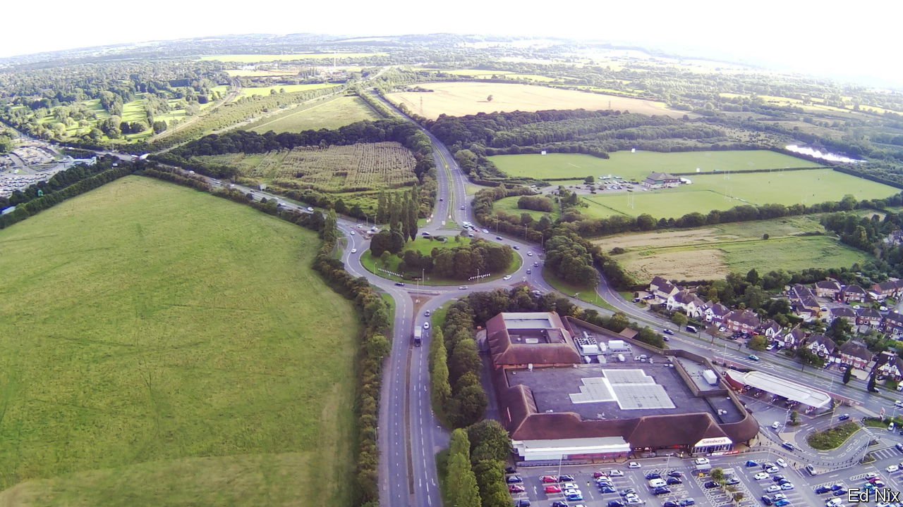

###### England’s green belt

# Britain should scrap its green belt 

##### It has a stranglehold over the economy and protects the wrong bits of land 

 

> Aug 17th 2023 

FOOD RATIONING is over. People can swear on the BBC. Homosexuality is legal. Thank goodness Britain has left behind the dreary restrictions of the 1950s. Yet the —16 rings around English cities dreamed up 70 years ago—not only persists but is growing. The belt doubled in size in the 1980s. Last year it grew by another 24,000 hectares, or 1.5%. The green belt was never meant to swallow up so much land, yet today makes up 12.6% of England. Another quarter is protected by national parks or other designations.

In its own terms the belt has been wildly effective.  do not sprawl. Just 9% of the country’s land is —meaning that it is hardly the concrete jungle of popular imagination. These days the government says one point is to spur investment in cities. The green belt certainly makes city life more expensive. By one estimate, house prices in the south-east would be around a quarter cheaper without it. The policy remains terrifically popular. It summons up images of William Blake’s “green and pleasant land”, a place of natural beauty and abundant wildlife. Who could object to that? 

The answer is anybody who would swap the 1950s for the 21st century. Despite its name, the green belt is not especially verdant: 7% of it is built-up land that happens to be designated as green belt and only a sliver is open for recreation. Two-thirds is for farming. The country’s remaining gaps of undeveloped land where houses, reservoirs or other infrastructure can be built are ever harder to find. 

That helps explain chronic housing shortages inside cities, especially in productive places like Cambridge, London and Oxford. London, lacking brownfield sites, builds less than half of the 85,000 new homes it needs each year. In the countryside the belt leads developers to “leapfrog”, putting up housing for commuters farther away from the cities where the jobs are. The result is urban scattering instead of sprawl, with less agglomeration and a jammed-up labour market. Because many such places lack good public transport, residents spend more time in their cars, leading to more emissions. By some estimates all this costs about 0.5% of England’s GDP each year.

What can be done? Ideally, England would scrap the belt. True greenfield land—the sort the public treasures—could be just as well protected by designating more of it as national parks, or areas of outstanding natural beauty or special scientific interest and the like. More of the rest would then be open for development. Building on green-belt land within 800 metres of railway stations, for example, would provide plots for 850,000 homes. Giving up just 10% of the green belt would provide land for 5m homes. Boldest of all, England could plan whole new towns, just as it once did with Milton Keynes and Welwyn Garden City. 

Unfortunately, even politicians who acknowledge that the green belt has a stranglehold over the most productive parts of the economy are unlikely to make such a radical case. Few even dare lay the foundations for reform by challenging popular misconceptions about the green belt’s true value. 

Taboo or not taboo, that is the question

Even so, planning is likely to come up in the next election. The Conservatives, stung by their struggles to reform it in the past 13 years, say that building should mostly be on cities’ brownfield sites. They would make it even harder to release green-belt land. To its credit, the Labour Party has said it would “take on the taboo” on the green belt. It claims that a lack of supply, notably of land, explains why British housing is shoddy and costly: developers don’t compete to sell the best homes because desperate buyers will take anything available. Sir Keir Starmer has yet to put flesh on his party’s plans for the belt once in government. But if he wants to preside over a stronger economy, one obvious measure would be to cut the green leash that holds it back. ■

