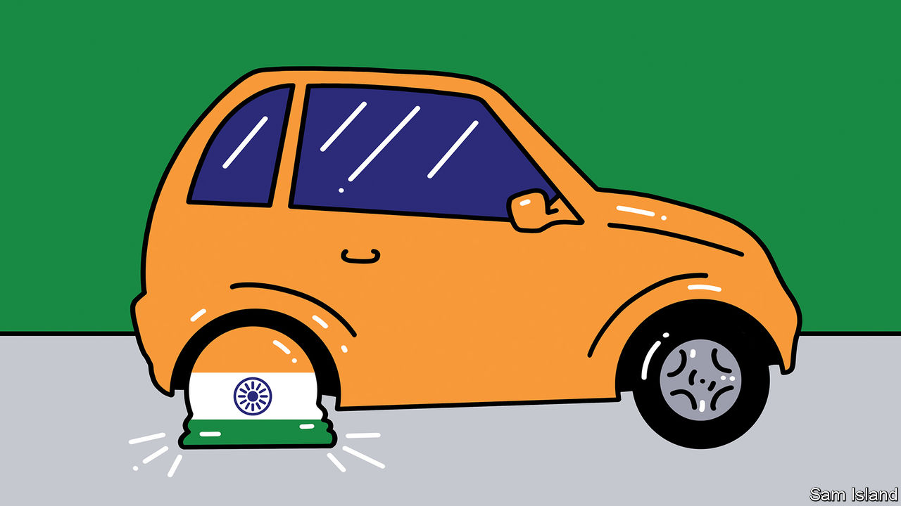
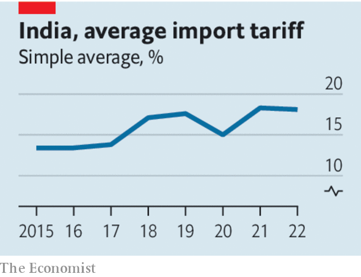

###### Beware the Licence Raj

# To reach its economic potential, India must abandon protectionism 

##### High tariffs and licensing do not help development—they hurt it 

 

> Aug 17th 2023 

It is not hard to see what enthuses the many evangelists for India’s economy. Western companies are investing handsomely in the country as they diversify their supply chains away from China. So indispensable is India to America that their two governments say they are “among the closest partners in the world”, even as India guzzles cheap Russian oil and attends anti-Western . In a greying Asia, India’s population—which this year became the world’s largest—stands out for its youth. Recently the country discovered reserves of lithium, a metal that is crucial to making batteries. Surveys of purchasing managers suggest the economy is growing at its fastest pace for 13 years, even as China slows. Yet for all this potential, India has an enormous handicap: its suspicion of imports, which is only getting worse as the rest of the world turns away from free trade. 

 


India has a long tradition of protectionism, but in the 1990s and 2000s it opened up. It slashed its average tariff from over 80% in 1990 to about 13% in 2008. Then in 2014 the prime minister, Narendra Modi, came to power and launched the “Make in India” campaign. Tariffs began to rise. Today they average about 18%, well above those of peers like Indonesia and Thailand. Recently, like other big economies, India has thrown cash at semiconductors: central-government spending on just one Micron assembly facility equals a quarter of its entire annual budget for higher education. The latest trade-busting measure, announced on August 3rd, would require Indian companies to get a licence before they could import personal computers or tablets.

India’s government is convinced that reducing imports is necessary for its security and creating manufacturing jobs, and especially hopes to . Like America, it views China with suspicion, given its border disputes with the country. But it also envies China’s decades-long high economic growth, which many Indian policymakers think was achieved with state-led mercantilism.

Yet India’s strategy is not working. In 2022 value added in manufacturing accounted for 13.3% of India’s GDP, down from 15.6% in 2015 and the lowest since 1967; a scheme to produce mobile phones locally seems mainly to have attracted low-value assembly work. In part this is because India is drawing the wrong lessons from China, which developed rapidly by becoming integrated in manufacturers’ global supply chains—a process that tariffs inhibit. China has never been as suspicious of global commerce as India, which has declined to join either of the two big Asian trade deals struck in the past decade. 

In any case, China’s crisis-struck economy is starting to  of state capitalism. A better example to follow is South Korea, which developed rapidly after 1970. It subsidised manufacturing exports but more often aimed for international competitiveness rather than self-sufficiency. It realised that restricting the inflow of capital goods is counter-productive, because importing the best inputs would benefit its manufacturers. One reason India’s computer protectionism will prove self-defeating is that the country’s IT services firms, which account for about a quarter of its exports, need lots of processing power. 

Before the reforms of the 1990s India was known for its “Licence Raj”. This imposed rules that made it impossible to get anything done without government permission, creating a class of favoured insiders who knew how to work the system. If India returns to those bad old days rather than opening up, then it will fail to take advantage of its moment of economic opportunity and its 1.4bn people will pay the price. ■

