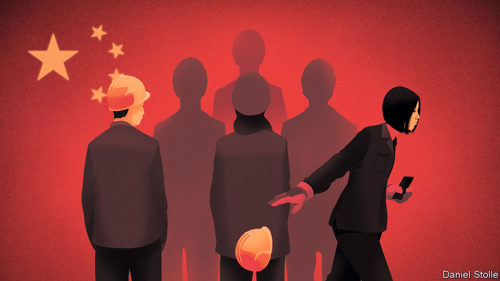

###### The danger of letting it rot

# Why are China’s young people so disillusioned? 

##### Xi Jinping wants them to focus on the party’s goals. Many cannot see why they should 

 

> Aug 17th 2023 

THE CROWD did not seem excited to see George Michael and Andrew Ridgeley. When Wham! became the first Western pop group to perform in Communist China, the audience was instructed to stay in their seats. It was 1985 and, despite appearances, the young people in attendance were in fact joyous. The country around them was by no means free, but it was starting to reform and open up. Over the next three decades the economy would grow at a rapid pace, producing new opportunities. An increasing number of Chinese travelled and studied abroad. Even the Communist Party showed signs of relaxing (a bit). Those brought up during this period had high hopes for the future.

Today, reality is falling short of expectations. A dark cloud hangs over Chinese born in the 1990s and 2000s. Since  won power in 2012, the government has grown more  and society less vibrant. Censors have turned the internet into a drearier place, while letting nationalist trolls drum in the state’s talking-points. At university students must grapple with Mr Xi’s forbidding personal ideology. Worst of all for some, China’s economy is . The unemployment rate for those aged 16 to 24 in cities is over 21%—a number so disheartening that earlier this month the government stopped publishing the data, pending a review.

For our  this week, we talked to young Chinese men and women about how they feel. Plenty still have faith in the party and support Mr Xi’s calls to make China strong. But many are suffering a deep sense of angst. University graduates are finding that the skills they spent years learning are not the ones employers want. Scarce jobs and punishing property prices have dashed their hopes of buying a home and starting a family. We scraped social media and found that the mood is growing darker. Disillusioned youth talk of  (lying flat) and  (letting it rot), synonyms for giving up.

China is hardly the only country where young people are gloomy. Nearly half of Americans aged 18 to 34 say they lack confidence in the future. When Chinese lie flat, Americans “quiet quit”. Perhaps Gen Z and millennials the world over have a tendency to mope. Yet in China, where some 360m people are between the ages of 16 and 35, something more serious seems to be happening. The ladder to a better life is being lifted away. In response, many are choosing to abandon the rat race and turn inwards. For a country that Mr Xi promises to mould into a great power by mid-century, their ennui raises profound questions.

One is whether their malaise carries political risks. Frustrated young folk jolted China in the past, notably in 1989, when students converged on Tiananmen Square to demand more freedom and less corruption. Last year, fed up with the government’s harsh covid-19 controls, young people gathered in cities across China. Some called for Mr Xi and the party to relinquish power. 

Nobody can rule out the possibility of more unrest. But last year’s protests were small and our reporting suggests that China’s young are not bursting with revolutionary fervour. They have grown up with an internet bounded by the great firewall, limiting their access to uncensored news and information. Brought up on propaganda about the party’s accomplishments, many continue to support it wholeheartedly. Even hip young urbanites say the government ought to limit some freedoms.

The real question the party faces is more prosaic: not the threat of revolution, but a quiet rejection of its ambitions. In order to accomplish his goal of restoring China’s greatness, Mr Xi needs the young to get married, have children and reverse the country’s demographic decline. In order to refocus the economy on manufacturing and away from consumer-internet technology, he’d like them to study hard sciences, not dream of designing video games. And he wants more youngsters to work in factories, including the type that might produce weapons for China’s growing armed forces. “Endure hardships” and “eat bitterness”, Mr Xi tells the young. Many cannot see why they should.

The party is mindful of their disenchantment. Policymakers have taken steps to curb speculation in the property market in hope of bringing down prices. Firms have been pressed to treat their overworked young employees better. Under the banner of “common prosperity”, Mr Xi has aimed to increase social mobility and reduce inequality. But much of this has backfired. In going after property developers, tech firms and the tutoring industry, he has harmed new graduates’ most reliable employers.

That leads to the biggest question of all. China’s leaders are fond of contrasting their one-party rule with what they tell their people is a flawed and dysfunctional West, a view stoked but not wholly fabricated by the official media. The unhappiness of young people sets the strengths and weaknesses of each system in clear relief. It is not a comparison that favours China.

Dropouts in America have alternatives to pursue. The country offers many routes to a fulfilling life. An ambitious few have even been able to harness their dissent to create great art, music or a multi-billion-dollar company. Mr Xi would like young Chinese to find enlightenment in their hardship, too, but not that sort. Advance comes exclusively through the Communist Party. China’s artists are yoked to its message. Having been branded as the party’s rivals, tech entrepreneurs have been humiliated.

A small but growing number of well-educated, high-potential young Chinese seem likely to abandon their country. Politicians in America and the wider West often say they are on the side of ordinary Chinese. They could prove it by ensuring Western universities and economies welcome young people who feel that their opportunities at home are limited.

Let them dream

However, most young Chinese will stay at home. When Mr Xi plays down their individual aspirations in favour of the collective interest, he adds to their gloom. He also ignores the role that dreams and choices in their hundreds of millions played in fuelling China’s four decades of growth. The party needs to offer its disenchanted young new paths to peaceful prosperity. The alternatives, including the stoking of angry, militaristic nationalism, would pose a threat to China and the world. ■


