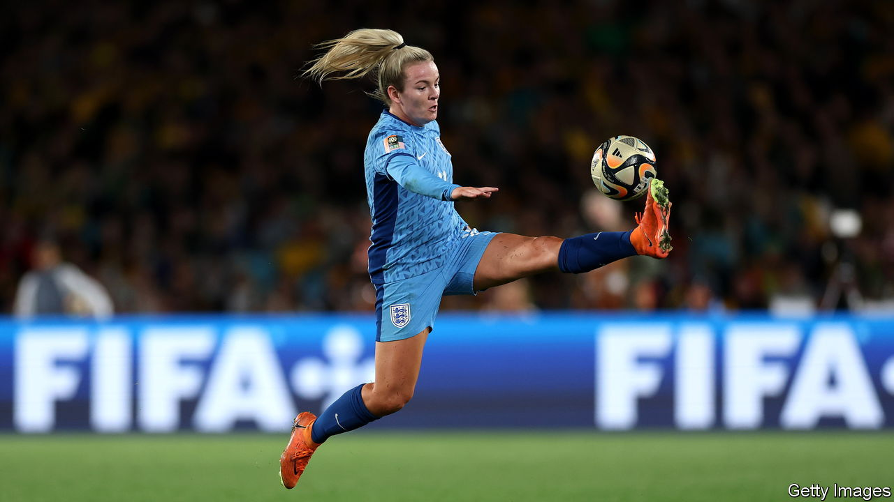

###### Substitution required

# Why sex differences matter in football 

##### Women are not simply men with long hair, even on the pitch 

 

> Aug 16th 2023 

For half a century, between 1921 and 1971, the Football Association, which governs the sport in England, forbade women from playing on FA-affiliated pitches. “The game”, it opined, “is quite unsuitable for females.” 

Tell that to the fans. The women’s World Cup, held this year in Australia and New Zealand, is gearing up for a final on August 20th between Spain and England, the reigning European champions. So far, more than 1.8m tickets have been sold, breaking the previous record of 1.3m in Canada in 2015. The television audience is likely to be double the previous record of 1bn. The level of play is higher across the board. 

The struggle for women’s football to be taken seriously has, so far, meant fighting for equality with the men’s game. In terms of money and exposure, it still has a long way to go. Although women’s prize money has more than tripled since the previous , it is still only 25% of men’s hauls. The disparity in club wages is cavernous. One reason is that women’s sport in general accounted for just 13% of TV sports coverage in Britain in 2022, and 5% in America in 2019.

But on the field itself, football is scrupulously equal. Women play on the same-size pitch, with the same-size ball and the same rules as men. And yet in sport that sort of equality .

Feminists have long argued, correctly, that women are not just men with long hair. The unthinking assumption that men are the “default human” means that everything from drugs and smartphones to stab vests and airbags has been  in ways that are inconvenient or dangerous for their female users. 

Similar arguments apply to many sports, an irony given that they are the reason why women’s sport even exists as a separate category. Women’s bodies are smaller, on average, than men’s, even among elite athletes. One paper calculates that a pitch scaled for them would be two-thirds as big as it is now. Goals would be slightly smaller and the ball would be smaller and lighter. Expecting women to play on the same-size pitch as men, the researchers point out, means asking them to play a game that is different from the one the men play—and harder. 


Another worry is the risk of injury. Until recently, making a women’s football boot meant little more than taking a men’s one and colouring it pink. Never mind the different shape and structure of women’s feet. Never mind that studs designed for a man’s weight might provide too much grip for a lighter woman. And never mind how that might increase the risk of knee injuries, to which women seem more prone. But it is not just knees. A 2018 study found that repeatedly heading a football seemed to harm women’s brains more than men’s. Having seen  among American football and rugby players, the sport’s authorities have a duty to consider using a lighter ball. 

Admittedly, such changes would be controversial. When World Rugby, the international governing body for rugby union, decided to test a smaller ball designed for women’s smaller hands, players were split. Some welcomed the removal of what they saw as a handicap. Others worried that anything which looked like a concession risked undermining the prestige of the women’s game. 

That is a real risk, but it can be overstated. Plenty of other sports accommodate the physical differences between the sexes. In athletics, women’s hurdles are lower and discuses are lighter. Basketball uses a smaller ball; volleyball a lower net. Men and women should be treated equally in sport as in any other walk of life. But they are not physically the same, and it does no one any favours to pretend that they are. ■

