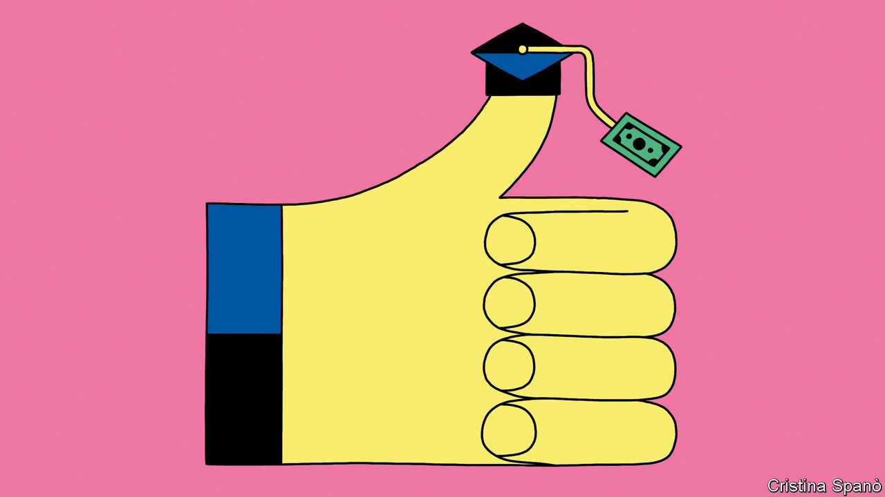
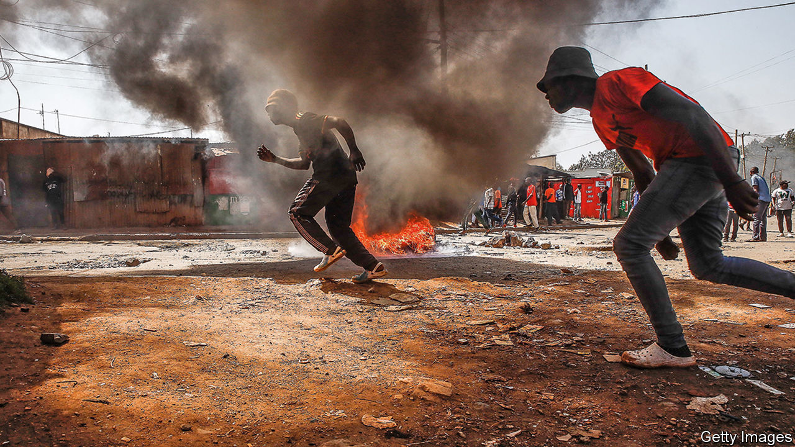

###### On college costs, climate change, our double issue, ice cream, dragons on flags, harsh critics

# Letters to the editor 

##### A selection of correspondence 

 

> Aug 17th 2023 


Paying for college

“” (July 29th) correctly notes that the college-affordability crisis in America is at least partly illusory because so few students pay full price. You suggest that this gap exists so that colleges can play Robin Hood, charging full price to the rich and less to the poor. Elite universities have the market power to do this, but the typical college does not. They have more openings than qualified applicants to fill them. 

Because non-profit colleges want the best students they can get (for rankings and other reasons), most give the biggest discounts to the best students. Because the best students so often come from rich families, the result isn’t much like Robin Hood at all. It is true, as you say, that college is not necessarily too expensive on average, but some students nevertheless pay a king’s ransom to attend colleges for which they are only marginally qualified. 

Unlimited federal loans make this possible. Unaccountable schools take the money, students and families suffer the consequences, and soon it seems taxpayers will foot the bill.

Dan Currell

Deputy under-secretary, US Department of Education, 2018-21


 


Reducing methane

Your otherwise excellent story on heatwaves jumps too quickly to the possible need for solar geoengineering to cool the planet quickly (“”, July 22nd). In terms of slower warming, our research shows that the best strategy over the next two decades is to cut methane, a super climate pollutant, which can avoid warming of up to nearly 0.3° Celsius by the 2040s. The International Energy Agency finds that the methane which leaks from oil and gas production could be reduced by 75% at no or low cost. A mandatory agreement to cut methane, starting with the oil and gas sectors, should be a priority at the next global climate negotiation in the United Arab Emirates in December.

Durwood Zaelke

President

Gabrielle Dreyfus

Chief scientist

Institute for Governance and Sustainable Development

 

 


The real obstacle to cities responding effectively to soaring temperatures is money (“”, July 22nd). It is often thought that cities are well resourced, but the reality is different. Only 11% of international funds for climate change go to cities. This is where city-resilience bonds could make a large difference. Through these bonds a city government or agency could raise money from capital debt markets for investment in building resilience. This instrument has been used to deal with a range of problems that cities face. For instance, America’s Federal Reserve pledged to buy up to $500bn in municipal bonds from small and medium-sized cities to finance their fight against covid-19. 

In many developing countries with huge urban populations and extensive exposure to climate change, like Bangladesh and India, there are no major administrative or legal barriers preventing cities from issuing bonds. In a recent survey of major cities in India, 60% were found to be creditworthy. City bonds would help cities tackle climate change.

Dr Aditya Bahadur

Principal researcher 

International Institute for Environment and Development


Double trouble

As a consumer of the audio edition, I noticed the run time for your summer “double” issue to be eight hours and 55 minutes (). That compares with nine hours and 14 minutes the previous week and seven hours and 35 minutes the week before that. Given ’s well-earned reputation for factual rigour, might I humbly suggest that a renaming of the “double” issue is in order?

Matt Mauro


 


Innovative ice cream

Speaking of avant-garde ice-cream flavours (“”, July 15th), I recall past garlic festivals held annually in July in Gilroy, California, that served garlic ice cream. The event is no longer held.

MARSHAL ALAN PHILLIPS

H

Fantastic beasts

The dragon on the flag of Wales may be “badass”, but it is not unique (, July 15th). The national flag of Bhutan features a white dragon, as does the flag of Moscow (although the dragon is pictured losing a fight to St George, so not so badass). Mythological creatures, badass and otherwise, can also be found on the flags of Atlanta (a phoenix), Tuscany (a pegasus) and the Pomeranian Voivodeship in Poland (a griffin).

The traditional flag of Tibet depicted two , or snow lions, creatures so powerful that their roar can cause dragons to fall from the sky. Now that’s badass.

Danny Bowles


 


Critics circle

Look at the demand side to understand the transition from the harsh tone of Victorian book reviews to today’s fawning in the literary pages (“”, July 29th). In the 19th century literature was a mass entertainment, lowbrow and highbrow alike, and written to be read. It aspired to sell, and needed connoisseurs to write reviews to help consumers navigate the shelves. Reviews contributed to efficiency and were compensated. 

The book market has changed. Most of today’s books are often too lowbrow to be reviewed by serious publications. (How many Harry Potter books did  review?) As for the highbrow stuff, literary prizes drive sales in that market. Book reviews in academic journals are risk-free and not informative, intended for tenure committees. 

Mass entertainment is now dominated by film and television, where even highbrow productions are made to be watched and expect to make money. The critics are not getting less cruel, they just get paid for reviews in other mediums; you can still find harsh reviews aplenty. 

Yoav Sivan


The most devastating hatchet job that I have come across is Q.D. Leavis’s article published in , a quarterly periodical, in 1937. In the article she demolished Dorothy Sayers’s reputation as a novelist, describing Sayers as “a combination of literary glibness and spiritual illiteracy”. 

H.P. Davis


It’s hard to beat Truman Capote’s take on Jack Kerouac: “That’s not writing, that’s typing”. But Randall Jarrell did just that, opining that a book by Oscar Williams “gave the impression of having been written on a typewriter by a typewriter”. 

I’m not sure how Kerouac reacted, but Williams—who was a prolific anthologiser—then proceeded to leave any and all of Jarrell’s poetry out of his editions. Touche!

David Perry


I despair wading through eulogising prose. Is “profound” a euphemism for “pretentious and turgid”? Does “thought-provoking” mean “I couldn’t follow it”? 

For a review to be useful one wants the negative as well as the positive, and there is a place for the brutal. My favourite film review ended with this line: “If you watch this movie the sequel will be your fault.”

Simon Garrett


