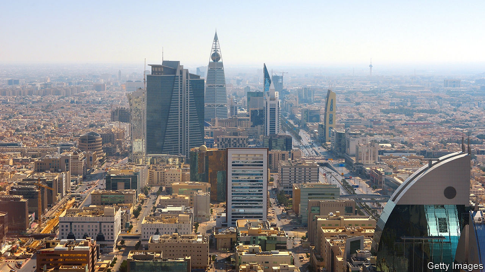

###### Zeal estate

# Dubai and Riyadh are both riding property booms 

##### The question, for developers and investors, is how long they can last 

 

> Aug 17th 2023 

IT IS a villa fit for a Bond villain. Sited in Emirates Hills, an opulent Dubai neighbourhood popular with politicians and billionaires, the mansion’s interior is lined with 700,000 sheets of gold leaf. It sports a 24-carat gold jacuzzi, a 16-car garage and a coral-reef aquarium in the dining room. The asking price, when it was listed in June, was 750m dirhams ($204m).

The mansion is one example of a red-hot property market in Dubai, the commercial hub of the United Arab Emirates (UAE). Prices are also soaring in Riyadh, the Saudi capital. Both logged double-digit price increases last year, when much of the rich world was in a housing slump. Developers are thrilled. But investors are wondering how long the boom can continue.

In Dubai, property investment accounts for around 8% of GDP. It recorded nearly 122,700 sales last year, a 45% increase from 2021. The value of those transactions rose by 78%, fuelled in part by surging sales of luxury homes. In 2022, 219 properties went for over $10m. There were 176 such deals in the first half of 2023 alone. 

Brokers are racking up records for the most expensive residential sale in Dubai. Last year they closed on villas for $76m and $82m. In February a penthouse went for $112m; three months later, another fetched $114m. On Jumeirah Bay Island, an artificial island shaped like a seahorse, someone recently paid $34m for an empty plot of sand.

Authorities think the city will continue to draw rich buyers from Asia and Russia and are eager to build more posh homes. In May they announced plans to develop Palm Jebel Ali, a bigger version of the city’s Palm Jumeirah. The development had been on hold since the property-market crash of 2009. Developers are reviving another artificial-island project further north.

The boom looks different in Riyadh, which has been a focus of Vision 2030, the kingdom’s plan to diversify its economy away from oil. Saudi citizens are moving there to find jobs and multinational firms have been told to move their regional headquarters to Riyadh by the end of the year or lose out on government contracts.

Soaring demand means soaring prices. At the end of the first quarter of 2023 prices in Riyadh, where state-run developers are adding thousands of new homes, were up by 12% year-on-year for villas and by 22% for apartments, estimates Knight Frank, an estate agent. The comparable figures in Jeddah, the kingdom’s second city and commercial capital, were 2% and 7%.

In 2017 less than half of Saudis were homeowners. Young people lived with their parents; poorer families rented. In recent years the government has lowered mortgage-deposit requirements and introduced various subsidies. The latest census, in 2022, found that 61% of Saudi families owned homes. Unlike many other targets in Vision 2030, the kingdom seems on track to meet its goal of 70% home ownership by the end of the decade.

This fits a broader boom-time feeling in a Gulf buoyed by high oil prices. But brokers think prices in both cities will fall next year. The Saudi market is already slowing. Some 70,000 homes were sold in the first half of this year, down from 103,000 last year. New mortgages fell by 35%.

That probably reflects rising interest rates: because the Saudi riyal is pegged to the dollar, the central bank has been forced to follow the Fed. It also reflects a yawning gap between price and wage growth. The average monthly income for Saudi citizens in the first quarter of 2023 was 9,893 riyals ($2,637), almost unchanged from a year earlier—and 4% lower than in 2019.

In Dubai the residential market has zoomed away from the underlying economy. Commercial property is in a seven-year slump. Many of the emirate’s malls are dotted with vacant shopfronts. Residential rents have soared over the past year, but remain far below their previous peak in 2016. Still, middle-class professionals are grumbling; salaries have not kept pace.

Luxury home sales are a nice fillip for Dubai’s treasury, which collects a 4% transaction tax. But prospective buyers are limited—and since many of them do not live in the city full-time, the luxury market may do little to boost the broader economy.

In January authorities demolished the Pearl, a $10bn project that was meant to contain almost 1,500 apartments and seven five-star hotels. It was never finished. Surprised locals thought the demolition was an earthquake. It was a reminder of past excesses—at a time of new ones. ■

