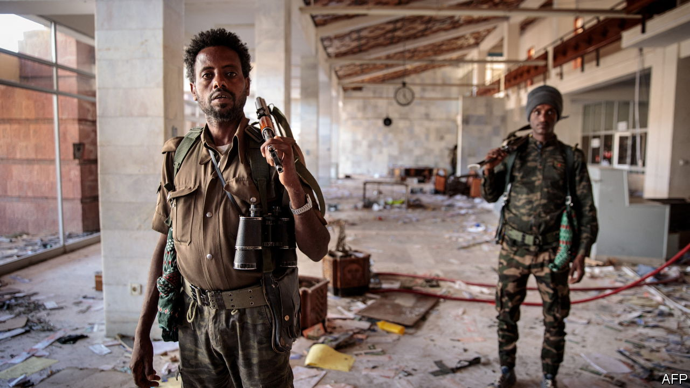
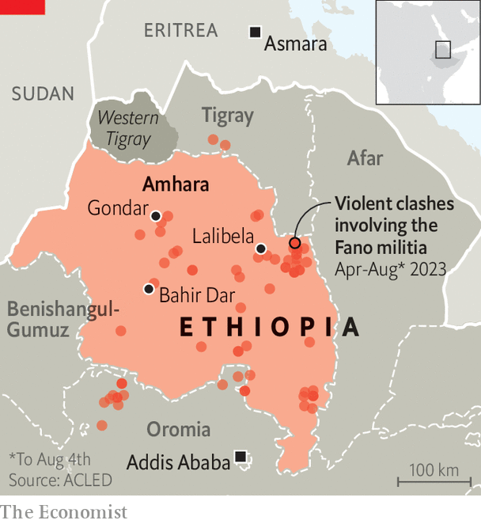

###### The Horn of Africa

# Ethiopia risks sliding into another civil war 

##### Ethnic tensions and land conflicts lie behind the clashes in Amhara 

 

> Aug 15th 2023 

The sight of tanks rolling through towns as armed drones circle in the sky was supposed to be history. Nine months after a formal end to Ethiopia’s civil war, many had hoped the country was inching back towards stability. Anxious to turn the page on a conflict that caused hundreds of thousands of deaths and shredded his reputation as a Nobel-prizewinning peacemaker, Abiy Ahmed, the prime minister, had his sights set on reaching deals with the IMF and the World Bank to rescue the war-wrecked economy. 

But even as calm has been mostly restored to , the northern region at the centre of Ethiopia’s two-year war, heavy fighting has spread across Amhara, a neighbouring region that is home to the country’s second-largest ethnic group. In early August, Amhara militias known as Fano swept into towns and cities, briefly taking over several of them. They attacked police stations and garrisons, freed prisoners and intermittently took control of the airport of Lalibela, Ethiopia’s most popular tourist town. Local officials fled. The government responded by sending in the army, shutting down the internet across the region and declaring a state of emergency. 

 


By August 9th the army appeared to have regained the upper hand against the rebels, forcing the Fano from Bahir Dar, the regional capital, Gondar and several smaller towns (see map). A number of civilians have been injured or killed, some of them in a drone strike on August 13th. “We buried 22 people,” says a resident of Bahir Dar, adding that they were unarmed youths. Lawyers and activists estimate that possibly thousands of Amharas have been detained in Addis Ababa, the national capital. On August 4th the police arrested an outspoken Amhara opposition MP. 

Even if the Amhara rebellion is in retreat, the escalation in violence is a reminder of how precarious the federal government’s hold is over a bitterly divided country. It also highlights the flaws of the narrow peace deal that ended the fighting in Tigray, but failed to address Ethiopia’s many other conflicts. Swathes of Oromia, the region with the largest population, have been wracked by insurgency since 2019. The government’s belated attempts at peace talks there have made little progress.

The crisis in Amhara, though, is particularly dangerous. When it went to war in 2020 against the Tigrayan People’s Liberation Front (TPLF), the party that has run Tigray for three decades, the federal army relied heavily on support from Fano militiamen as well as the Amhara region’s own paramilitary forces. In exchange, Abiy allowed them to seize contested territories from Tigray. Amhara forces were given most of a fertile area officially known as Western Tigray, where they carried out a ferocious campaign of ethnic cleansing. Over the course of the war, Amhara paramilitaries and Fano fighters evicted or killed hundreds of thousands of ethnic Tigrayans. Later, much of Amhara was invaded by Tigrayan forces, who looted hospitals and murdered civilians in revenge. Angry locals accused Abiy’s government of doing too little to protect them.

Since the peace deal signed last November by the TPLF and Abiy’s government, Amharas have grown ever more worried about their hold on the disputed territories. According to the agreement, the status of the contested areas is to be resolved “in accordance with the constitution”. Many Amharas believe this means that Abiy plans to hand them back to Tigray. Such fears were heightened in April when the federal government launched a campaign to disarm the regional forces. Protests and gun battles swiftly engulfed Amhara. On April 27th the head of the ruling party in the region was assassinated. 

Having prevailed against the TPLF, Abiy may feel confident he can make short work of the Fano. The Tigrayans, who dominated the federal government from 1991 until Abiy ousted them in 2018, boasted a highly organised regional militia as well as lots of heavy weaponry. The Fano have neither. “What you see are local loyalties to local leaders who organise their own forces,” notes a foreign researcher. 

Nonetheless, unrest in Amhara would be difficult to stanch. Amharas ruled the roost under Ethiopia’s last emperor, Haile Selassie, and under the Derg, the Marxist military regime that deposed him in 1974. They continue to be well represented in the federal bureaucracy, national army and media, though this influence is diminishing. Under Abiy the federal government and security apparatus have become increasingly dominated by Oromos, the country’s largest ethnic group. 

Still, Amharas are about 25% of the population, compared with the 6% who are Tigrayan. “Fighting the Amharas is not like fighting the TPLF,” notes an Ethiopian analyst. “Amharas are everywhere.” Western diplomats also reckon the Fano may have the backing of neighbouring Eritrea, whose forces fought alongside Abiy’s in Tigray. Since he made peace with the TPLF, Abiy is believed to have fallen out with Eritrea’s secretive dictator, Issaias Afwerki. “I don’t think the Fano would act this way without some encouragement from Eritrea,” says one diplomat. 

Underlying the discontent in Amhara is widespread insecurity. Politicians there claim that Amharas have been the victims of a “genocidal” campaign ever since they were dethroned by the Tigrayans in 1991. In recent years Amharas living as minorities in other regions have often been the target of ethnic attacks. The Amhara Association of America, an advocacy group, documented more than 3,300 killings in 2021 alone, most of them in Oromia. Many blame the federal constitution that came into force in 1995 for the current conflict because it enshrined ethnicity as the central feature of Ethiopian politics.

Like Oromia, much of Amhara is becoming ungovernable. Abductions and killings are rampant. Local police and officials are often more loyal to the Fano than to the federal government. Droves of young men are reported to be joining the rebels. “We will continue to fight,” says one in Bahir Dar. “We just need guns.” ■

