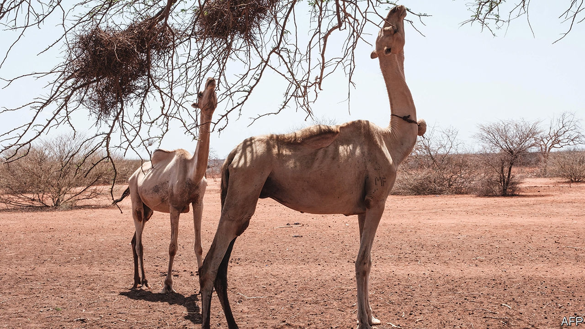

###### Scrambled skies

# Herders and farmers seek reasons for east Africa’s drought 

##### Was it climate change, conflict, or the wrath of God? 

 

> Aug 17th 2023 

Afew years ago, before the great drought, Molu Golbowa looked into a goat’s intestines and foresaw the disaster to come. Some of his neighbours listened and sold their animals while they could. Others scorned his predictions. The old ways were idolatry, said a local sheikh.

And then the rains failed for five seasons in a row. The plains of northern Kenya turned to dust, swept by a scudding wind. Animals dropped dead from hunger and disease. What was the cause? “God knows,” says Huri Mahabolle, a herder who lost all but 14 of his 150 goats.

Only half of Africans have heard of climate change, according to surveys by Afrobarometer, a pollster. That is not to say they are unaware of it. The signs are everywhere. The drought in the Horn of Africa that began in 2020 and is only now easing has claimed tens of thousands of lives. 

But in Marsabit county few people talk about greenhouse gases. At a women’s group, Shuke Guyo suggests that God is punishing people for fighting over pasture and water. When feuding clans made peace this year, the rains returned. Only one of her friends, clutching a smartphone, deems carbon emissions a likelier cause.

This is not politically charged climate scepticism, of the kind familiar in the West. Instead, locals treat anthropogenic climate change as just one more possibility in a world where indigenous beliefs, Abrahamic faiths and modern education coexist. Elders recall a time when they would pray to traditional gods and the rain would fall so fast that it would “wash away the footprints that brought you there”. Such rituals have been fading for decades under the influence of wandering preachers, some from as far away as Saudi Arabia or Ethiopia, who have brought sterner varieties of Islam and Christianity. Just as important in eroding the old ways are schools and the internet. Young people would rather read social media than the stars.

Yet these religions also offer supernatural explanations. In February William Ruto, Kenya’s president and an evangelical Christian, called for God “to send us the rain” in a national day of prayer against drought. There is nothing peculiarly African about this outlook. One in ten Americans say climate change is not a serious problem because God is in control. 

Studies in various African countries find that people blame changing weather patterns on local deforestation, divine will or even, on the picturesque island of Zanzibar, the deplorable sins committed by foreign tourists. Farmers in northern Ghana, for instance, point to the erosion of traditional values: trees are being felled with abandon and people no longer pour libations to the ancestors and gods.

In Marsabit locals listen for the radio weather forecast and for the warnings of soothsayers, without fully trusting either. They complain that meteorologists predicted another failed season in April, which instead brought plentiful rains. Among a group of elders who have gathered to play , a board game, there is talk that the respite is only temporary. They have heard from a man who can dream the future. He says conflict and drought will return. ■


