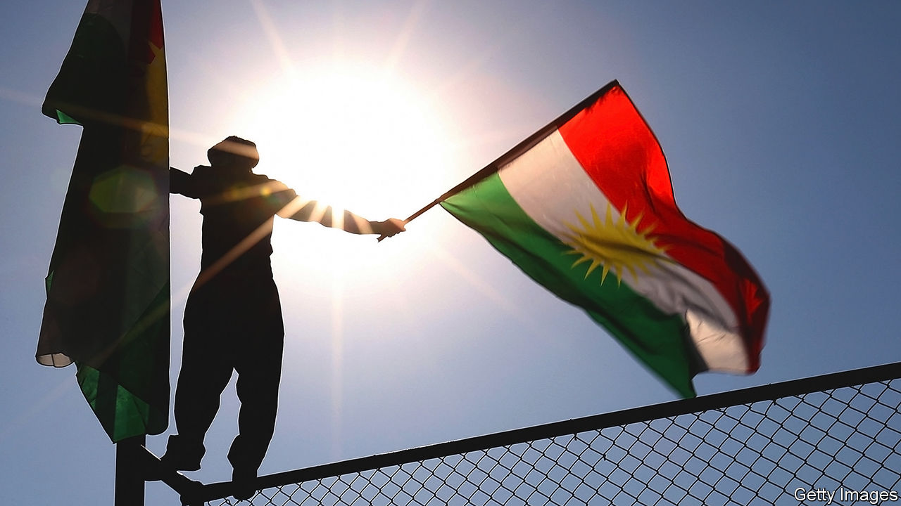
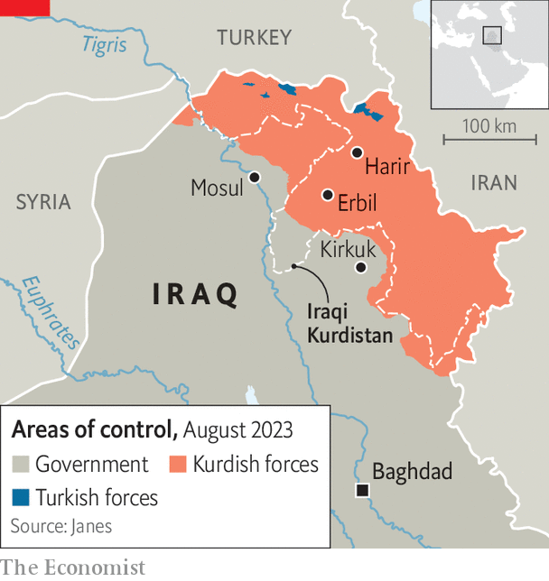

###### Divided they fall

# The Kurds’ dreams of independence look farther off than ever 

##### As the Kurds bicker, Iraq’s federal government is regaining control 

 

> Aug 17th 2023 

For three decades Kurdistan boomed while the rest of Iraq sputtered. The region had the country’s fastest economic growth. It built modern oil complexes, hotels and motorways. With a vote in favour of independence in a referendum in 2017, its future looked bright. Six years on that dream has faded. The cranes that rotated above sprawling conurbations are parked over half-finished estates. And as Iraq’s capital, Baghdad, rebounds thanks to improved security and oil revenues, its rulers are chipping away at Kurdistan’s autonomy. After 30 years of self-government, the Kurds’ economy, borders, disputed territories and politics are largely back under central control. The Kurdish Regional Government (krg) is losing strength, says a Western diplomat monitoring developments from Baghdad: “There’s a risk that the Kurdistan project will fail.”

The Kurds largely have themselves to blame. Squabbling between their two feudal families—the Barzanis who rule the west and the Talabanis in the east—has intensified. Since 2017 their leaders have transferred power to brasher sons with clashing personalities. Their parties—the Barzanis’ Kurdistan Democratic Party (KDP) and the Talabanis’ Patriotic Union of Kurdistan (PUK)—fight over diminished resources. Their ministers often vote against each in the cabinet in Baghdad.

 


The puk, the weaker of the two, openly appeals to Baghdad for backing. “Iraq is better than Kurdistan,” says the party’s leader, Bafel Talabani. Despite Western urging, the two parties refuse to unify their separate forces, known to both sides as the Peshmerga. Assassinations of each other’s cadres have resumed. 

The last session of the Kurdish parliament ended in a televised brawl. And as Kurdish disaffection with the infighting grows, their leaders are growing more oppressive. An election set for last year has been delayed until February 2024 at the earliest. Media freedom, once a hallmark of the Kurdish region, has been restricted.

The Iraqi government in Baghdad is taking advantage of this rivalry to claw back the power it lost after the Kurds rose up against Iraq’s old dictator, Saddam Hussein, in 1991. It has started with money. Earlier this year the Supreme Court used an international arbitration ruling in Paris to outlaw Kurdish oil sales, stripping the Kurds of revenues they accrued from selling 450,000 barrels a day. Kurdish salaries now depend on the monthly allowance Baghdad pays the regional government. Kurdish leaders who once shunned Baghdad now troop to the capital to plead for handouts. In his four years as the KRG’s president, Nechirvan Barzani has made ten official visits to Baghdad; his predecessor and uncle, Masoud Barzani, made one in 15 years. Under a new national budget passed in June, any of the krg’s provinces can now seek direct funding from Baghdad. That could tempt the Talabanis to break away from the Barzani-dominated krg and further undermine the region’s unity.

The government in Baghdad is also taking control of the Kurds’ borders. It has stationed guards at the krg’s crossings and airports, in effect giving it a veto over who can get in and out. The Talabanis still pocket the revenues from the influx of cars and from cigarettes smuggled in from Iran—but not for much longer, says an Iraqi official. Turkey’s suspension of oil purchases from Iraq has also cost the Kurds the transit fees they used to earn from such transactions (an international court deemed that Turkey had been importing oil from the KRG without Iraq’s consent and awarded Iraq around $1.5bn in compensation).

To the south, the Iraqi army and its associated Shia militias are consolidating their hold on the disputed territories that they retook from the Kurds after the referendum in 2017. They have since rejigged the demography by encouraging Arabs to settle on land claimed by the Kurds. Were that referendum held today, the Kurds might no longer be a majority.

Most damaging, perhaps, is the Iraqi state’s reassertion of legal supremacy. In May its Supreme Court declared Kurdistan’s decision to postpone elections unconstitutional and ordered the replacement of the Kurdish electoral commission with Iraq’s. Kurdistan is also losing its status as a haven for Iraqi activists on the run. Last year Kurdish security men arrested an Iraqi researcher working for an American think-tank and handed him over to Baghdad. Employers in the KRG’s formal sector now need recruits to get security clearance from the capital.

Culturally Baghdad’s advances are also taking a toll. For three decades the Kurds have promoted their own language and rolled back the old Baathist programme of Arabisation. A generation forgot how to speak Arabic. But it is making a comeback. A Kurdish leader’s son addressed the audience at his graduation ceremony at a local university in Arabic. As ties with Baghdad tighten, Kurdistan’s private sector now requires new hires to speak it, too. And it is back on shop fronts in the Kurds’ capital, Erbil, as an influx of southerners has hoovered up empty property on the cheap. “Arabs are a business opportunity,” says a Kurdish risk consultant. “But also a threat.”

Things fall apart

While the influence of Iraqi Arabs is increasing in Kurdistan, the Kurds’ leverage in the capital is weakening. The pro-Iranian Shia factions that dominate the central government are sidelining Kurdish leaders, along with Iraq’s other minorities, such as Sunni Arabs and Christians. Iraq’s president, a sinecure for a Kurd, has the clout of a puppet, say officials in Baghdad.

Once upon a time the Kurds might have looked to the West for salvation. Western powers created a Kurdish safe haven after the Gulf war of 1991 with a un-approved no-fly zone. But Western interest has been waning, too. The Kurds lost their no-fly zone when America occupied Iraq in 2003. And although the Americans still keep an airbase in Kurdistan at Harir, 65km north of Erbil, the Kurds complain they offer no support when Iran’s Shia proxies lob missiles and drones at them. A vast new American consulate in Erbil is behind schedule. The West’s inertia casts doubt on the alliance’s strength, worries a Kurdish official. 

The Kurds still have some cards to play. They have been making overtures to the Chinese, who are set to build dams, a cement plant and a $5bn real-estate development outside Erbil. The Kurds can also use the threat of large numbers of refugees to rattle the West. A full takeover of Kurdistan by central Iraq could trigger an exodus to Turkey and thence to Europe. 

But most Kurds are despondent: “We’ll just be another province in Iraq,” says an analyst in Erbil. The beacon of independence that shone for some 30m Kurds dispersed across Turkey, Iran and Syria is beginning to fade. ■

