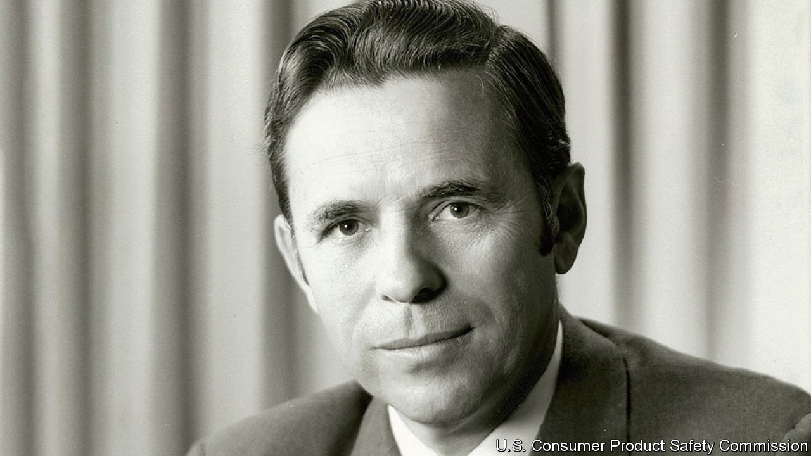

###### Safety first

# Richard Simpson strove to balance buyers against manufacturers 

##### America’s first consumer-product-safety tsar died on July 21st, aged 93 

 

> Aug 17th 2023 

YOU COULD make a good case, back in 1973, that Richard Simpson was the most powerful man in America. President Richard Nixon, who appointed him, could send battalions of young men to Vietnam and order the building of the space shuttle. But Mr Simpson, who was amiable, big-built and had a boyish smile, could order you to unplug your TV antenna immediately from the wall; make you heave your built-in gas cooker out of your kitchen; take Uncle Jack’s flaming lighter away, with which he liked to perform his trick of lighting cigarettes at a distance; and could reduce little Johnny to tears by saying no, he could not have a back step on his tricycle, to give his friends rides. His agency could force mass recalls of faulty products and, if it met resistance, bring in criminal penalties. These, in his soft-spoken way, he called “motivations”. 

He was chairman of the brand-new Consumer Product Safety Commission for only three years, from 1973 to 1976, but in that time his agency was reckoned to have saved Americans from buying 25m dangerous things. Its remit was vast, covering around 11,000 product categories (though not food, drugs, cars, cosmetics, anything radioactive or, for some reason, insecticides). A congressman once told him that he had “life-or-death over whether consumers have anything to consume”. Mr Simpson admitted that he did have a frightening amount of power. It would be all too easy to overstep, but he meant to do good if he could.

Scientifically, for he was an electrical engineer by training, he drew up lists of the most dangerous things, ranked by number of accidents caused per year and the severity of the injuries. Data from hospital emergency rooms showed that, each year, around 700,000 injuries were caused by children’s toys; 500,000 by playground equipment, mostly swings; 150,000 by glass doors and windows, and 140,000 by power lawn-mowers. Human bumbling was a factor, of course. But it did not need to be compounded by products that were likely to pinch your fingers, poison your child, or electrocute you. Those had to be tracked and banned. 

When he came to the agency from the Commerce Department, where he had been doing similar work, he found 50 cases already in train, and jumped right in. His first act was to tell mattress manufacturers that their products had to be resistant to fire, and by his deadline, or else display a label confessing that they didn’t comply. The manufacturers were outraged to be told that, and by a man who had been a manufacturer himself. They were also annoyed when almost all the CPSC’s meetings, rather than being cosy corporate huddles, were thrown open to anyone at all. He took pride in making them transparent as a goldfish bowl. 

In fact, though registered Republican, the new chairman took no sides. His creed was “Hard work and long hours”. He had been brought up in grinding poverty in Missouri, one of nine children. His father was a carpenter, but the family lived on welfare. He was the first in his family to graduate from high school, let alone go on to university, making his way with scholarships and night jobs. Eventually he built up a business making naval electronics that had sales of $4m a year. 

This self-made man was going to run the CPSC as he chose. The agency had been set up anyway by a Democratic Congress, and from the start he proclaimed his independence. Traditionally, at least under Nixon, agencies were staffed with party loyalists. But when the White House said it reserved the right to “chop” unacceptable candidates, he fought back. It would be less than honourable, he told two congressional committees, when he was spending his days resisting capture by manufacturers, to allow his agency to be captured by politicians. He got his way. 

In his first three and a half months on the job, besides the mattress showdown, he also refused to postpone ordering child-resistant packaging for oven-cleaning aerosols; told people to disconnect their Little Wonder TV antennae; urged them to stop using glue which might, just possibly, cause birth defects in future offspring; and had a grand round-up of fireworks before July 4th, including $15,000-worth of firecrackers from a single company. Notable later victories included a fire-proof standard for children’s pyjamas and the finalising of mandatory child-proof rules for pill-bottles. He was wary of getting emotional about injured children, but two of his own, when small and playing “Doctor”, had eaten so many candy-flavoured aspirins that they had ended up in hospital. One victim of the obligatory “press and turn” tops was Nixon himself, who once called in his staff to help him open a pesky bottle of allergy pills. The cap bore presidential tooth-marks, where he had gnawed it in his despair. 

It was cigarettes that eluded Mr Simpson, though they were both unhealthy and a cause of countless fires. He hoped to get most of them banned under the Hazardous Substances Act, by setting a maximum level for tar and nicotine. The surgeon-general had already declared them hazardous, but the tobacco companies claimed to be exempt from both the act and the agency. The second part was true; Mr Simpson could not deal with them. He had to settle for going after makers of butane lighters, which not only produced monster flames but didn’t go out when dropped; and matchbook-makers, telling them it wasn’t good enough to merely put on their products, “Close cover before striking”. 

It was impossible to remove all risk from life, and he didn’t try. Only 15% of product-caused accidents, he reckoned, could be avoided by improved safety codes. He took care to balance that benefit against the cost to manufacturers, as well as to the wider economy in higher prices and lost jobs. On his desk he had a figurine of a boy attempting a hand-stand, and his job felt like that much of the time. But he revelled in it, and when, frustratingly, his term was not extended he felt the agency had probably fulfilled its purpose anyway; safety was now drilled into people’s minds. 

Up to a point. When he relaxed, which was not often, he hunted quail and pheasant, played golf and smoked cigars. Not risk-free, any of that. But it was the sort of risk he approved of. ■

