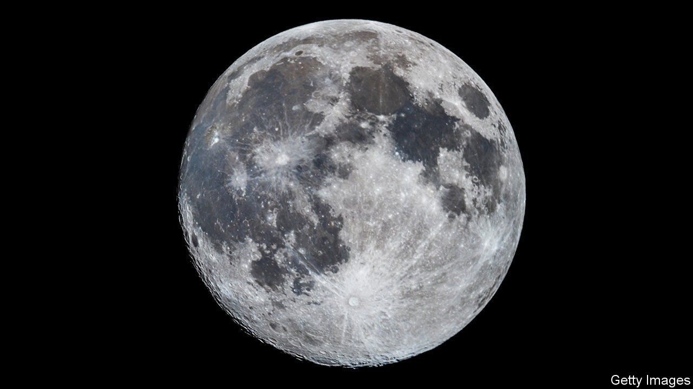

###### The second shall be first

# A pair of Indian and Russian probes approach the Moon 

##### Both are looking for ice; one will mark a spacefaring first 

 

> Aug 16th 2023 

When a calendar month can boast two full Moons, as this August does, the second is customarily called a Blue Moon. When a week boasts two Moon landings, the second is customarily called…well, no one knows; such a one-two punch is not something that has ever happened. But there is a decent chance that the week beginning on August 21st will change that. 

, an  currently orbiting the Moon, blasted off on July 14th. It arrived in orbit around the Moon three weeks later, having taken a fuel-efficient but comparatively slow approach to leaving Earth orbit. It has spent the days since then slowly lowering its orbit towards the tight, circular loop from which the mission’s lander will attempt a touch down on August 23rd.

 headed into space from Vostochony, in Russia’s far East, only on August 10th. But it took a more direct route and entered lunar orbit on August 16th. Its operators plan to get it down on to the Moon’s surface on August 21st, shortly after dawn at its landing site. 

That landing site, like ’s, will be at a much higher lunar latitude than any previous landing, only about 600km from the Moon’s south pole. The region is of interest because there is evidence that there may be water ice below the surface—or even, in a handful of craters close to the pole where the Sun never rises above the horizon, sitting at the surface as frost. A NASA camera on a South Korean orbiter is currently taking pictures of their Stygian depths using a camera so sensitive that it can see the details of landscapes lit only by the light reflected from distant peaks and the stars above. 

Scientists want to understand how and when that ice got into these darknesses in the sky. As the Earth’s ice caps contain records of past events, so may the lunar ice. Proponents of lunar settlement, and space industrialisation, see ice as a source of oxygen, water and rocket propellant. An American mission due to launch in November is aiming to land on the edge of a crater called Malapert, which is much closer to the pole than the Indian and Russian landing sites and contains some of the enigmatic permanently shadowed regions. Researchers in both America and China are looking at Malapert as a possible site for human exploration. 

Successful landings on August 21st and 23rd will be an encouraging omen for such future endeavours. They are not guaranteed. Russia has not run a successful interplanetary mission since the fall of the Soviet Union. Yuri Borisov of Roscosmos, the Russian space agency, has said he thinks  has a 70% chance of success.

India, for its part, may be more confident, in part because of past failure. In September 2019  got to within a couple of kilometres of the lunar surface before something went wrong, and it crashed. Details of quite what went wrong have never been made public, but it seems reasonable to assume that ISRO, the Indian space agency, would have satisfied itself that there will be no repeat. If it succeeds, India will become just the fourth country, after America, the Soviet Union and , to have landed on the Moon. If Russia makes it down, it will be simply repeating achievements its antecedent superpower treated as routine half a century ago. The second landing, if it is the second, will be the true first. ■


