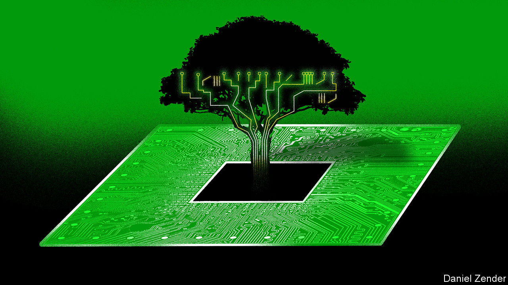
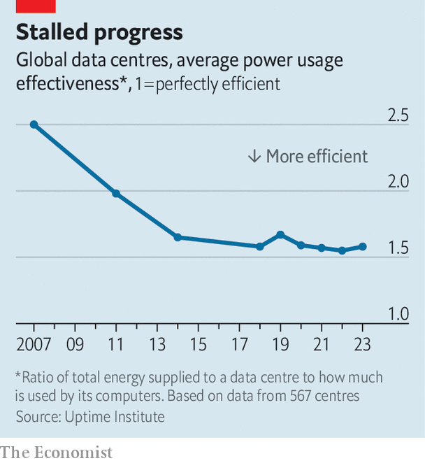

###### Mean and green

# Can computing clean up its act? 

##### The industry consumes as much electricity as Britain—and rising 

 

> Aug 16th 2023 

“What you notice first is how silent it is,” says Kimmo Koski, the boss of the Finnish IT Centre for Science. Dr Koski is describing LUMI—Finnish for “snow”—the most powerful supercomputer in Europe, which sits 250km south of the Arctic Circle in the town of Kajaani in Finland.

LUMI, which was inaugurated last year, is used for everything from climate modelling to searching for new drugs. It has tens of thousands of individual processors and is capable of performing up to 429 quadrillion calculations every second. That makes it the third-most-powerful supercomputer in the world. Powered by hydroelectricity, and with its waste heat used to help warm homes in Kajaani, it even boasts negative emissions of carbon dioxide.

LUMI offers a glimpse of the future of high-performance computing (HPC), both on dedicated supercomputers and in the cloud infrastructure that runs much of the internet. Over the past decade the demand for HPC has boomed, driven by technologies like , genome sequencing and simulations of everything from stockmarkets and nuclear weapons to the . It is likely to carry on rising, for such applications will happily consume as much computing power as you can throw at them. Over the same period the amount of computing power required to train a cutting-edge AI model has been doubling every five months.

All this has implications for the environment. HPC—and computing more generally—is becoming a big user of energy. The International Energy Agency reckons data centres account for between 1.5% and 2% of global electricity consumption, roughly the same as the entire British economy. That is expected to rise to 4% by 2030. With its eye on government pledges to reduce greenhouse-gas emissions, the computing industry is trying to find ways to do more with less and boost the efficiency of its products. The work is happening at three levels: that of individual microchips; of the computers that are built from those chips; and the data centres that, in turn, house the computers.

Start with the microchips themselves. Digital computers have become vastly more efficient over the past 80 years. A modern machine can do around 10trn calculations for the same amount of energy as a single calculation would have consumed in the aftermath of the second world war. Much of that enormous progress was a result of the industry’s attempts to stick to Moore’s Law—the observation that the number of components that can be crammed onto an integrated circuit doubles every couple of years. 

When the chips are down

For several decades one happy side-effect of Moore’s Law was that, as circuitry shrank, it also became more frugal. That effect is known as Dennard scaling, after Robert Dennard, a scientist then working at IBM who wrote a paper on the subject in 1974. During the mid-2000s, though, the tricky physics of ultra-tiny components meant that relationship began to break down. Computers are still becoming more efficient as their components shrink, but the rate at which they are doing so has slowed sharply. 

That has forced chipmakers to work harder in pursuit of gains that they used to get free. The CPUs in LUMI—the general-purpose chips that run programs and co-ordinate the rest of the machine—are made by AMD, an American chip designer. Besides supercomputers its cpus, alongside those of Intel, its larger rival, power many of the data centres that make the internet work. In 2010, with Dennard scaling confined to the history books, the firm put improving energy efficiency “at the top of our priority list”, says Samuel Naffziger, the product technology architect at AMD. 

These days its chips use an array of tricks to try to keep power consumption down. They are covered with sensors that monitor and minimise the amount of power sent to parts of the circuit depending on the tasks assigned to them. Other improvements have focused on making sure that as much of the chip as possible is doing useful work at any given moment, since idle circuitry wastes power to no purpose. AMD hopes that a combination of even more clever tricks and even smaller components will allow it to boost the efficiency of its most powerful chips 30-fold by 2025, compared with 2020.

Another option is to shift work from general-purpose CPUs to specialised chips designed for a narrower range of mathematical tasks. The best-known are “graphics processing units”, or GPUs. Originally developed to produce snazzier graphics for video games, GPUs have turned out to excel at many tasks that can be broken up into small bits, each of which can then be worked on simultaneously. Similarly specialised chips increasingly handle tasks like networking, which would previously have been left to the CPU to deal with. 

Such system-level tweaks are the second scale at which efficiency can be improved. “When you are playing with thousands of CPUs and GPUs, how you connect them up can make or break a supercomputer’s energy efficiency,” says Justin Hotard, who is in charge of high-performance computing at Hewlett Packard Enterprise, a firm that specialises, among other things, in efficient supercomputers. 

Exactly how best to wire everything up is still an active area of research. Sending a signal to another chip elsewhere in the computer consumes a great deal of energy. The goal is therefore to minimise how often it happens, and minimise the distance the signal has to travel when it does. HPE prefers something known as a “dragonfly topology”, a two-layer system in which groups of chips are connected to each other in clusters, and those clusters are wired up to each other in turn. The system is modular, which makes it easy to scale up by simply adding new nodes. And a paper published in February by Francisco Andújar, a computer scientist at Valladolid University, and his colleagues, showed, after a great deal of mathematical analysis, that the dragonfly setup is close to the ideal design for efficient supercomputing. 

And efficiency need not come at the cost of performance. Top500.org, a website, publishes rankings of supercomputers by both speed and efficiency. Its most recent, published in June, list LUMI as the seventh-most efficient machine in the world as well as the third-fastest. Frontier, a computer installed at Oak Ridge National Laboratory in Tennessee, is by far the world’s fastest, around four times quicker than LUMI. Nevertheless, when it comes to efficiency, Frontier ranks sixth. 

The final scale at which gains can be made is that of the data centre, the high-tech shed in which both supercomputers and the more quotidian servers that power the internet live. Computing produces a great deal of heat. Despite the newfound focus on efficiency, a modern CPU or GPU can produce 500 watts or more of heat at full tilt. With tens of thousands in a single data centre, that means disposing of several megawatts of heat.

Keeping them cool requires energy in turn. The standard measure of a data centre’s efficiency is the power usage effectiveness (PUE), the ratio between the data centre’s overall power consumption and how much of that is used to do useful work. According to the Uptime Institute, a firm of IT advisers, a typical data centre has a PUE of 1.58. That means that about two-thirds of its electricity goes to running its computers while a third goes to running the data centre itself, most of which will be consumed by its cooling systems.

Reaching the Finnish line

Clever design can push that number much lower. Most existing data centres rely on air cooling. Liquid cooling offers better heat transfer, at the cost of extra engineering effort. Several startups even offer to submerge circuit boards entirely in specially designed liquid baths. Thanks in part to its use of liquid cooling, Frontier boasts a PUE of 1.03. One reason LUMI was built near the Arctic Circle was to take advantage of the cool sub-Arctic air. A neighbouring computer, built in the same facility, makes use of that free cooling to reach a PUE rating of just 1.02. That means 98% of the electricity that comes in gets turned into useful mathematics. “That is closing in on the limits of what is possible,” says Dr Koski. 

 


Even the best commercial data centres fall short of such numbers. Google’s, for instance, have an average PUE value of 1.1. The latest numbers from the Uptime Institute, published in June, show that, after several years of steady improvement, global data-centre efficiency has been stagnant since 2018 (see chart). Economics, rather than computer science, is the main reason. As demand for computing has boomed, it makes sense for firms to keep older, less efficient infrastructure running for longer. 

What is presently merely a nice to have may soon become a legal requirement. Mindful of their carbon-reduction targets, the governments of America, Britain and the European Union, among others, are pondering new rules that could force data centres to become more efficient. A new German law would mandate a minimum PUE of 1.5 by 2027, and 1.3 by 2030. “We want LUMI to illustrate how high-performance computing can get across the line on net-zero carbon emissions,” says Dr Koski. Those wanting tips could do worse than book a trip to Finland. ■


