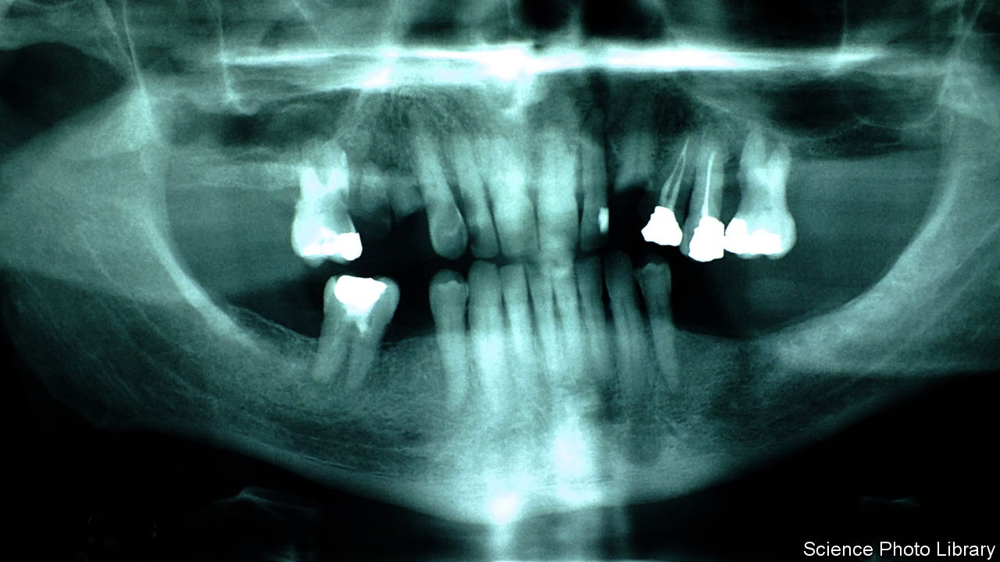

###### Regenerative dentistry

# Scientists want to fix tooth decay with stem cells 

##### Regrowing natural enamel would be better than a filling 

 

> Aug 16th 2023 

The human body is a marvellous thing. But like anything built by evolution, it has plenty of flaws. Consider teeth. Whereas sharks grow new teeth throughout their lives, adult humans get one set, which must last 60 years or more. 

That is tricky. A combination of poverty, sugar-rich  and poor hygiene means 2.5bn people around the world suffer from tooth decay, in which acid produced by mouth-dwelling bacteria eats away at the hard enamel that coats the outside of a tooth. That can open the door to painful infections, which cause further damage. Once decay has set in, all a dentist can do is fill the gap with an artificial plug—a filling. 

But in a paper published in , Hannele Ruohola-Baker, a stem-cell biologist at the University of Washington, and her colleagues offer a possible alternative. Stem cells are those that have the capacity to turn themselves into any other type of cell in the body. It may soon be possible, the researchers argue, to use those protean cells to regrow a tooth’s enamel naturally.

The first step was to work out exactly how enamel is produced. That is tricky, because enamel-making cells, known as ameloblasts, disappear soon after a person’s adult teeth have finished growing. To get round that problem, the researchers turned to samples of tissue from human foetuses that had been aborted, either medically or naturally. Such tissues contain plenty of functioning ameloblasts. 

The researchers then checked to see which genes were especially active in the enamel-producing cells. Tooth enamel is made mostly of calcium phosphate, and genes that code for proteins designed to bind to calcium were particularly busy. They also assessed another type of cell called odontoblasts. These express genes that produce dentine, another type of hard tissue that lies beneath the outer enamel. 

Armed with that information, Dr Ruohola-Baker and her colleagues next checked to see whether the stem cells could be persuaded to transform into ameloblasts. The team devised a cocktail of drugs designed to activate the genes that they knew were expressed in functioning ameloblasts. That did the trick, with the engineered ameloblasts turning out the same proteins as the natural sort. A different cocktail pushed the stem cells to become odontoblasts instead.

Culturing the cells together produced what researchers call an organoid—a glob of tissue in a petri dish which mimics a biological organ. The organoids happily churned out the chemical components of enamel. Having both cell types seemed to be crucial: when odontoblasts were present alongside ameloblasts, genes coding for enamel proteins were more strongly expressed than with ameloblasts alone. 

For now, the work is more a proof of concept than a prototype of an imminent medical treatment. The next step, says Dr Ruohola-Baker, is to try to boost enamel production even further, with a view to eventually beginning clinical trials. The hope is that, one day, medical versions of the team’s organoids could be used as biological implants, to regenerate a patient’s decayed teeth. 

Stem-cell-based therapies are not the only ones heading to clinical trials. Another class of treatments is known as biomimetic repair. This involves rebuilding the tooth crown using synthetic proteins, which are similar, but not quite identical, to human enamel. Unlike stem-cell treatments, the proteins could be included in toothpaste, mouthwash and even cough drops. But synthetic formulations can be less durable than human enamel. 

It will take time for either technology to arrive in the clinic. One question is just how durable the enamel made by stem-cell-derived ameloblasts proves to be. Another is how best to deliver the stem cells to a patient’s mouth. But these findings are promising. As any dentist will tell you, prevention is better than cure. But a better cure would be welcome nonetheless. ■


