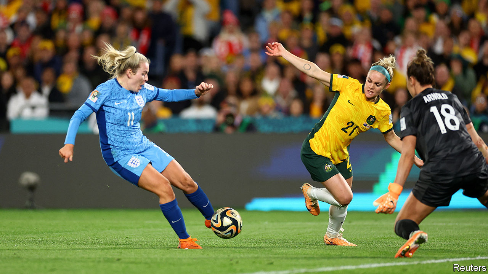

###### Sports science

# Should women’s football have different rules from men’s? 

##### Women are not just smaller men 

 

> Aug 16th 2023 

A little boy, face covered in red and white paint (and a dab of ketchup) screams with delight when England equalise with Colombia in their quarter-final match. Stadium Australia, just outside Sydney, is packed. Your correspondent is rubbing shoulders with England fans in white and red, Colombian ones in yellow and Australians giddy from their team’s earlier victory over France. 

The , held this year in Australia and New Zealand, is setting records. England eventually beat Colombia, and then Australia, to set up a final against Spain on August 20th. Attendance at the tournament is over 1.8m, up from 2015’s record of 1.4m. TV viewership across all matches is set to pass 2bn, double the previous high point.

Much of the coverage has compared the women’s game with the men’s. One striking advert tries to dispel the idea that the women’s game is less skilful. It shows a series of impressive highlights, ostensibly featuring members of the French men’s squad. Later, the digital trickery is revealed: viewers have actually been watching the women’s team. A paper published last month in a journal, had participants watch videos of men and women playing football. Viewers rated the men’s videos more favourably than women’s—but the difference vanished when the players were blurred to hide their sex.

Yet another study, published in 2019 by Arve Vorland Pedersen, a neuroscientist and sports scientist at the Norwegian University of Science and Technology, and his colleagues, concludes that the women are indeed playing a game that is subtly different—and considerably harder—than the one being played by the men. 

The researchers start from the observation that women are physically different from men in many ways. Women are shorter than men (168cm v 182cm in a Norwegian sample). Female footballers are lighter (65kg v 76kg). Women are slower (4.84 seconds to run 30 metres, v 4.25), and cannot jump as high (36cm v 57cm). Those differences persist even among the most athletic members of each sex. 

 


The researchers then try to scale the size of a football pitch to account for those anthropometric differences. A pitch that was the same relative size for women as it is for men would, they say, be 93 metres long and 61 metres wide, down from the current recommended dimensions of 105 metres x 68 metres (see table). 

Nor is it just the pitch. Shorter female keepers can cover a smaller part of the goal than a man can. To achieve parity between the sexes, the women’s goal, say the researchers, should be shrunk from 7.32 metres wide and 2.44 metres high to 6.76 metres across and 2.25 metres high. Even the ball would change: taking account of women’s lower leg strength would require a ball weighing 287 grams, rather than the 430-grams of a standard male ball (though that would alter how the ball behaves in flight). Put another way, say the researchers, expecting women to play with a men’s ball is a bit like asking men to kick a 623-gram basketball-sized sphere around. 

Admittedly, the maths are rough-and-ready. And the researchers are quick to say they are not arguing that the rules should actually be changed (such discussions, they say, are for the game’s administrators). But although football expects men and women to play by the same rules, many other sports try to account for sex differences. In athletics, women put lighter shots, throw lighter discuses and leap over lower hurdles than men do. The WNBA, a women’s professional basketball league in America, uses a lighter ball. Volleyball uses a lower net. Indeed, women’s football used lighter balls until the 1990s.

But changing the rules of a sport is as much about culture as it is about science. World Rugby, the international governing body for rugby union, is planning tests of a ball sized for women’s smaller hands. The response from the players themselves is said to have been mixed. Some are keen on the idea. Others worry that, after fighting for so long to be taken seriously, making the women’s game even slightly easier might damage its reputation. 

Designing for women is less controversial when it comes to kit. In the past, women’s football boots were derived from shoes designed for a man’s weight, foot size and biomechanics. Boots made specifically for women are beginning to appear. A firm called Ida Sports sells a boot that is wider around the toes, narrower at the heel and gives more support round the arch, with shorter and more plentiful studs. Among other benefits, one hope is that this might reduce the incidence of knee injuries, to which women seem more susceptible. “So many people blame the design of the woman’s body,” says Emelia Funnell, Ida Sports’ research lead. Instead, she says “it’s the fact that the world has been designed for men.” ■


