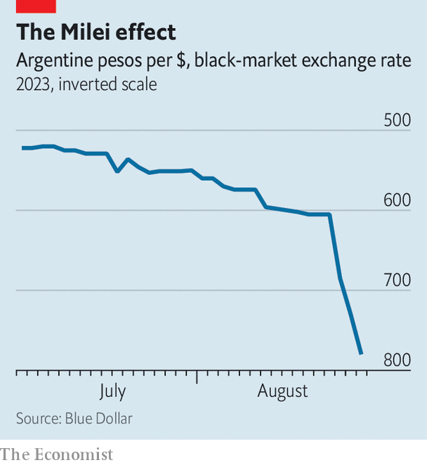
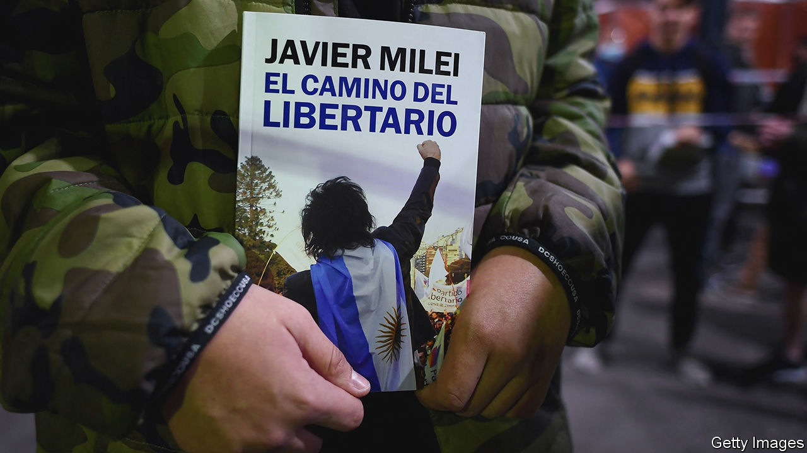

###### The lion’s roar

# Argentina could get its first libertarian president 

##### Javier Milei, a free-market radical, won the most votes in a primary ahead of general elections 

 

> Aug 14th 2023 

Hard rock blared from the speakers as 10,000 fans cheered. An image of a roaring lion surrounded by fire lit up the screen. Jumping on stage, a man in a leather jacket whipped the crowd into a frenzy. “I am the lion!” he cried. “I am the king in a lost world!” It was not a rock concert. The speaker was Javier Milei, a libertarian who hopes to become Argentina’s next president, at a recent rally. On August 13th Mr Milei took the most votes in national primaries, in which Argentines selected candidates to compete in presidential and legislative elections scheduled for October 22nd, with the top-scoring candidate from each party going through to the main vote. Because voting is mandatory, the poll is widely seen as the best indicator of who might win the presidency. 

Argentina’s notoriously unreliable opinion polls had predicted that Together for Change, a centre-right coalition, would take the most votes, divided between its leading contenders. These are Horacio Rodríguez Larreta, the mayor of Buenos Aires, a moderate, and Patricia Bullrich, a hawkish former security minister. Sergio Massa, the main candidate of the incumbent Peronist party, was expected to get a third of votes, and Mr Milei only a fifth. Instead Mr Milei took 30% of ballots cast, compared with 28% for Ms Bullrich and Mr Larreta combined. The ruling Peronists got 27%. Mr Milei led in 16 of 24 provinces. 

Before being elected to Congress in 2021, Mr Milei worked as a consultant and economics professor. He bills himself as an outsider. As the results were announced he promised “to end the useless, parasitic, criminal political caste that is sinking this country.” Argentina has been mismanaged by a left-wing government for much of the past two decades. The last time Together for Change was in charge, from 2015 to 2019, it also ended in crisis. At rallies his supporters chant “Get rid of them all!” 

His support stems from Argentines’ frustration with their country’s chronic economic dysfunction.  is 113%, higher than anywhere else in the world except for Venezuela, Zimbabwe and Lebanon. Crushing taxes lead many businesses to operate off the books. Capital controls make it hard for Argentines to legally buy dollars, the currency they prefer to save in. 

 


This has led to a huge black market for greenbacks, the price of which is a good proxy for the state of the economy. Until the poll, a black-market dollar cost around 600 pesos, double what it did a year ago (the official rate was half that). As we went to press, the black-market dollar reached a record 780 (see chart). Fears of increased political uncertainty led the central bank to devalue the official rate of the peso by 18%, and raise the policy interest rate by 21 percentage points to 118%. The devaluation is likely to put further upward pressure on inflation.

The lion’s roar

The country took out a loan of $57bn with the IMF in 2018. The fund had already disbursed $44bn when it became clear Argentina would not be able to pay it back. So the loan was renegotiated in 2022. The fund required that Argentina cut its primary deficit, build its net foreign-exchange reserves at the central bank and reduce the amount of money the central bank prints to finance the government’s budget deficit. 

Argentina has not been able to meet the targets, in part because a record drought this year hurt exports. Net reserves are estimated to be over $8bn in the red. In July the IMF and Argentina reached a new agreement which lowered the amount of international reserves the central bank has to accumulate this year, from $8bn to $1bn. But the target of 1.9% for the primary deficit was retained (it is on track to be 2.4%). Mr Massa’s poor showing in the election means the government is even less likely to make the spending cuts needed to reach the IMF’s targets.

By contrast, Mr Milei recently said the IMF’s spending-cut targets are “tiny compared to the austerity package I’m proposing”. He wants to scrap ten of the 18 ministries that currently exist (including the education ministry), slash spending by 15% of GDP and lift capital controls. He also wants to open the country further to foreign trade and privatise state companies that run deficits. (Argentina has 34 state firms, whose combined deficit amounts to around 1% of GDP.) 

His most radical idea is to dollarise the economy—and, he says, “blow up” the central bank in the process. Emilio Ocampo, a former investment banker and the architect of the dollarisation plan, explains that for a yet-to-be determined period both the peso and the dollar would be legal tender. To raise the roughly $32bn that Mr Ocampo calculates would be needed to swap pesos in the banking system for dollars, the government would set up a fund in a low-tax, OECD country. That fund would hold Argentine assets, such as shares of YPF (the state oil firm) and assets belonging to the state pension fund. These would serve as collateral for the issuing of short-term debt on international capital markets. 

Gimme greenbacks

Advocates of dollarisation argue that this would simply make legal what is already happening. Argentines are thought to hold more dollars per person, either abroad or stuffed under mattresses, than citizens of almost any other country outside the United States. They save, buy property and set prices in dollars. 

However, some economists are sceptical. They argue that although dollarisation can lower inflation, it may not deliver on its promise of stopping the government overspending. Under some forms of dollarisation, both the government and the banks could still accumulate excessive dollar-denominated debts. In the 1990s the peso was pegged to the dollar, but in 2001 the experiment ended in failure with a run on the banks, a deep recession and five presidents in 12 days. 

Critics worry it will be difficult to raise the $32bn needed to convert pesos in the banking system. A strong dollar would also make Argentina’s exports more expensive while increasing demand for imports. That could lead to a balance-of-payments crisis.

 


Mr Milei’s radicalism goes beyond the economy. He has promised to ban abortion, allow Argentines to carry guns freely, and legalise a market in human organs. He calls climate change a “socialist lie”. He can be unpredictable. In his first year as a deputy in Congress he was absent from half of the sessions where bills were voted on. Allies complain that he does not listen to his economic team, confident in his own expertise. His sister Karina, who he has compared to Moses, runs his campaign. “How will the economy ministry work if he doesn’t delegate jobs?” asks one adviser. 

Although he calls himself a libertarian, Mr Milei attracts many voters from the far right. In the 1990s he briefly advised Antonio Bussi, a congressman and former military officer who was later convicted of crimes against humanity committed during Argentina’s military dictatorship. Mr Bussi’s son is running to be a congressman for Mr Milei’s party. Jair Bolsonaro, Brazil’s former right-wing president, is a fan of Mr Milei. He also has close ties with Vox, a nationalist party in Spain. 

If Mr Milei wins, he may find it hard to govern. Currently his coalition has only two seats out of 257 in Congress and none in the Senate, though in the first round of the election 130 seats in Congress and a third of the Senate will be up for grabs. Juan Cruz Díaz of Cefeidas Group, a consultancy in Buenos Aires, thinks Mr Milei’s strong showing in the provinces means he could get at least 30 deputies elected to Congress, although that will not get him very far. Many of his policies would cause short-term pain, such as high unemployment. That could increase social unrest. 

Recently several heavyweights have joined his team, such as Roque Fernández, a former economy minister, and Diana Mondino, an economist who used to work for Standard &amp; Poors, a ratings agency. They “speak the language that investors trust”, says Mr Díaz. 

But the road to the presidency is still uncertain. It is unclear how many more voters Mr Milei will be able to attract. Ms Bullrich, who is now the candidate for Together for Change, will try to peel away his supporters. Mr Massa could benefit from the struggle between them by appealing to moderates. If no candidate gets at least 45% of votes, or 40% with a ten-point margin over the runner-up, the election will go to a run-off. Mr Milei’s 53rd birthday coincides with the first round. His gift may be the task of rebuilding a broken country. ■


