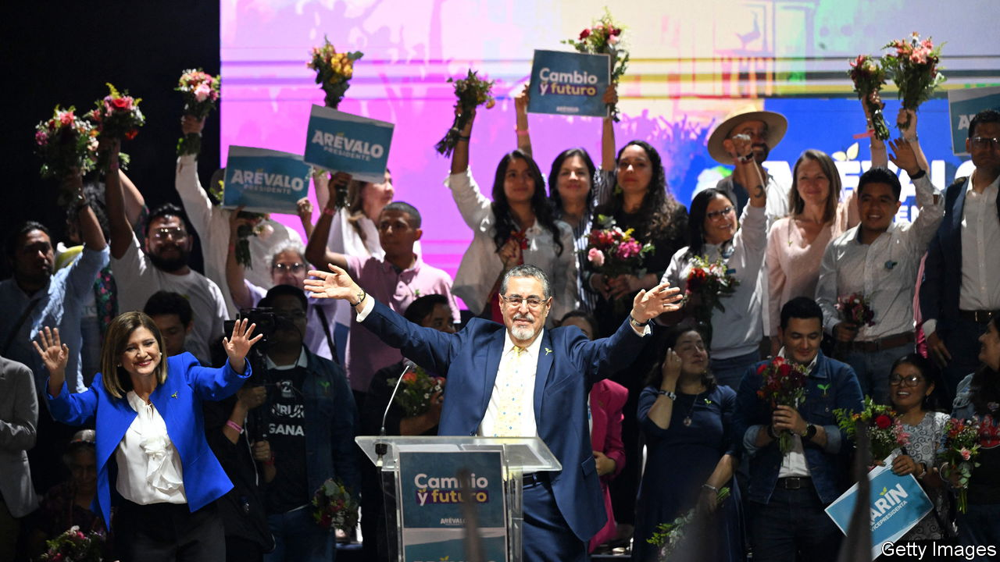
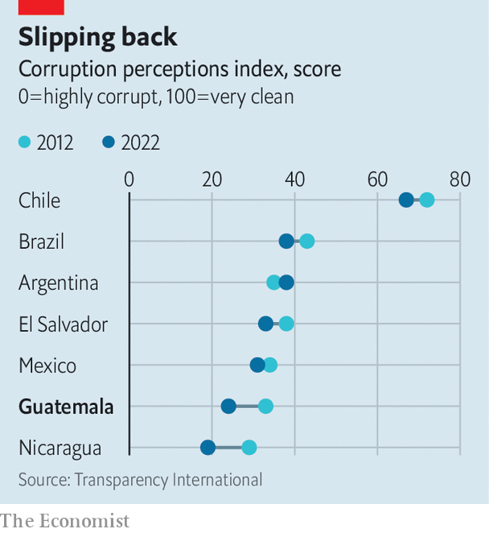

###### Democracy in doubt

# Guatemala’s elite may try to scupper the presidential election 

##### Could the “pact of the corrupt” deny Bernardo Arévalo the office? 

 

> Aug 17th 2023 

In June Bernardo Arévalo unexpectedly won a place in Guatemala’s presidential run-off. It was a glimmer of hope for the troubled Central American country. Mr Arévalo, the son of Guatemala’s first democratically elected president, is an outsider candidate who ran on an anti-corruption platform. But since then the country’s elite has done its best to block Mr Arévalo from the second round of the election, which takes place on August 20th.

By rights the presidency should be Mr Arévalo’s. He is polling 26 percentage points ahead of Sandra Torres, a former first lady to whom he came a close second in the first round. Along with promising to tackle corruption, Mr Arévalo, of the progressive party Movimiento Semilla (Seed Movement), pledges to reduce poverty and improve health and education for the country’s 17m people. 

 


His popularity shows a deep desire for change. According to one poll, three-quarters of those surveyed believe the country is going in the wrong direction; a similar percentage think the government is corrupt. Over the past decade the country has fallen in the rankings of a corruption-perceptions index by Transparency International, a Berlin-based NGO (see chart).

Guatemalan politics remain scarred by a 36-year civil war, which ended in 1996 but left the state in the hands of what Guatemalans scornfully refer to as “the pact of the corrupt”: a network of political, military and economic elites. Their power has grown since 2019, when a UN-backed anti-corruption body was closed down by the then-president. The current administration of President Alejandro Giammattei has further politicised the courts.

Few think those in power will allow the second round to run smoothly. After Mr Arévalos’s surprise showing in the first round, nine mainstream parties alleged fraud, even though observers had seen no irregularities. The constitutional court ordered the electoral tribunal to review the vote count, delaying certification of the results. When this failed to lead to any change in the outcome, officials tried to suspend Semilla for allegedly forging signatures. (The constitutional court blocked the suspension, but the challenge is ongoing, as no party can be barred during an electoral period.) 

Attempts to use the judicial system to shape the election result are part of a pattern. Before campaigning started this year the electoral tribunal banned—for unconvincing reasons—three anti-establishment presidential candidates who were becoming increasingly popular. 

Some fear the elite will try to manipulate the results using tactics such as blocking voting in urban areas that are keenest on Semilla. Others predict it will try to stop Mr Arévalo taking power in January if he wins, possibly using a legal wrangle similar to the one in the first round. Recently a video surfaced showing an official from Ms Torres’s party telling local officials to be ready to contest the results (Ms Torres denies any wrongdoing). This risks sparking protests and international condemnation. 

Much may depend on outside pressure. Marielos Chang of the University of Valle de Guatemala reckons the elite was unable to bar Mr Arévalo from the second round because both Guatemalans and the international community reacted so strongly. Antony Blinken, the US secretary of state, and Luis Almagro, head of the Organisation of American States, a regional body, both condemned any attempts to interfere with the results. On July 23rd, in a review of corruption in the region, the US State Department banned a further ten Guatemalans from entering the United States. 

Even if Mr Arévalo wins and is sworn in, he may find life very difficult. Semilla could yet be suspended as a party, leaving its 23 lawmakers rudderless. Institutions could refuse to co-operate with Mr Arévalo and stifle his agenda; people will get disillusioned with the lack of results from a candidate who promised change. What lies ahead is an uphill battle, says Ms Chang. But the potential reward justifies it. His win would ensure there are “a few years more of life for democracy”, she says. ■

