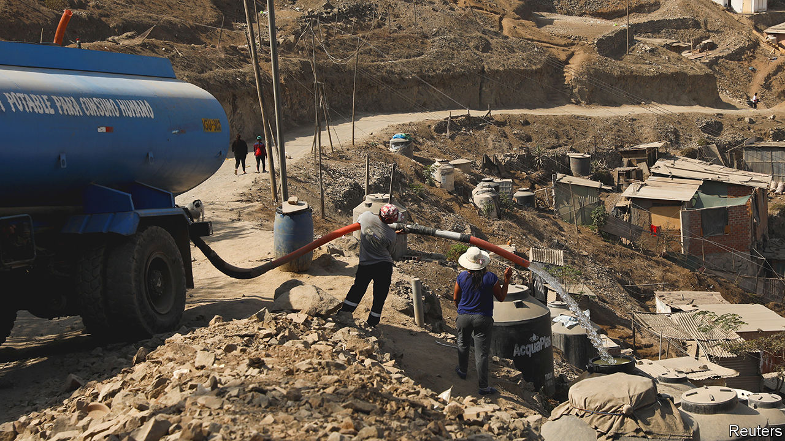

###### Sub-national and sub-optimal

# Latin America’s local governments too often fail their people 

##### A forthcoming paper shows the effects of bad government 

 

> Aug 17th 2023 

As Latin America underwent its stunning shift from dictatorship to democracy in the 1980s and 1990s, new constitutions were written. Mindful of past experiences with strong central governments, many countries devolved powers to local ones. The share of expenditure controlled by sub-national layers of government almost doubled between 1985 and 2015, to 25%. The World Bank and other institutions applauded. Local governments, they reckoned, would respond better to their constituents.

Yet a paper, currently under peer review, by Antonella Bancalari of the Institute for Fiscal Studies in London, may give advocates of decentralisation pause. Ms Bancalari studied a $3bn plan in Peru to build sewers between 2005 and 2015. The country’s 1,800 municipalities took the lead. She found that bad building practices increased deaths of children. The mortality rate for infants under 12 months increased by 6% on average in places while the work was done, and by 3% for children under five. Most of these deaths were caused by waterborne diseases from ditches on construction sites, the type of pestilence the works were meant to treat. The risk of such deaths increases when projects are halted mid-construction. This was the case in 85% of municipalities. By the end of the study period, 40% of projects were on hold. 

Federal governments can screw up. But local ones may be particularly likely to. The Inter-American Development Bank estimates that inefficiencies in the way local governments spend in Argentina, Brazil, Colombia, Mexico and Peru wastes the equivalent of 2% of each country’s GDP per year on average. Almost 60% of Peru’s district municipalities have fewer than 5,000 inhabitants. They can struggle to do big projects. Many do not spend their budgets in full. 

Meanwhile too much money can hurt. In the early 2000s Peru ruled that half of the corporate tax from mining firms should go to the places where the mining took place. When commodity prices spiked, those local governments received giant windfalls. In one, Ancash, all four governors who served between 2006 and 2018 have been arrested on corruption charges (three have served time in prison, while one has been released from pre-trial detention, pending further investigation). One study found social conflict increased in the regions that received the most money. 

Decentralisation remains popular. Chile is in the process of writing a new constitution which could devolve more power to its regions. In Colombia a new law from 2019 gave more power to regional entities. Local decisions and projects can do good. In Bolivia decentralisation helped funnel more money to poor districts, which spent it on education. As the example from Peru shows, a degree of competence is needed, too.■

