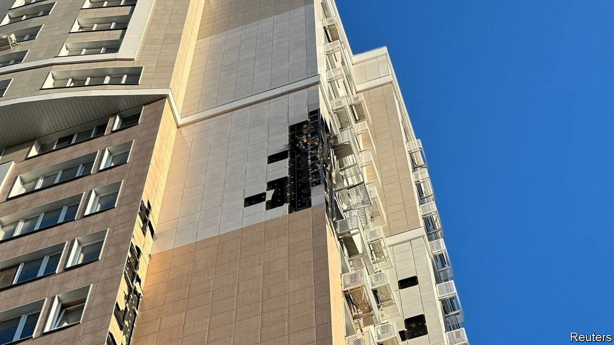

###### The Economist explains

# Why are Moscow’s air defences performing so badly? 

##### The city is curiously unprepared for drone attacks 

 

> Aug 14th 2023 

ON AUGUST 9TH a plume of smoke rose over the Zagorsk manufacturing plant, north of Moscow, which supplies optical equipment to . An explosion there killed one person, wounded 60, and left eight unaccounted for, according to officials, who downplayed the obvious explanation: that it was the result of a Ukrainian drone strike. Since May dozens of , apparently launched from Ukraine, have struck Russia’s capital or sites nearby. One high-rise building, home to three government ministries, was hit twice in successive attacks on July 30th and August 1st. That suggests that some of these drones are hitting their targets, rather than merely causing damage when crashing. Moscow is one of the world’s best-protected cities. Why is it struggling to defend itself?

The Moscow Air Defence Directorate was established in 1918, with 36 anti-aircraft guns. Since then it has been upgraded many times and the system now includes surface-to-air missile complexes, radar and jet fighters. The outer layer of defence—known as the A-135, and which covers the whole city—is one of very few fixed anti-ballistic missile systems in the world. Activated in 1995, it has around 100 missiles intended to intercept nuclear warheads. Inside this is the S-50M complex, which includes radars, control centres and long- and short-range surface-to-air missile launchers. With the notable exception of Kyiv, Ukraine’s capital, the rest of Europe has nothing like it.

But drones are not on Moscow’s radar—either metaphorically or literally. Its air defences were designed to deal with high-speed bombers and cruise and ballistic missiles. Old radar systems automatically filter out low, slow-moving objects (such as birds) which might cause false alarms. Unfortunately for the Kremlin, that also means they frequently miss drones. Not that it appears to have given much thought to the problem: Russia’s current air-defence plan, which covers the period up to 2030, does not mention the technology at all. 

That seems a strange decision. Though defence against drones is tricky—America, for example, has struggled to protect its forces from such attacks in Syria—several countries have successfully altered and augmented their defence systems to deal with increased risks from drones. Israel, which in recent years has been a frequent target of rocket attacks from both Islamic Jihad and Hamas, an armed Palestinian Islamist movement, has upgraded its “Iron Dome” to tackle drones as well. Though it took them several months, the Ukrainians can now reliably shoot down drones attacking Kyiv. And though drone attacks on Moscow itself are new, Russia has long been aware of the problem: its airbase in Khmeimim in Syria has been attacked by small drones many times since 2018.

But rather than trying to develop a coherent strategy, since the attacks on Moscow began Russian authorities have mostly relied on ad hoc workarounds. One is positioning tactical air-defence systems in the city centre, including a Pantsir-S1 vehicle (normally used on battlefields) on the roof of a Ministry of Defence building on the Moskva river. Officials credit the Pantsir—which carries up to 12 surface-to-air missiles plus two 30mm automatic cannons—with shooting down several drones. But its efficacy is doubtful: Pantsirs seem to have performed poorly against drones in Syria, Libya and Armenia, where many were apparently destroyed by the drones they were trying to defend against. In 2018 a Russian military journalist claimed that the Pantsir was practically incapable of detecting small, slow targets. 

It is not that Russia lacks kit, but that it might deploy better. Ukraine has plenty of Russian-made air-defence weapons; according to General Mark Kelly, the head of the US Air Force’s Air Combat Command, they are “pretty capable” when operated by Ukrainians. In March 2022 he noted that the Russians, meanwhile, were struggling to use their surface-to-air weapons effectively. 

So far the attacks on Moscow have been largely symbolic, involving only a handful of drones with small warheads. But in the next few months Ukraine plans to produce hundreds of long-range drones with bigger explosive payloads. That could force the Russians to get organised, perhaps by bringing back surface-to-air systems from Ukraine to defend the capital. Failure to do so would lead to mounting damage to Moscow, both physical and psychological. ■

