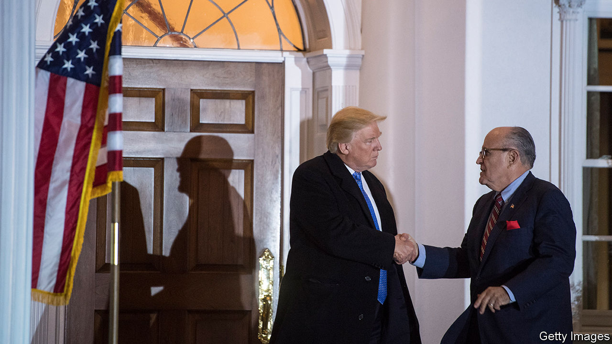

###### The Economist explains

# Why was RICO, a mafia-targeting act, used to charge Donald Trump? 

##### The legislation is a powerful and increasingly flexible tool 

 

> Aug 15th 2023 

THE MAFIA, a sex cult and several titans of Wall Street have all been brought down by America’s Racketeer Influenced and Corrupt Organisations (RICO) Act, a legal tool designed to tackle organised crime. Now a version of it could be used to nail a former president after a grand jury in Georgia , along with 18 of his associates, on August 14th. What are RICO charges and how might they apply to Mr Trump?

Congress first passed the legislation in 1970 while trying to target the Italian-American mafia. In America, you cannot be prosecuted for simply being a mobster; that constitutes a “status crime”, and the Eighth Amendment protects against it. And, as anyone who has seen “The Godfather” knows, the more powerful a crime boss is, the less likely they are to be the one actually getting their hands dirty. To get around this problem, lawmakers developed RICO, a broad statute allowing prosecutors to charge members of a long-running enterprise for their patterns of behaviour and connections to the organisation. Some active involvement is still necessary: the prosecution must prove that the accused committed two out of thirty-five possible offences, ranging from murder and kidnapping to bribery, fraud and obstruction of justice. Defendants face up to 20 years in prison if convicted.

RICO worked, contributing significantly to the  in America in recent decades. The bosses of the five major mafia families in New York, for example, were all felled by RICO charges between the late 1980s and early 2000s. And it is not only useful against those at the top. In 2021 federal prosecutors in Brooklyn brought RICO charges against the Colombo crime family, a mafia entity. The breadth of the legislation allowed prosecutors to levy racketeering charges against the boss and many of his underlings simultaneously. That let them shut down the enterprise quickly rather than having to painstakingly peel off individuals. 

Over time, prosecutors began targeting enterprises beyond the mob. In the late 1980s Rudy Giuliani—then Manhattan’s top federal prosecutor, having spearheaded the state’s mob-boss takedown—rocked Wall Street when he threatened two swanky investment firms with RICO indictments. (Mr Giuliani’s pioneering use of RICO-style laws feels ironic now that he is one of Mr Trump’s co-defendants in Georgia.) The threat of the law’s stiff penalties forced one firm to settle on lesser charges; the other collapsed after spooked investors fled. In 2020 New York’s Eastern District used RICO to hand down a 120-year prison sentence to the leader of “NXIVM”, a cult that forced women and teenagers to become sex “slaves”. 

More than 30 states have their own versions of RICO laws. But the Georgia statute is particularly broad: it includes many types of crime and is lax on how longstanding an enterprise’s activities must be. That scope has allowed lawyers in the state to experiment with new applications of the legislation—most notably Fani Willis, the district attorney in Fulton County responsible for the case against Mr Trump. Ms Willis has previously used the statute against teachers who conspired to inflate students’ scores in state exams, and rappers associated with the same record label for facilitating criminal gang activity. In both cases, the charges brought by Ms Willis helped define the targeted enterprise in ways others had not done before.

She has done something similar with Mr Trump, positioning him as the kingpin of an enterprise that conspired to “unlawfully change the outcome” of the 2020 presidential election. The case accuses Mr Trump and 18 co-conspirators—a collection of lawyers including Mr Giuliani and politicians including Mark Meadows, Mr Trump’s former chief of staff—of operating in Georgia, Arizona, Michigan and elsewhere “for a period of time sufficient” for the group to “pursue its objectives”, which it claims include defrauding the state, committing perjury, forgery, and theft. (Mr Trump and Mr Giuliani have denied wrongdoing.)

The 19 accused have until August 25th to appear before the court in Atlanta. Unlike the federal act, Georgia’s version of RICO carries a minimum sentence (an undesirable five years), which might compel Mr Trump’s co-defendants to settle and co-operate rather than risk prison time. The outcome will be watched closely. Alan Dershowitz, a former law professor, once derided RICO’s expansive powers as a “cheap” attempt by lawmakers to use “one statute to solve all the evils of society”. Many opponents of Mr Trump will be hoping that criticism proves true. ■

