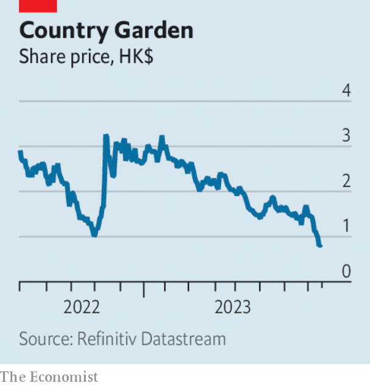

###### The world this week

# Business 

#####  

 

> Aug 17th 2023 

 unexpectedly  as new data shed light on the country’s flagging economy. Industrial production and retail sales during July both fell short of predictions. Nationwide unemployment increased to 5.3% and authorities suspended reporting of figures on youth unemployment, which stood at 21.3% in June.

 


In a sign of further distress in China’s property sector, , one of the country’s largest developers, sank into crisis. The firm expects to post a loss of up to 55bn yuan ($7.5bn) for the first half of 2023 and suspended trading in some of its bonds, having missed coupon payments earlier this month.

Britain’s annual rate of  stood at 6.8% in July, down from 7.9% in June. Lower household energy bills contributed to the sharp drop. Core inflation, which strips out energy and food prices, was unchanged at 6.9%. Annual wage growth was 7.8% during the three months to June, the highest since comparable records began in 2001.

A big scrap

Bidders are circling . The 122-year-old American industrial firm rejected an approach from Cleveland-Cliffs, another big steelmaker. Esmark, a privately held conglomerate, also announced an offer to buy the firm for $7.8bn.

In the latest example of dealmakers falling foul of geopolitical tensions between America and China,  axed its acquisition of Tower Semiconductor after failing to secure necessary approvals from Chinese regulators. The American chipmaker will pay Tower Semiconductor, an Israeli firm, a $353m fee for terminating the transaction, which was announced in February 2022.

central bank raised interest rates by 3.5 percentage points to 12%. The move followed a , which fell past the value of 100 to the dollar. Consumer prices rose at an annualised rate of 7.6% during the past three months, above the bank’s target of 4%.

agreed to buy Carbon Engineering, a Canadian startup. The energy firm, which counts Berkshire Hathaway as its largest shareholder, will pay $1.1bn for the carbon-capture concern.

, a Vietnamese electric-vehicle manufacturer, made its stockmarket debut on the Nasdaq. Shares in the lossmaking firm surged in a debut reminiscent of headier times for American equity markets. VinFast listed by merging with a special-purpose acquisition company and counts Pham Nhat Vuong, Vietnam’s richest man, as its controlling shareholder.

The American arm of , an accountancy firm, abandoned its traditional partnership structure. The firm tapped Apollo, a private-markets giant, for funding as part of the reorganisation. In another example of private equity’s interest in professional-services firms,  reportedly rejected a proposal by TPG, a private-equity firm, to invest in its consulting arm after abandoning a plan to spin off the business earlier this year.

 terminated an agreement with the Swiss government designed to protect the bank against losses stemming from its acquisition of Credit Suisse. The agreement, which was signed before the deal closed in June, required authorities to shoulder up to SFr9bn ($10.2bn) of potential losses. UBS also ended a SFr100bn liquidity agreement with Switzerland’s central bank and agreed to pay American authorities $1.4bn to settle a long-running case relating to its legacy mortgage-backed securities business.

 reported a 41% year-on-year increase in profits during the second quarter. Despite a surge in income from online advertising, revenue growth at China’s biggest internet firm, of 11%, fell short of expectations. 

America’s Commerce Department said that its measure of national increased by 0.7% in July, compared with a month earlier, as consumers continued to hold up better than expected. Investors also pored over minutes from the July meeting of the Federal Reserve’s rate-setting committee, during whichsome participants voiced concerns about risks to economic activity. 

 posted better than expected quarterly results. However, the retailer still reported a 5.4% decline in sales compared with the previous year, driven partly by a customer backlash against the firm’s Pride Month products. The firm also lowered its profit guidance for the year. 

Aussie rules

Industrial action by workers in Australia threatened to disrupt the global supply of liquefied natural gas. Talks between workers and , an Australian supplier, are ongoing. The threat of disruption was enough to cause a spike in the price of natural-gas futures.

