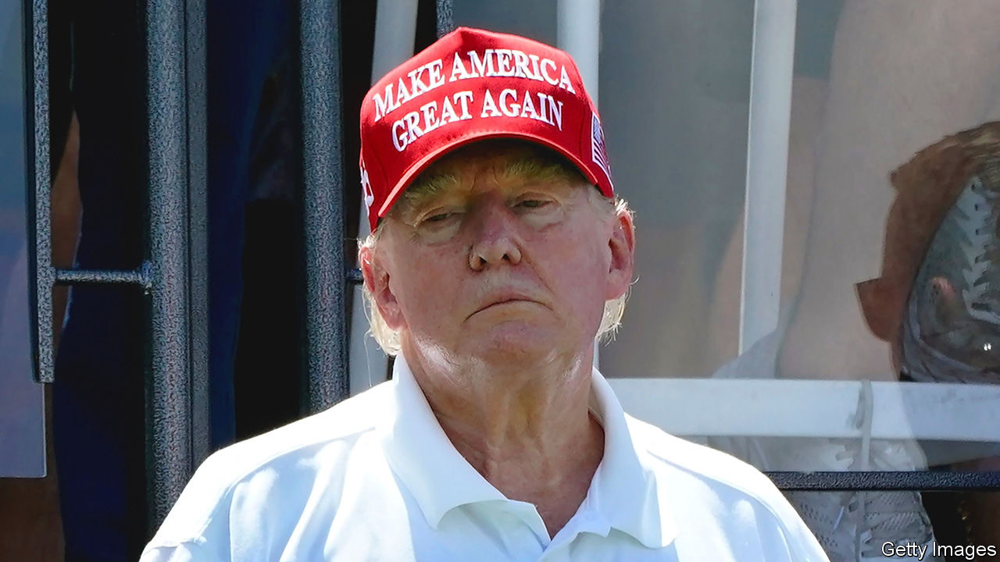
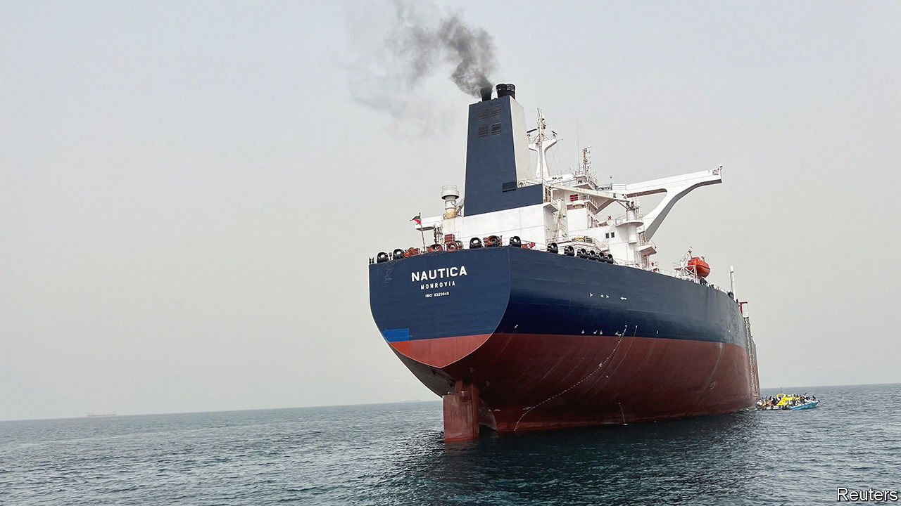

###### The world this week

# Politics 

#####  

 

> Aug 17th 2023 

 was hit with a fourth indictment. The front-runner in the Republican primary faces a total of 91 criminal charges. The latest blow comes from , where the former president and 18 others are accused of trying to overturn the swing state’s election result in 2020. Fani Willis, Fulton County’s district attorney, accuses Mr Trump of violating a racketeering act, more often used to ensnare mob bosses. He calls the indictment a “witch hunt”.

The death toll from  passed 100, making them America’s deadliest in more than a century, and over 1,000 people remain missing. Thousands are homeless. The blaze was probably sparked by a knocked-down power line which remained live; residents sued Hawaiian Electric, the island’s main utility. 

A federal appeals court in New Orleans upheld restrictions on access to mifepristone, an . It stopped short of banning the drug, as a lower court in Texas did in April. Before the order goes into effect it will probably return to the Supreme Court.

In one of the strongest legal decisions on  yet, a court in Montana ruled in favour of activists accusing the state of violating their constitutional right to a healthy environment. The plaintiffs, aged five to 22, blamed the state for favouring fossil fuels over renewables.

Javier Milei, a libertarian, took the most votes in a primary in , in which voters chose candidates to compete in presidential and legislative elections scheduled for October 22nd. Mr Milei, an economist who was only elected to Congress in 2021, presents himself as an anti-establishment choice. He wants to dollarise the economy and “blow up” the country’s central bank. Its response to the poll result was to devalue the peso by 18%, and raise its policy interest rate by 21 percentage points, to 118%.

announced plans to cap high-season  from the mainland to the islands of Sicily and Sardinia at 200% of their average prices. Europe’s largest low-cost carrier, Ryanair, called the measure illegal. Airlines demanded that the European Commission step in. Markets were already jittery after Italy’s hard-right government unveiled a surprise windfall tax on banks last week. Georgia Meloni, the prime minister, later took “full responsibility” for that decision, which shaved a tenth off the value of Italian bank stocks and was rolled back a day later.

 president, Volodymyr Zelensky, fired all heads of regional recruitment centres in a crackdown on corruption. More than 30 officials face criminal charges for accepting bribes and smuggling people out of the country to avoid conscription. 

Taking a grain check

The first loaded cargo ship passed through Ukraine’s new humanitarian corridor in the  from the besieged port of Odessa. Russia has threatened to treat merchant ships as military targets. Earlier in the week a Russian warship entered Bulgarian waters to harass a Turkish freighter heading to Ukraine. Russia is also targeting Ukrainian ports on the Danube, which now handle a third of Ukraine’s agricultural exports.

Germany’s cabinet approved a plan to legalise the personal use and growing of . If the bill passes parliament, it will be one of the most liberal regimes in Europe. Adults would be allowed to possess 25 grams. The original plan was to let stores sell the drug, but distribution was scaled back to non-profit social clubs.

 released five Iranian-American citizens into house arrest in Tehran, the capital. They are expected to be freed when  unfreezes $6bn of Iranian assets and lets go several jailed Iranians. Iran said the prisoner swap could pave the way for an opening in other areas. The deal comes as the two countries remain unable to reach an agreement on Iran’s nuclear programme.

 


A tanker adrift in the  since 2015 was drained of one million barrels of oil, averting the threat of a disastrous spill. The vessel was dumped off the coast of Yemen when war broke out in the country.

In violent clashes were reported between Tuareg separatists and the army, backed by the Wagner Group of mercenaries. A peace agreement signed in 2015 is at severe risk as the UN peacekeepers supporting the deal are withdrawing—at the Malian junta’s request. 

Army chiefs of countries in the Economic Community of West African States (ECOWAS) were due to meet on August 17th to consider using force to reverse a military coup in . The junta said it is charging Mohamed Bazoum, the deposed president, with treason.

Police in  have arrested 40 members of the opposition Citizens Coalition for Change ahead of a general election scheduled for August 23rd. Opposition meetings have also been banned.

 acknowledged its custody of , an American soldier and criminal who dashed across the border from South Korea in July. The regime said he was escaping “inhuman maltreatment and racial discrimination” in America’s army.

 Move Forward party, which won the country’s parliamentary elections in May, had its hopes of leading the next government dashed. The constitutional court rejected its appeal of a decision by the military-controlled senate to block the progressive party’s leader, Pita Limjaroenrat, from becoming prime minister. Move Forward refuses to back its former coalition partner and runner-up, Pheu Thai. The verdict clears the way for parliament to pick a new leader next week.

 wreaked havoc in Japan. Nearly 900 flights were cancelled as it made landfall on Tuesday and 240,000 people were evacuated; power was cut off from 90,000 homes in central and western Japan.

A drop in the ocean

removed 39 migrants from the , a barge intended for 500 occupants that is moored off Dorset, after a lung-infecting bacteria was found in its water system. The debacle with the barge is mostly of symbolic importance. A backlog of 172,000 applications from asylum-seekers, 50,000 of whom are being housed in hotels, needs clearing. More than 100 migrants cross the Channel on a typical day.

Average  in the Gulf of Mexico reached 31.1°C (88°F), the hottest on record. Coastal cities are suffocating. Warmer waters could produce a busier hurricane season, now approaching its peak weeks.

