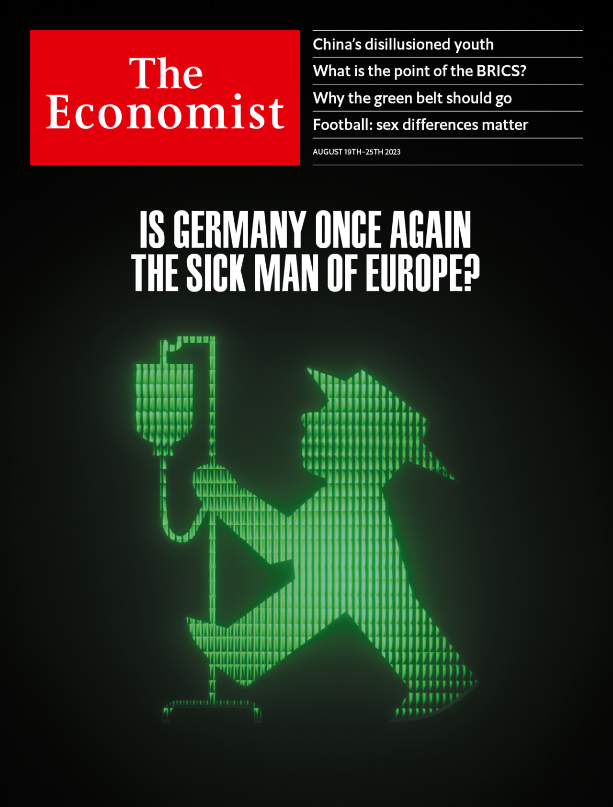

###### The world this week

# This week’s covers 

##### How we saw the world 

> Aug 17th 2023 

Some weeks, including this one, we publish more than one cover. In most of the world, we depicted China’s disillusioned youth. They are disenchanted with their prospects and full of angst. This is bad for their country—and perhaps the world. When Xi Jinping plays down their individual aspirations in favour of the collective interest, he adds to their gloom. 

 


In Europe, we asked whether Germany has become the sick man of Europe again. This is not 1999, but Germany’s ailments are more serious than its politicians admit. The German economy used to inspire envy. But it has failed to adapt to a changing world, turning from a growth leader into a laggard. 

 


 

: 


