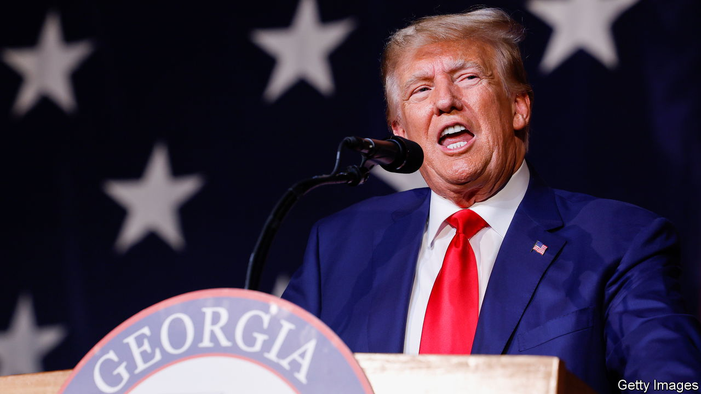

###### Puerto RICO

# Donald Trump’s racketeering indictment is the most sweeping yet 

##### A prosecutor in Georgia lays out her claims of a criminal enterprise 

 

> Aug 17th 2023 

ON January 4th 2021, just a fortnight before Joe Biden’s inauguration, Fani Willis started her new gig as chief prosecutor in Fulton County, the seat of Atlanta, Georgia, and several adjoining suburbs. The night before, a tape had been released of Donald Trump begging Georgia’s secretary of state, Brad Raffensperger, to “find 11,780 votes”—the exact number needed to overturn the swing state’s November 2020 election results in his favour just a fortnight before Joe Biden’s inauguration. 

Though she later admitted to praying that Mr Raffensperger had been outside the county when he took the now-infamous phone call, Ms Willis has come to embrace her role of top cop on Georgia’s biggest case. On August 14th, after a two-and-a-half-year investigation, she unveiled an indictment accusing  and 18 of his acolytes of orchestrating a plan to reverse the election in the state. As the sun set over the downtown courthouse a grand jury swiftly indicted them. 

The news fits what has become a familiar pattern. It has not even been two weeks since Jack Smith, a prosecutor at the federal Department of Justice, accused Mr Trump of conspiring to reclaim the Oval Office, issuing an indictment that also explored the ex-president’s behaviour in Georgia, as well as in other states. The new charges are the fourth set against Mr Trump in five months, raising his  to 91. 

The primary charge levelled against Mr Trump this time is more commonly used to ensnare mob bosses than to keep politicians in check. Ms Willis contends that Mr Trump and his allies violated Georgia’s capacious Racketeer Influenced and Corrupt Organisations (RICO) Act by arranging a criminal ring that conspired to defraud the state and obstruct the counting of votes. The group, she alleges, solicited officials to commit crimes, made false statements, influenced witnesses and impersonated public officers, among other offences. The use of rico laws is controversial because they tilt the scales in favour of prosecutors. For the same reason, this indictment should alarm Mr Trump’s team.

The state law allows Ms Willis to bring evidence that would otherwise be inadmissible and to charge more suspects if she can prove collective conspiring. And although Ms Willis could have focused on Georgia alone, she has also roped in Mr Trump’s behaviour in Arizona, Michigan, Pennsylvania and other states. That makes her probe more consistent with Mr Smith’s federal case. It may also strengthen it.

The 97-page charging document points to several events also described in Mr Smith’s indictment. The phone call with Mr Raffensperger, which the former president has called “perfect”, is perhaps most likely to convince a jury—either in Georgia or Washington, DC—of his guilt. Not only did Mr Trump explicitly ask Mr Raffensperger to tip the tally, he threatened the secretary of state with criminal jeopardy for declining his request.

Although Mark Meadows, Mr Trump’s then chief-of-staff, was missing from the federal indictment, Ms Willis charged him for soliciting Mr Raffensperger to violate his oath of office. The same charge appears in relation to a call where Mr Trump urged David Ralston, a former speaker of the Georgia House, to call a special session for allegedly unlawful purposes. (The details of the request are not described.)

Like Mr Smith, Ms Willis also investigated a slate of Republican electors who submitted false paperwork to Congress alleging that Mr Trump had won Georgia. Emails between a Trump aide and a campaign official show that Rudy Giuliani, one of the former president’s lawyers, intended to hide the scheme and hoped to keep an early elector meeting “quiet until all the voting is done”. Whereas the federal indictment just targets Mr Trump as the choreographer of the scheme, Ms Willis’s case goes after Mr Giuliani and John Eastman, another of Mr Trump’s lawyers, for pushing the plot. At least eight of the electors took immunity deals in April. They could aid Ms Willis’s case that they all knew that the fake-elector scheme was a sham and “knowingly, wilfully and unlawfully” created false documents.

The ex-president’s proxies also committed perjury, Ms Willis contends, by telling lawmakers and state officials that votes were counted from tens of thousands of felons and dead or underaged Georgians, and that poll workers in the State Farm Arena in Fulton County rigged the vote by pulling out “suitcases” of ballots and passing flash drives to one another “like vials of heroin” during counting. Team Trump then went on to tamper with election machinery in a hunt for fraud, the document asserts. The day after insurrectionists stormed the Capitol on January 6th 2021, it says, “members of the enterprise” raided a polling station in Coffee County, a rural Republican stronghold 200 miles south-east of Atlanta, and stole voting data. 

Little Caesar

The racketeering charge, which fuses all these episodes and more into one grand democracy-defying scheme, is the broadest yet brought against the former president. It is also Ms Willis’s strong suit. As a budding prosecutor, she used the same statute to indict schoolteachers in a test-cheating scandal. As district attorney she has employed it 11 times, most notably to bust Atlanta’s street gangs. 

Ms Willis, a Democrat, has brought over 12,000 indictments during her tenure. Her enthusiasm has, at times, made her a bogeyman for both the right and the left. Some progressives who now hope she will nail Mr Trump have previously condemned her for prosecutorial overreach. As for the Trump campaign, it calls Ms Willis a “rabid partisan”, and claims that she deliberately stalled her probe to “maximally interfere” with the presidential race.

Ms Willis’s decision to charge the ex-president’s allies will slow the case. Though she hopes to start the trial within six months, the district attorney is not known for speed: her previous RICO trials were the longest in Georgia’s history. Mr Trump will probably seek to delay it. He is also expected to appeal to move the case to federal court in the hopes of securing a moderately more sympathetic jury, as he aimed to do in New York over a separate hush-money indictment.

The Georgia case will probably be the only one televised (and the only one to result in a mugshot). And if Mr Trump is indeed convicted of crimes in state court, no governor or president (not even himself) would have the power to pardon him. ■


