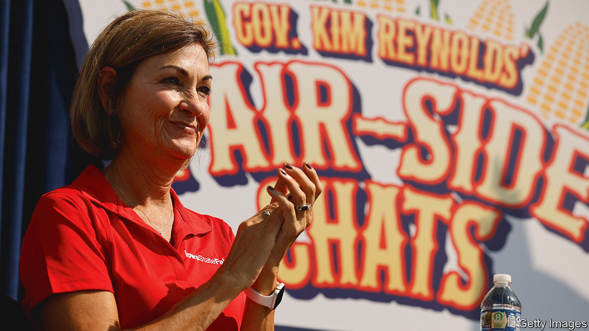

###### Lock, stock and pork barrel

# Iowa has become a petri-dish of Republican radicalism 

##### Is the Grand Old Party in danger of overreaching? 

 

> Aug 17th 2023 

When Tim Scott, a senator from South Carolina, stepped onto a stage at the Iowa State Fair in Des Moines on August 15th, his first topic was how brilliant the woman interviewing him was. That was Kim Reynolds, the state’s Republican governor, who this year has stolen the limelight from the which traditionally has given visiting politicians a literal soapbox at the fair, by hosting her own series of interviews with Republican candidates for president. “When your governor passes monumental school choice…it gets my attention. And frankly, I celebrate her success,” said Mr Scott, as Ms Reynolds, dressed in cowboy boots, beamed out at the crowd. “Education is the closest thing to magic,” he went on. And “no state is doing it better” than Iowa.

The reform Mr Scott was referring to is a bill that Ms Reynolds signed in January, which allows almost any Iowan parent to apply for a voucher from the state to pay private-school fees. By August 4th, over 18,500 applications had been approved, meaning that almost 4% of the total number of school pupils in the state will be starting this school year at private schools courtesy of the Iowan taxpayer. The voucher bill is just the most consequential (and controversial) of a slew of conservative laws that Ms Reynolds has acceded to this year. The dozen or more wannabe Republican candidates flocking to her state may have only a limited hope of beating Donald Trump in next year’s caucuses. But they at least get to visit a place where Republicans are almost completely triumphant. Iowa, which a decade ago was purple-ish, has become a petri-dish of right-wing radicalism.

The radicalism comes from the fact that the Republican Party now totally dominates the state, and Ms Reynolds the Republican Party here. Though Iowa has been turning more red for a decade, such emphatically right-wing policymaking had to wait until this year. In May 2022, a weaker version of her school-voucher law failed in the state house, when several Republican representatives scuttled it, fearing that it would empty out rural public schools. But the midterms changed all that. Though Republicans unexpectedly struggled in much of America, in Iowa, as Ms Reynolds repeatedly points out, they expanded their majorities. The party now holds 34 out of 50 seats in the state senate, 64 out of 100 in the state house, as well as the entire congressional delegation. Ms Reynolds, who took office in 2017, won reelection with a thumping 19-point margin and took much of the credit for the Republican wave.

In addition to the school-voucher bill, in May, Ms Reynolds signed a bill cutting property taxes, having already replaced the state’s progressive income tax with a simple 3.9% flat tax last year. She also signed a law banning books with any “descriptions or visual depictions of a sex act” from school libraries—something schools are now scrambling to comply with, in one case by having artificial intelligence scan books. In July Iowa banned abortions from six weeks after conception (though that law has so far been held up by the state’s courts). Other new laws ban “gender affirming” treatment of transgender children; loosen restrictions on when children can work; and limit the power of the state’s auditor (now the only elected statewide post still held by a Democrat). 

Can it last? For now, Ms Reynolds is practically unchallenged, and her prominent part in the state’s Republican caucus shows it. The state’s Democratic Party is reeling. In January it selected a new chairwoman after weeks of infighting. Yet things can change. Rob Sand, the now-defanged state auditor, jokes that too many Democrats “approach politics as a form of therapy”, instead of trying to win elections. But if Democrats can focus, they can turn around their misfortune, he says. Polling suggests opponents of the school-voucher bill outnumber supporters by two to one. Around 60% of Iowans say they support legal abortion. Mr Sand, a one-time model who rides a motorbike, hunts game with a bow and enthusiastically quotes the founding fathers, points out that even though Iowans have drifted towards the Republican Party, many still split their vote. His narrow reelection win last year, with 120,000 more votes than Ms Reynolds’s Democratic opponent, proves that.

Next year’s elections will test the theory. Yet even if the state stays ruby red, it doesn’t necessarily bode well for Republicans nationally. Though it is changing, Iowa remains an unusually rural state. Comparatively few people have degrees—and a large share of those who get them leave. It remains almost 90% white. And it is relatively old. At the state fair, people on rented mobility scooters hugely outnumbered those pushing children in prams. In other parts of the Midwest, formerly Republican suburbs have turned dramatically against the party of late. If Iowa’s Republican policies survive, it will be because there are not enough outraged suburbanites to counteract growing rural conservatism. That is not true of most of America. ■


