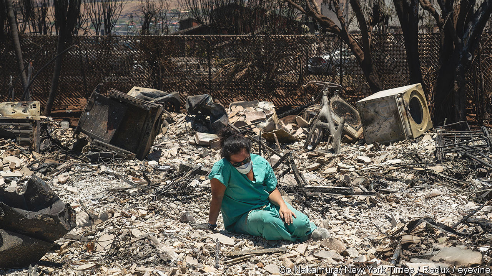

###### Paradise lost

# Lessons from the blaze that levelled Lahaina 

##### A deadly wildfire on Maui steals Hawaiians’ homes and history 

 

> Aug 17th 2023 

WHEN KING Kamehameha I united the Hawaiian islands in the early 1800s, he made Lahaina the capital of his new kingdom. The seaside city on western Maui was his crown jewel. Missionaries and whalers flocked to its shores. Kings and queens were buried in the graveyard of Waiola church. Later, it became a tourist destination. Surf shops, bars and museums lined its streets; 13,000 people called Lahaina home. Now an ashen moonscape lies between the mountains and the sea where it once stood. 

The wildfire that swept through town on August 8th was indiscriminate. Scores of birds lie dead on the ground throughout the burn zone, felled by flames or the toxins they released. White picket fences melted. For many homes, the only thing left is the scorched husk of a washing machine sitting amid rubble where a laundry room once stood. Skeletons of cars sit where they were overtaken by the inferno. Some drivers abandoned their vehicles, climbed over the seawall and threw themselves into the Pacific to escape the flames.

As of August 16th the fire had killed at least 111 people, making it the deadliest blaze America has seen in more than a century. The death toll is certain to climb. Rescue crews and dozens of cadaver dogs are still searching the burned area. More than 1,000 people are missing. 

 contributed to Lahaina’s demise. Drought worsened rapidly on Maui this summer; rainfall has declined in Hawaii over the past 30 years as the climate has warmed; invasive (and flammable) grasses have flourished on what used to be farmland; and high winds brought by Hurricane Dora provided the right conditions for a blaze to form—and to spread. All that was needed was a spark. What ignited the fire is still uncertain. But testimony and videos from Lahaina residents suggest that a utility pole snapped in the wind, breaking a power line. Sparks quickly became flames. Two Lahaina residents have already filed a class-action lawsuit against Hawaiian Electric, which serves 95% of Hawaiians, alleging that the utility was negligent in keeping its lines energised during dangerous weather conditions. 

Besides the cause of the fire, two questions are playing on the minds of Maui residents. First, is why the island’s warning system did not alert locals to the danger. Outdoor sirens throughout the islands are meant to be used to warn Hawaiians of all manner of hazards, from tsunamis to wildfires to terrorist threats. But as flames consumed 2,200 buildings (which would cost $5.5bn to rebuild) all 80 sirens in Maui County were silent.

Demetrius Clark and Lilinoe Fonohema were already stuck in gridlock when they realised that the fire was headed in their direction. Rather than an alert or a siren call, their first sign of trouble was the smoke. “All we could see is just black smoke covering our town and just getting worse by the moment,” says Mr Clark. Then they noticed the flames. Herman Andaya, Maui’s emergency management chief, has defended the decision not to use the sirens, arguing that locals might have sought safety on higher ground, as they would for a tsunami, and ended up in the middle of the fire. 

Yet the flames swallowed the town anyway. That the fire took Lahaina by surprise should serve as a warning, both for places accustomed to extreme weather, and those that are not. A warming climate means disasters such as fires and floods will become more common and more severe, making it imperative that towns routinely update and test their emergency warning systems and evacuation plans. 

The second question is where to house people who have lost everything. The Church of Jesus Christ of Latter-day Saints in Kahului turned its basketball gym into an emergency shelter. Volunteers used tarps to create separate bedrooms, each with an air mattress and some blankets. America’s Federal Emergency Management Agency (FEMA) is putting fire victims up in hotel rooms. But these are short-term solutions. “The need for housing in the mid-term and long-term is going to be one of the most challenging aspects of this recovery,” says Keith Turi, a FEMA official. 

Making things worse is Hawaii’s housing shortage. The state’s median listing price is nearly twice the nation’s. Last month Josh Green, the state’s Democratic governor, signed an emergency proclamation to hasten development. But thousands more Hawaiians will now be searching for a home. Some may not find one. Homelessness spiked in Chico, California after  incinerated the nearby town of Paradise. The housing shortage also raises a tricky economic question for the island. In 2019 the Maui Economic Development Board reckoned that 51% of workers in the county were employed by the tourism industry. If visitors stay away because of the fires, or hotel rooms are filled with survivors instead of vacationers, the local economy will suffer. 

For now, Lahaina’s residents are scattered across Maui, mourning the loss of their homes and their history. Many locals say they want to rebuild what they lost. Ms Fonohema chokes up as she recalls what the town’s streets were like before the blaze. “Lahaina will always be home,” she says, “but it won’t be the same.”■


