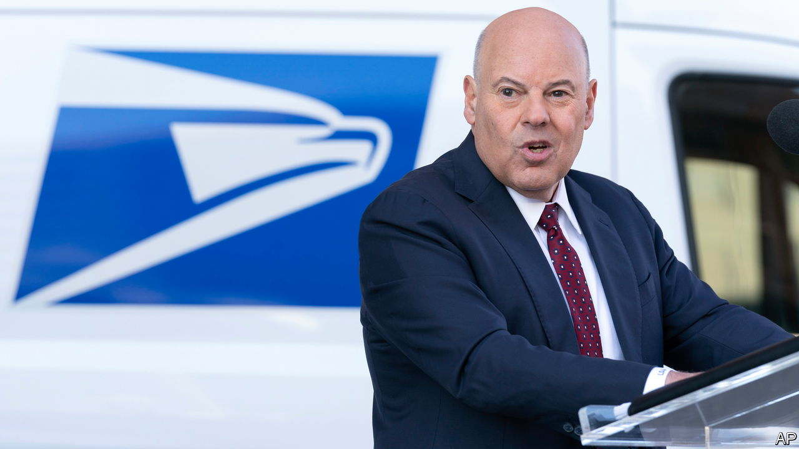
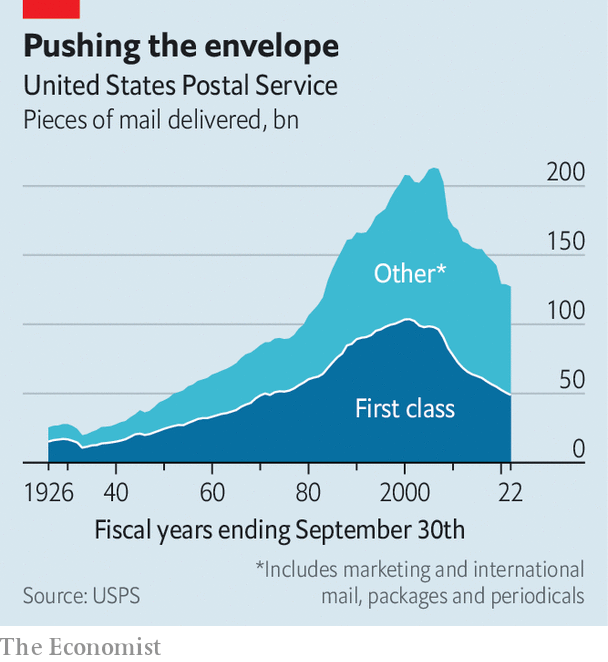
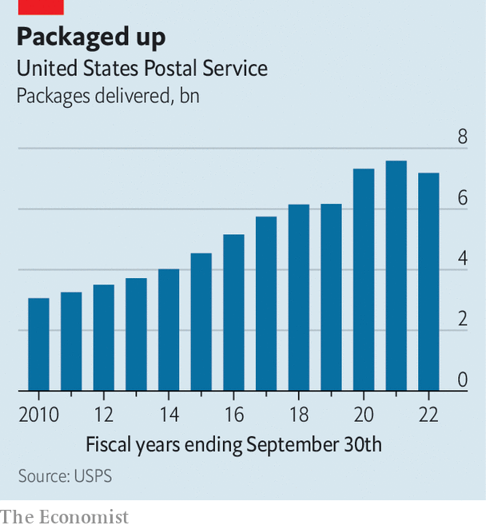

###### Post haste

# Louis DeJoy’s ambitious plans for America’s postal service 

##### Cogitation, consolidation, reorganisation and electrification 

 

> Aug 13th 2023 

ASK THE average American what the National Institute of Standards and Technology does, or where the closest Department of Agriculture Service Centre is, and you’ll probably get a blank stare. But everyone knows what the United States Postal Service (USPS) does and where the nearest post office is. No federal agency is more recognisable, or older: the USPS predates the Declaration of Independence. 

Oddly, therefore, although most Americans would have no problem explaining, at least roughly, what the president does, or who the first one was, doing the same for postmaster-general would be trickier. The first was better known for other achievements, such as inventing the lightning rod and helping draft the Declaration of Independence. Louis DeJoy, who has held the office for just over three years, is the 75th chief. If he is less obscure than his predecessors, that stems from the politically fraught period (in the middle of a pandemic, immediately before the 2020 election) during which he took office, and the conspiracy theories whipped up by the Trump-enraged American left. In office, Mr DeJoy has proved to be effective and ambitious.

Those conspiracy theories painted Mr DeJoy as a Trojan horse dispatched to destroy the USPS. A generous donor to Republicans generally and Donald Trump in particular, he was the first postmaster-general in decades to take the helm without rising through the USPS ranks. Just weeks before he was appointed, then-President Trump called the USPS—which because of covid-19 was about to play an unusually large role in the coming election—“a joke”, and soon afterwards mused about withholding funding to prevent postal voting. Protesters went postal, demonstrating outside Mr DeJoy’s homes in Washington, DC, and North Carolina. The fear was that he would interfere with postal voting, throwing the election to Mr Trump. Undeterred by the fact that this did not happen, some Democrats are still sending out fundraising emails about removing him.

 


When he took office, the USPS, which delivers 44% of the world’s total mail volume and is largely self-funded, was in trouble. It had enough cash to last just 60 days, and was projected to lose $20bn in 2020 and $160bn by 2030. The problem was twofold. First, the volume of first-class mail—which includes letters, postcards, bills and lightweight packages—had declined markedly, from roughly 103.7bn pieces in 2001 to 52.6bn in 2020 (it has continued falling; see chart). Even with increased package volume, that shift led to a 36% revenue decline from 2007 to 2020.

 


Second, because of a law passed in 2006, the USPS—uniquely among federal agencies—must pre-fund the health benefits it provides for its retired workers. The intent was to ensure that such benefits existed in the future; the result was billions of dollars in annual losses for the USPS. Combine those two factors with the statutory requirements to deliver the mail to 165m addresses six days a week, charging someone in a house next to a post office in a city the same as someone at the end of a dirt road in Alaska, and it is easy to see how solvency worries might arise.

These problems were not new, but, says Mr DeJoy, “nobody did a freaking thing…Congress sees the losses going on and on and on, [and] they were just sort of watching it happen.” Inside the USPS, Mr DeJoy says, “there was no strategy to do anything to fix it”: the organisation was beset by drift and a we’ve-always-done-it-this-way mentality. Mr DeJoy, who ran a logistics company that was sold for $615m in 2014, responded as any private-sector boss would: by looking for places to cut costs and improve efficiency. His initial steps provoked outrage: he argued that removing dismantled mail-sorting machines made sense because they took up space better used for sorting packages; some on the left feared the removal would slow ballot processing. He suspended the move.

Mr DeJoy’s style can be brash and combative, but he has not destroyed the USPS. Quite the opposite. The 2020 election went off without a hitch (at least without a mail-based hitch). In 2022 the USPS delivered 750m covid-test kits. And from January 2021 to April 2023, average mail-delivery times fell by more than 24 hours.

Last year he helped pass legislation with bipartisan support. It included measures that many on the left favoured, such as a better health-benefits programme for staff and guaranteed six-days-a-week deliveries. It repealed the onerous rule about pre-funding retirement benefits, established a public-facing dashboard on its performance and allowed the USPS to team up with other government agencies to offer moneymaking non-postal services, potentially opening the way to postal banking. The slings and arrows Mr DeJoy suffered during his appointment gave him credibility with the right that a boss who came up through the ranks and was a union member might have lacked.

That was just the second year of his tenure. The remainder will be taken up by implementing his “Delivering for America” plan, to put the USPS on a stabler financial footing. Some parts will be unpopular. Relying more on trucks, which the USPS owns, rather than planes, which it does not, may mean that sending letters and packages across the country will take longer. Consolidation means some neighbourhoods may lose their post offices. Though price rises may be necessary, nobody likes paying more. 

Mr DeJoy still has his critics: Gerry Connolly, a Democratic congressman who chaired the subcommittee overseeing the USPS, calls his reform plans “reckless” and a “road to ruin”. Still, most people like the USPS: in a recent survey its favourability rating of 77% exceeded every federal agency except the National Park Service. The rise of e-commerce and decline of letter-writing have shifted the assumptions behind its business model, which suggests its operations must change too. The changes may not all be the right ones, but they are better than denial and drift. ■


