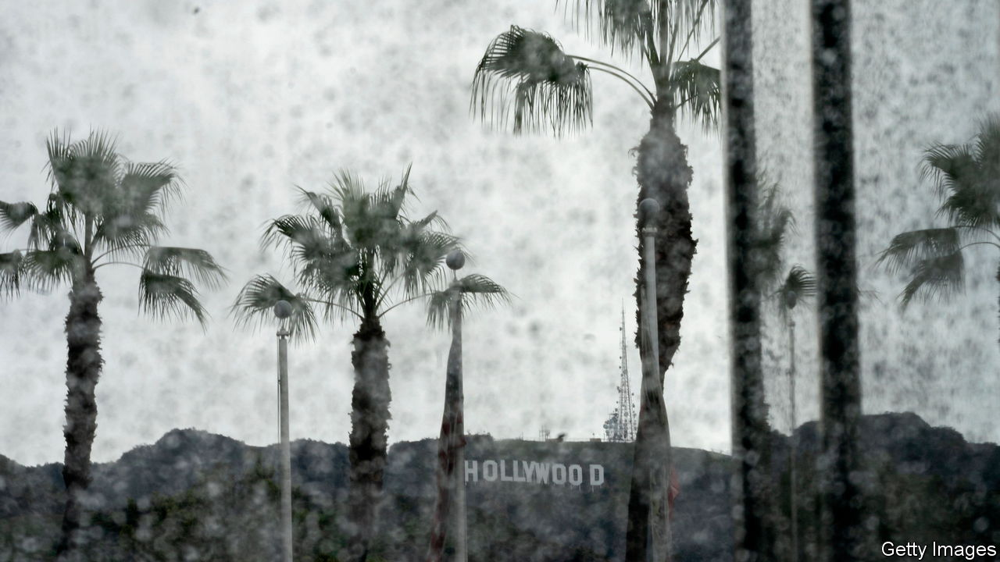
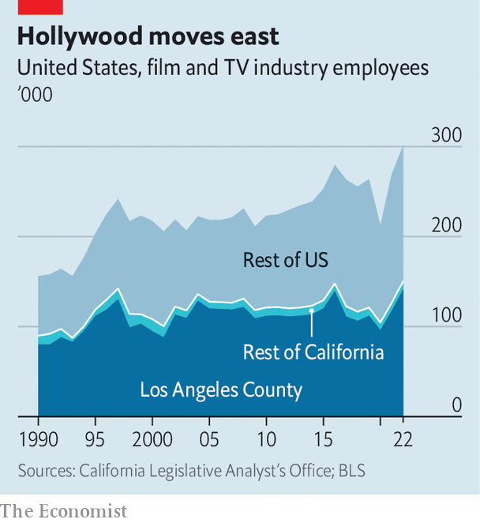
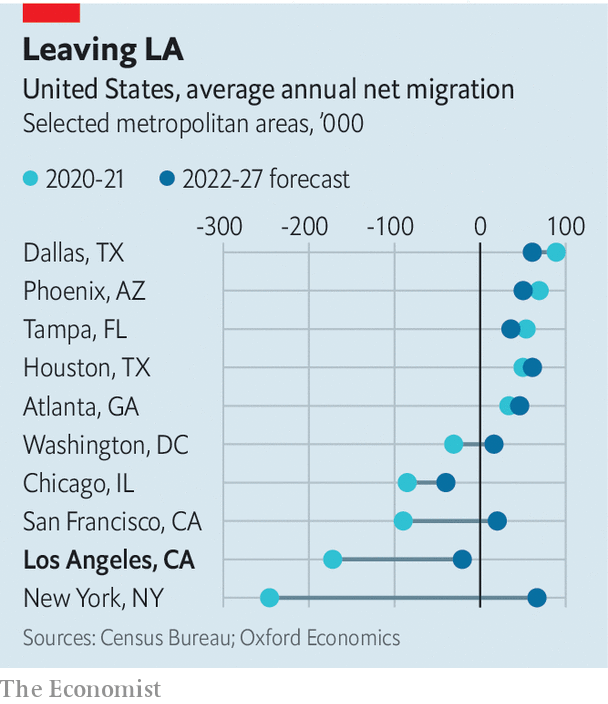

###### California leavin’

# The Hollywood strikes reveal Los Angeles’s deepest anxieties 

##### Questions of cost haunt the industry and its home town 

 

> Aug 17th 2023 

ON THE 100TH day of the Hollywood writers’ strike, on August 9th, the picket line outside Warner Brothers’ studios was more like a party than a protest. A marching band strutted alongside Los Angeles’s screenwriters and actors as they belted out the lyrics to Neil Diamond’s “Sweet Caroline”. One striker shrieked periodically near the studio entrance. “This is the executive gate, so we try to make as much noise as possible”, says Jon Long, a member of SAG-AFTRA, the actors’ union. Rather than marching, he offered his comrades free massages. Soon afterwards, a black SUV ferried a Warner Brothers VIP through the sea of jeering strikers. 

Two stories emerge from talking to writers and actors on the picket lines at studios around Los Angeles. The first is of an industry in chaos as workers fret about the effects of technological change on their pay-cheques, and studios balk at Wall Street demanding profits, not just subscriber growth, from their streaming platforms. The second story is about a city that is shrinking because it is too expensive for its workers. Nithya Raman, a city-council member whose district borders on Disney, Warner Brothers and Universal Studios (and whose husband is a TV writer), wonders if LA is at risk of losing the industry that gave it fame and makes it, arguably, the entertainment capital of the world. Unless something changes, she says, “I don’t know that these are professions that will allow people to come to Los Angeles.”

American cities shrink in two ways. One is like Detroit in the 1980s and 1990s, when population decline makes housing cheaper but the city still cannot attract more people. The other way is like New York or San Francisco, when lots of rich Americans live, or have bases in, the city but high housing costs push regular folk out. That is what is happening in LA. Median incomes are higher and have grown faster in the Golden State than the US average (or than Texas, where lots of Californians have moved to). That ought to act as a magnet. And yet America’s second-biggest city is repelling people.

For decades, Los Angeles promised perfect weather and economic opportunity, a golden land between the sandy shores of the Pacific and the San Gabriel mountains. Manfred Keil of the Inland Empire Economic Partnership IEPP, a southern California economic development group, compares the competition between states and cities to a decathlon, which California neglected to train for because it was so far ahead. Officials believed that firms would continue to accept more taxes, higher energy costs and burdensome regulations in order to get access to the state’s vast labour and consumer markets. But all of a sudden, he says, other places are catching up. 

 


Hollywood is not about to abandon its home town. But politicians are right to be worried about Los Angeles’s future. A recent report from Mr Keill and other economists confirms that LA’s hold on industries important to the region’s economy—such as video production and aerospace—has weakened as firms and workers have left the city for cheaper places that have developed amenities and jobs to rival what California can offer. Roughly half of the jobs in America’s motion-picture industry are in California, with the vast majority in LA County (see chart). But the city’s slice of the pie has shrunk as employment in the industry elsewhere has increased. Recent growth in production has gone to New York, Georgia and British Columbia, which all offer more generous incentives for filming than California does. 

The LA exodus is more dramatic outside Tinseltown, however. A report from Stanford University’s Hoover Institution, a conservative think-tank, found that 352 firms moved their headquarters out of California between 2018 and 2021, with departures more than doubling in 2021. la County saw 80 firms up sticks, more than any other county in the state. That is perhaps to be expected, as there were more headquarters there to begin with. LA County is, after all, home to a quarter of all Californians.

 


Though perhaps not for long. California saw its population decline for the first time in 2020, after which it lost a congressional seat. About 42% of the state’s population loss between April of 2020 and January of 2023 came from Los Angeles County. Oxford Economics, a consultancy, compared past and projected population growth of the 20 metro areas that experienced the most in- and out-migration in 2020 and 2021. The forecast suggests that nearly all of them can expect to see their populations grow or stagnate as they recover from the pandemic. Chicago and Los Angeles are two notable exceptions. 

Gaze further into the future, and things look worse. New projections from California’s Department of Finance suggest that the state’s population will be much the same size in 2060 as it is was in 2020, but that LA County could lose 1.7m people, or almost 18% of its residents. Hans Johnson of the Public Policy Institute of California (PPIC), a think-tank based in San Francisco, says that rather than taking such long-term projections as gospel, officials should view them as a warning. If the labour market is not as strong, then the region will be less competitive. “We’re not there yet”, says Stephen Cheung, the boss of LA County’s economic development organisation, “and we don’t want to get there.”

Los Angeles could solve its population conundrum in three ways: with more immigration, which cities and states cannot control; with more babies, which seems unlikely with California’s birth rate at its lowest level in more than 100 years; or by attracting more Americans. That would mean addressing cost. “The most critical issue that Los Angeles is facing”, says Karen Bass, the city’s mayor, “is the fact that LA has become unaffordable for so many people that work here.”

According to the PPIC, wealthy Californians have been leaving the state in higher numbers since about 2017. This trend accelerated during the pandemic when office workers found they could do their jobs from the kitchen table. But the biggest group of leavers, both before and after the pandemic, are poorer Californians who have been priced out of the state. “When people cite cost of living as a reason for leaving the state, it’s really about housing,” says Mr Johnson, “because that’s the area where California’s costs are much higher than the places where people are moving to.” A housing affordability index created by the California Association of Realtors suggests that 36% of Americans can afford the median cost of a single-family home where they live. Only 16% of Californians and 15% of Angelenos can say the same. 

Los Angeles’s leaders know that the city needs to shake off its malaise. Less than a year into her administration, Ms Bass has made housing and homelessness—the most visible manifestation of the city’s unaffordability—her signature issues. She has streamlined permits for affordable housing (though not yet for all housing developments). She is clearing homeless camps, which was once taboo. Ms Bass is worried that unaffordability is not just driving people out of Los Angeles, but is also putting people on the streets. That has knock-on effects for the city’s economy, she adds. “It’s very hard to come to the downtown area and want to open a business when there’s tents everywhere.”

In theory, a smaller population ought to mean that Los Angeles’s housing shortage will in time disappear and costs will come down. In practice, households are getting smaller, meaning that a city with a smaller population will still need more units as people spread out or opt to live alone. In 2021, California’s state government reckoned that Los Angeles needed to build 457,000 housing units by 2029. That would mean about 57,000 units each year, more than three times the city’s actual completion rate between 2014 and 2021. 

It’s hard to envision a city as vast and populous as Los Angeles shrinking. The idea of the poster-child for urban sprawl going into retreat seems unnatural. Some locals may happily contemplate fewer cars on the serpentine freeways and fewer hikers in Griffith Park. But any upsides to accidental population loss would come at a cost. Los Angeles still sees itself as a golden land of opportunity and the urban embodiment of the California Dream. The footfall says otherwise.■


