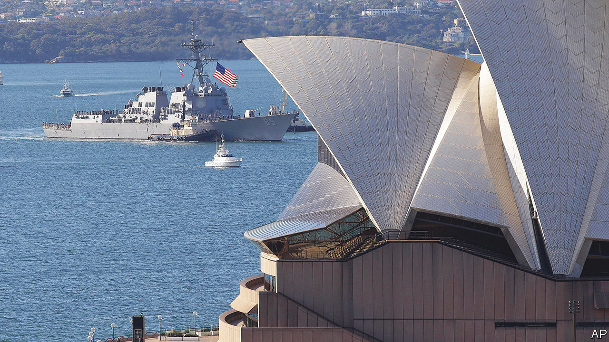
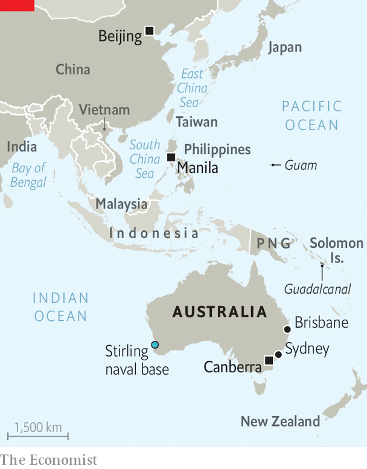

###### The great mateship

# Australia is becoming America’s military launch-pad into Asia 

##### Are Australian voters ready for the costs of great-power rivalry in the Indo-Pacific? 

 

> Aug 23rd 2023 

When imperial Japan’s troops were sweeping all before them in 1941, the Australian prime minister, John Curtin, made a desperate turn. Cutting the last bonds of colonial fealty, he issued this plea: “Australia looks to America, free of any pangs as to our traditional links or kinship with the United Kingdom.”

These days, Australia and America are keenly looking to each other again, to confront China. Their “mateship” is undergoing its greatest overhaul since General Douglas MacArthur led allied troops from Brisbane. Australia is upgrading its military bases to host more American forces and arming itself with weapons that can threaten China. It is also helping America weave a wider “” of ad hoc security pacts across the Indo-Pacific region.

“We have no greater friend, no greater partner, no greater ally than Australia,” declared Antony Blinken, America’s secretary of state, during a recent visit. And he meant it. If America ever goes to , American officials say the Aussies would be the likeliest allies to be fighting with them. Yet the risks and cost of their more aggressive security posture are causing some disquiet in Australia.

It is, for now, less conspicuous than recent progress in the bilateral relationship. Much pomp attended the American warship  when she entered Sydney harbour to be commissioned on July 22nd. Escorted by her Australian namesake,  she was the first American warship commissioned in a foreign country. The two vessels, named after an Australian cruiser sunk in 1942, are symbols of burgeoning ties. This week conducted war games with the Philippines with American marines and their mv-22b tilt-rotor aircraft aboard. 

With a population of just 26m, on an island-continent spanning three time zones, Australia has capable but only modest armed forces. Its 58,000 personnel are very roughly a third the size of America’s Marine Corps or Britain’s armed forces. But Australia plays an outsize role because it has things America needs: trustworthiness, a shared perception of the Chinese threat and a valuable geography.

As a member of the “Five Eyes”, Australia and America have long shared intelligence, along with Britain, Canada and New Zealand. Australia has also taken part in American wars that others shunned, such as in Vietnam. A “fear of abandonment”, as some see it, underlies Australia’s readiness to pay a blood price for the relationship. Naturally, officials on both sides prefer to see this as an enduring strength.

Highlighting the threat of China, Australia’s , issued in April, stated that: “The United States is no longer the unipolar leader of the Indo-Pacific.” Partly as a result, Australia no longer has a decade of “warning time” of possible war. In the missile age, it is also no longer far from the world’s troubles. The answer, Australian strategists concluded, is for Australia to cling all the more tightly to America, “contribute more to regional stability” and develop weapons “to hold an adversary at risk further from our shores”.

Australia’s geographical advantage is that it lies in what strategists call a Goldilocks zone: well placed to help America project power into Asia, but beyond the range of most of China’s weapons. It is also large, which helps America scatter its forces to avoid giving China easy targets.

 


The most ambitious leap for the alliance is the  defence-industrial agreement, which some liken to a marriage. The centrepiece is a long-term effort to arm Australia with nuclear-powered (but not nuclear-armed) submarines. The boats are planned to be British-designed with American nuclear propulsion, and to emerge in the 2040s. That could be a problem. The geopolitical risk may be sharpest this decade, as China seeks the capacity to invade Taiwan by 2027. 

American -class attack submarines will therefore call more often at  a base on the western coast, as the did earlier this month. From 2027 America will rotate four subs through the base (Britain will send another). In the 2030s Australia aims to buy three, and perhaps five, of its own  boats. Plans are afoot for a second submarine base on the east coast.

 The second “pillar” of aukus ranges from co-operation on artificial intelligence to quantum computing and hypersonic missiles. The three partners hope it will start to deliver deployable technology within months. America also promises to help Australia make, repair and maintain munitions, including missiles for the himars system, now busy in Ukraine, which Australia is buying. This would help ease the West’s . On August 21st Australia announced plans to buy 200 Tomahawk ship-borne cruise missiles, with a range of about 1,500km.

Not quite so fast…

Joint weapons development will work best if America grants aukus partners waivers from rules that guard American know-how. Some talk of a “free-trade agreement in defence”. The Pentagon is supportive. Whether the State Department and Congress will agree is unclear. A more immediate possible sticking-point is a Republican reluctance to give Australia precious -class boats at a time when America does not have enough of its own.

The politics of aukus are even harder in Australia, despite bipartisan support for the deal. It was signed in 2021 by the conservative government of Scott Morrison, and later endorsed by his Labor successor, Anthony Albanese, a left-winger who did not want to be considered weak on defence. Stalwarts on the Labor right have long been critical. Bob Carr, a former foreign minister, criticises the “grandiosity” of aukus, based on a reasonable fear that it risks hollowing out the rest of the armed forces. He also worries that Australia is making itself a target for nuclear attack. On August 18th, at Labor’s annual conference, loud dissent emerged from the Labor left, too. The Greens, on whom Labor relies for support in the Senate, are also hostile. 

The opposition is relatively small for now. Mr Albanese won the support of the Labor conference, albeit with a promise that all aukus boats would be built locally and that Australia could not “be directed” by others on their use. Not for Labor the forthright view of Peter Dutton, the Morrison-era defence minister, who declared in 2021 that “it would be inconceivable that we wouldn’t support the US in an action”. Even so, aukus almost inevitably makes such Australian participation more likely.

The public is also broadly on board. A survey by the Lowy Institute, published in June, found 82% of Australians considered the alliance “important” or “very important”. A majority favoured establishing American bases on Australian soil. Two-thirds supported acquiring nuclear-powered submarines, though many recoiled when told the likely price: A$268bn-368bn ($173bn-238bn) over three decades. In case of a war over Taiwan, a majority would send the navy to prevent a Chinese blockade. Most opposed sending troops.

But if most Australians view China as a threat rather than an economic partner, the government recognises that Mr Morrison’s hawkishness contributed to his electoral defeat, especially among Australia’s many China-born voters. Hence Mr Albanese’s greater stress on regional diplomacy and stabilising relations with China. He is due to visit Manila, Washington and, perhaps, Beijing, in the coming months. 

Meanwhile, Australian exports to China are booming, reaching a record A$103bn in the first half of this year, partly on the back of growing sales of lithium concentrate. China has ended unofficial bans on Australia’s timber and coal, and recently lifted tariffs on its barley.

Mr Albanese stresses the job-creating potential of AUkus. But its financial cost may end up mattering more. Experts doubt that the new weaponry can be paid for under Australia’s current plans. The core defence budget is set to shrink in the next two years. Thereafter, total defence spending will rise only gradually, from the current 2% of gdp to about 2.3% in 2033.

For Hugh White of Australian National University, Australia would do better to defend waters closer to home with cheaper diesel-electric submarines. Efforts to preserve America’s primacy are doomed to fail, he says: America cannot win a conventional war close to China’s shore and may ultimately pull back from Asia.

Champions of aukus retort that losing Taiwan would mean the “Finlandisation” of much of Asia, ie, its subjugation to China even if countries remain sovereign. Moreover, adds Michael Green of the University of Sydney, China’s economic woes suggest its dominance is not preordained.

For America, the relationship showcases its effort to rally allies against China without suggesting it is rushing to war. Australia must balance a fear of abandonment against a reasonable fear of entanglement. Critics of aukus cite a comment attributed to Kurt Campbell, Mr Biden’s Asia “tsar”, who reputedly said of Australia: “We have them locked in now for the next 40 years.” Equally, though, Australia may have America locked in for the same duration. ■

