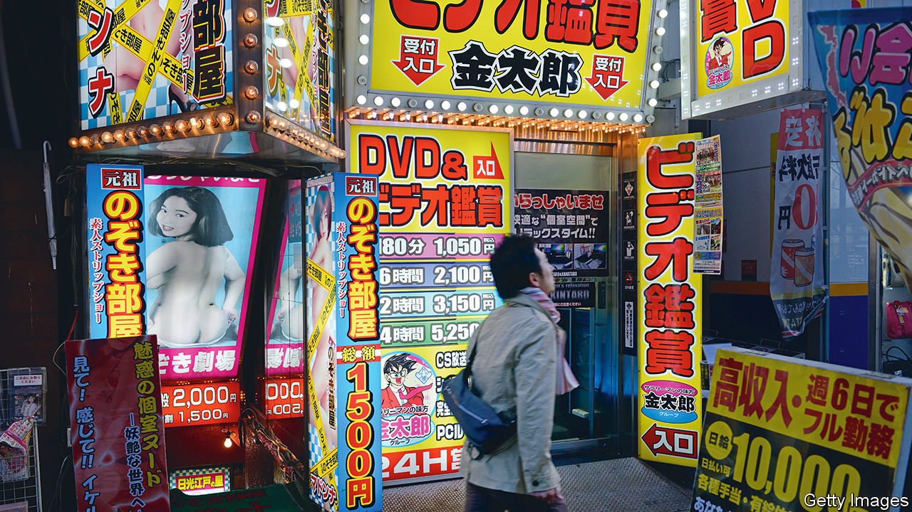

###### Regulating sex

# Japan’s porn industry comes out of the shadows 

##### Politicians want to protect actors—but many want to be left alone 

 

> Aug 19th 2023 

KURUMIN AROMA, a 33-year-old YouTuber who lives near Tokyo, used to dream of becoming a singer. A decade ago, a man approached her on the street and asked her to be a swimsuit model. He also offered to pay for singing classes and help her succeed in the entertainment business. After some cajoling, she agreed. On the day of the photo shoot, she was coaxed into getting naked. She ended up appearing in several porn videos. Beset by feelings of shame and fear, Ms Kurumin considered committing suicide. “I kept thinking: what went wrong with my life?”

The Japanese porn industry is enormous. It is estimated to churn out 4,500 videos a month, to generate about 55bn yen (about $380m) a year, and to employ around 10,000 performers. While it has shrunk since its peak in the early 2010s it remains a significant export, including to South Korea, where the production and distribution of pornography is officially banned. Taipei, Taiwan’s capital, once issued metro cards stamped with the picture of a popular Japanese porn starlet.

The Japanese industry long existed in a legal grey zone. That changed in May 2022 when the government passed a law targeting the sort of coercion Ms Kurumin had experienced. It obliges companies to sign contracts with performers, and to clarify what they are expected to do during shoots. For such a law to have passed Japan’s male-dominated parliament (only 15% of legislators are women) was a “miracle”, says Shiomura Ayaka, who, as a member of the opposition Constitutional Democratic Party, initiated it.

Abuse in the porn industry had long been a concern. In 2020 a government survey suggested one in four women under 40 had been accosted on the streets about supposed modelling gigs. Of those who agreed, 14% were asked to perform sex acts. 

The problem became more urgent last year when Japan lowered the age of adulthood from 20 to 18. That meant teenagers could become legitimate targets of the porn industry. “We could have seen a surge in high-school girls turned porn stars,” says Ms Shiomura. Last year, before the adult age was lowered, 40,000 people signed an online petition urging legislators to allow 18- and 19-year-olds to void porn contracts. The new law ended up extending that protection to all age groups.

Yet the law has sparked a fierce backlash from porn-industry workers. Before passing the law, which took just three months, politicians conducted hearings with victims of the industry and groups that help them, but did not make much effort to speak to representatives of the thousands who work in it willingly.

The hasty passage of the bill also caused confusion about its contents. A survey last year found that more than half of porn actors had seen job offers and income fall after its passage. Actors and producers have criticised various provisions in the law as unrealistic. These include forbidding filming for a month after contracts are signed, and banning the release of videos for four months after they are shot. 

In the 2010s Japan saw a series of coercion allegations like Ms Kurumin’s. Facing a public backlash, the porn industry “had to transform to survive,” says an industry player. In 2017 it formed an oversight organisation, the AV Human Rights Ethics Organisation. This body established rules that mandate contracts, regular inspections and certification of porn.

Yet how much the porn industry has improved is unclear, as is the extent of ongoing exploitation. A lack of research makes the industry a black box, says Makihara Hideki of the ruling Liberal Democratic Party, who took part in negotiations on last year’s law. While big porn-production companies tend to be fairly transparent, there are believed to be many underground businesses that ignore the rules.

Some feminists object to the new law on the basis that it legitimises porn. “There’s no such thing as consent in the sex industry. You can’t buy sexual consent,” says Kanajiri Kazuna of PAPS, an NPO that helps victims of the porn industry.

There is at least agreement on the need for a broader debate about consent. Laws on sex and women’s rights in Japan are outdated, though improving. In June the country raised the age of sexual consent from 13 to 16. In March it amended the legal definition of rape to “non-consensual sexual intercourse”, removing a stipulation that the crime involve physical force. 

Still, Ms Kurumin doubts that the porn law “could actually save others from going through” what she did. Improving sex education at schools and teaching students about consent might help, she suggests. At least Japan is now not only watching sex avidly, but talking about it seriously. ■

