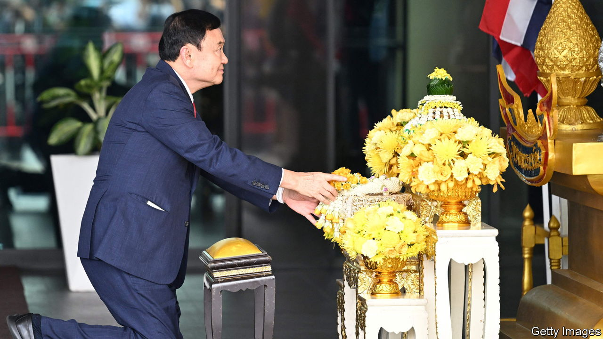

###### Strange bedfellows

# Thailand’s new Thaksinist government 

##### The country’s military establishment clings to power 

 

> Aug 22nd 2023 

Ever since Thaksin Shinawatra, one of Thailand’s richest men, became prime minister in 2001 he has loomed over the country’s politics. Leaders of the army and royal establishment, Thailand’s dominant institutions, despise him and resent his popularity among the poor Thais he wooed with populist giveaways. Even after Mr Thaksin was ousted in an army coup in 2006 and later fled the country, parties connected to his family continued to command widespread support.

That pattern shifted dramatically in May, when a party of punchy liberal reformers called Move Forward won more seats than any other party. This was a threat to the military establishment—which therefore used its control of an army-rigged system to stop Move Forward forming a government. The deadlock ended on August 22nd when Srettha Thavisin, a property tycoon and candidate from Mr Thaksin’s Pheu Thai party, was appointed as the country’s next prime minister.

At the head of a sprawling coalition of 11 parties, he received a clinching majority in a combined vote of the House of Representatives and the military-appointed Senate. After weeks of uncertainty, the promise of a functioning government was needed; the Thai baht rose on the news. But the deal between Mr Thaksin and the military establishment, in effect to nobble Move Forward, looks bad for Thai democracy.

A former critic of the establishment, Mr Thaksin has now launched his party into a coalition including the two largest military parties—an arrangement Pheu Thai had previously forsworn. Move Forward, which said it would not support any alliance with pro-military parties, will now be the main opposition party.

The price of Pheu Thai’s accommodation with the establishment was suggested earlier on August 22nd, when Mr Thaksin arrived in Bangkok by private jet, thereby ending 15 years in self-imposed exile. Upon disembarking, he bowed before a portrait of the king. He was then arrested on long-standing corruption charges for which he has been sentenced to eight years in prison. But he is expected to receive a royal pardon before long. How active a role he will then play in politics is unclear. The 74-year-old claims merely to want to be close to his grandchildren. But even if that were plausible, his lead role in the formation of the new government is testament to his continuing political clout.

Many in Thailand are outraged by Mr Thaksin’s opportunism. Ahead of the election, Pheu Thai promised to minimise the army’s role in politics. It had good reason to. Mr Thaksin is not the only member of his family ousted in a military coup; a government led by his sister, Yingluck Shinawatra, was also toppled in 2014. During violent street protests in 2010, the army shot and killed Mr Thaksin’s supporters. Yet instead of reducing the army, Mr Thaksin has now cemented its overreach. Mr Srettha would not have been appointed without support from pro-military parties.

Mr Thaksin’s party may come to rue this. In a poll by the National Institute of Development Administration, a research outfit, over 60% of Thais said they disagreed with Pheu Thai going into government with pro-military parties. In expectation of the deal, protesters recently gathered outside Pheu Thai’s headquarters in Bangkok. Some poured fake blood onto effigies of Mr Thaksin and set them alight. 

Mr Thaksin and his party must hope to placate Thais by providing better government than the army has. That should not be hard. A decade of military rule has been defined by incompetence and corruption. Thailand’s economy has lagged its neighbours, including Indonesia and Vietnam. Its post-covid economic recovery has been the slowest in South-East Asia. Mr Thaksin and his party at least have a record of decent economic management. And despite the sprawling nature of its new coalition, it should survive a four-year term, predicts Siripan Nogsuan Sawasdee of Chulalongkorn University. That is because, if the government foundered and fresh elections were held, Move Forward would be likely to win by a bigger margin than it did in May. Despite Mr Thaksin’s dealmaking, Thailand’s most popular party is not done yet.■

