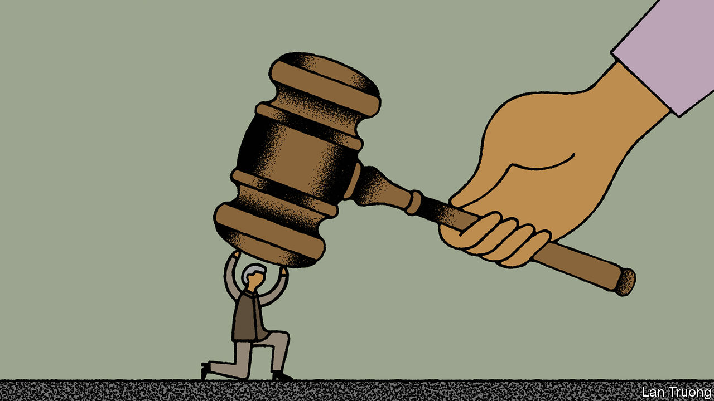

###### Banyan

# The trials of Muhammad Yunus 

##### Bangladesh is lurching towards repressive one-party rule 

 

> Aug 24th 2023 

To foreign donors, development wonks and some of the world’s poorest people, Muhammad Yunus is a hero. The Bangladeshi economist, social entrepreneur and founder of Grameen Bank pioneered the use of microloans and other services for those too marginalised to access conventional banking systems. In 2006 Mr Yunus won the Nobel peace prize for his work in grassroots development—empowering the most impecunious. The model he helped pioneer did much to improve economic, social and health conditions in Bangladesh. It has since spread across continents.

Yet to Sheikh Hasina Wajed, the prime minister who has ruled Bangladesh since 2009 (and once before), Mr Yunus is diabolical. With a general election due in January, she salts campaign speeches with attacks on him. She calls the development hero a “bloodsucker” of the poor, hellbound for his supposedly extortionate interest rates. She accuses him of embezzlement. She blames him for the World Bank’s decision in 2012 to withdraw from a crucial bridge project over the Padma river, the main channel of the Ganges in Bangladesh, citing corruption. She hints that Mr Yunus might have betrayed his country, by somehow scheming with America to help it control the Bay of Bengal.

Sheikh Hasina has long had it in for Mr Yunus. In 2011 she pushed for his removal as head of Grameen Bank; later the government took control of its board. His main offence may perhaps be that, back in 2007, during a grim period of military rule, he briefly toyed with the idea of entering politics. But it was never a very serious prospect; politics, he tells Banyan, “is not my cup of tea”. Now 83, Mr Yunus patently poses no direct threat to Sheikh Hasina. But that is not deterring the prime minister’s Awami League (AL) and the country’s compliant police and judiciary from redoubling the persecution that she has unleashed.

Mr Yunus has been hauled before the anti-corruption commission and faces charges of tax evasion and labour infringements. He fears he will be arrested. Some suggest the assault is a precursor to the government seizing Grameenphone, the country’s biggest mobile operator, which he also helped to launch.

Sheikh Hasina appears to find it unbearable that anyone might oppose or outshine her. The 75-year-old leader, whose father was Bangladesh’s first president, talks as if she will be in charge for ever. The coming election may seal Bangladesh’s descent into a one-party state.

A campaign rally in July by the opposition Bangladesh Nationalist Party (BNP) was met with rubber bullets and tear-gas. Human Rights Watch describes a “systematic” assault on the opposition. Over 800 BNP activists have been arrested. The opposition party claims that over 4m cases have been filed against its leaders and supporters since 2009. Critics of the prime minister in Dhaka mutter that, if only she could, she would emulate the “Terminator” and go back in time to kill her future challengers.

Sheikh Hasina’s sense of entitlement to Bangladesh is rooted in tragic loss: her father, Sheikh Mujibur Rahman, and nearly all her other close relatives were murdered in an army coup in 1975. Yet the personality cult she has built for her assassinated father—and by extension herself—is pernicious. Those who join this cult are assisting a regime thick with cronyism and corruption. In return for backing the government, favoured tycoons win banking licences and other plums. Meanwhile, Bangladesh’s years of strong economic performance look imperilled. Its economic growth is far too reliant on one sector, clothing, as well as on remittances from Bangladeshis toiling overseas.

This amounts to a dreadful threat to Bangladesh’s progress. It is also wholly unnecessary, even for Sheikh Hasina. If she allowed a free election, she would probably win it, so weak is the opposition. But she will not put that to the test, in part because she considers her authoritarianism risk-free. Though she rails against Western countries for opposing her repression, their criticisms of her have in truth been muted. Only recently did America, which fears China’s efforts to woo Sheikh Hasina, announce plans to restrict visas to Bangladeshis who undermine democracy. The attack on Mr Yunus, a sainted figure in the West and (gallingly for Sheikh Hasina) perhaps the best-known Bangladeshi, is emblematic of her sense of impunity. Would America and its allies finally balk if the octogenarian were arrested? That might be Mr Yunus’s best hope.■


