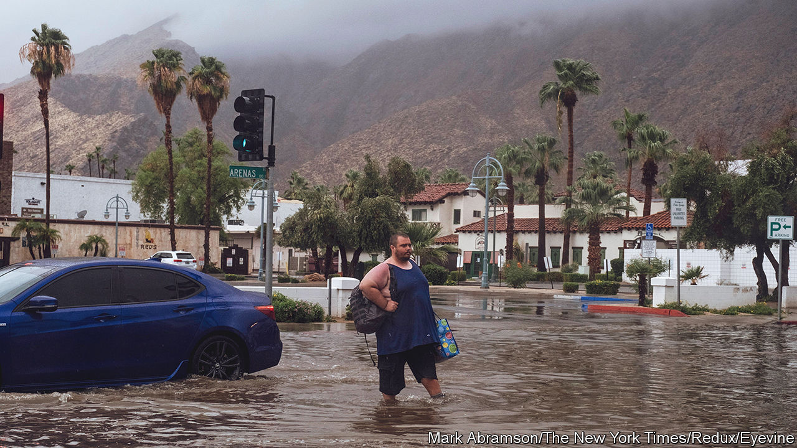
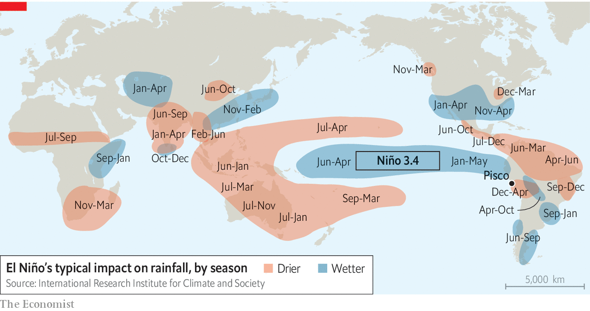
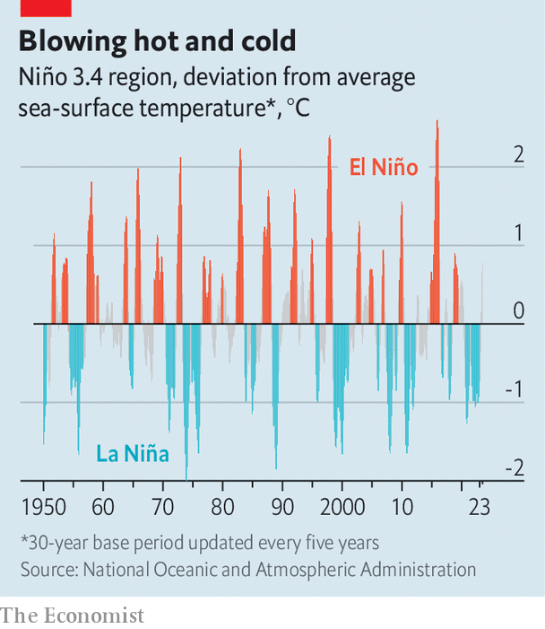
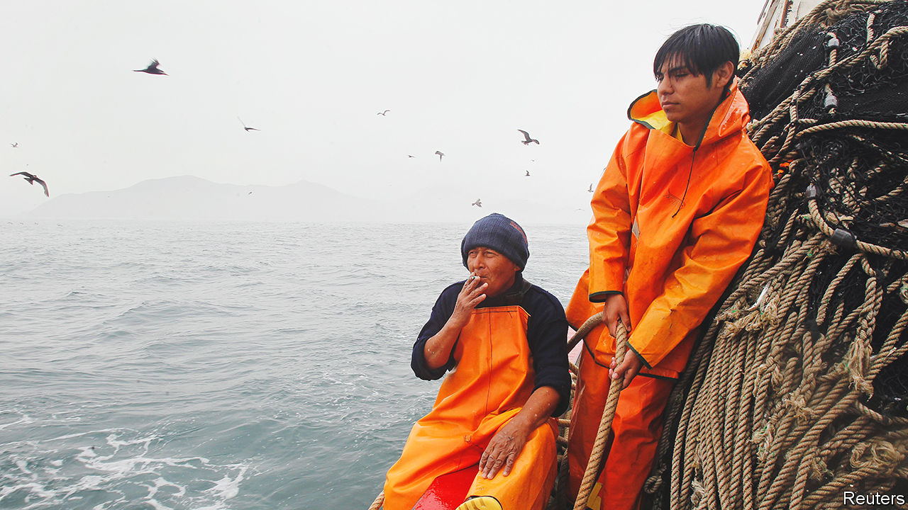

###### A problem child

# El Niño and global warming are mixing in alarming and unpredictable ways 

##### Havoc in poor countries and commodities markets is inevitable 

 

> Aug 24th 2023 

AFTER YEARS of praying for more rain, Californians unexpectedly found themselves wishing for less this week, when tropical storm Hilary blew in from Mexico on August 21st. Rainfall records were smashed in Los Angeles and San Diego. Death Valley, farther inland, was deluged with as much rain in a day as it normally receives in a year. Inundated roads completely cut off the nearby city of Palm Springs (pictured) for a time. 

Hurricanes and tropical storms hit California only very rarely: none had even come close since 1997, and the previous one to make landfall was in 1939. Most of the few that have reached the state, however, including Hilary, have coincided with El Niño, a weather pattern that temporarily raises global temperatures while redistributing heat and moisture around the world.

Meteorologists predict that the current El Niño, which began in June, will be a strong one—perhaps as severe as the one that ended in 2016, which helped make that year the hottest ever recorded. If they are right, the record is almost certain to fall this year or next. “We are in uncharted waters,” says Maarten van Aalst, director of the Dutch meteorological agency and former head of the Red Cross Red Crescent Climate Centre. “We have never had an El Niño on top of so much global warming, so we don’t know what is going to happen.”

El Niños form and eventually dissipate owing to interactions between the trade winds that blow to the south of the equator and the ocean beneath them. The resulting accumulations of hotter- or colder-than-average water and high or low pressure in the atmosphere affect temperatures, winds and rainfall. Most of the time, the trade winds blow warm water from the central Pacific westward, towards Australia and Asia. That movement, in turn, helps draw cooler water up from the depths in the eastern Pacific, near South America. But every two-to-seven years, conditions conspire to create a vast pool of warmer-than-average surface water all the way across the Pacific, as far as South America.

Peruvian fishermen named this phenomenon after the baby Jesus ( in Spanish) because it tends to reach its peak around Christmas. It is of more than passing interest to them: the vast shimmering shoals of  on which their livelihood depends prefer colder water, and so vanish when El Niño appears.

In recent weeks small fishing boats in the port of Pisco have been unloading species rarely found nearby: butterfish, sierra, sardines. Meanwhile, the industrial fishing fleet, which relies on , languishes in the harbour. Farther down the waterfront, factories that normally grind its catch into fishmeal are shuttered. No smoke billows from their chimneys; no fishy odour lingers in the air. An industry with exports of $2bn a year has been brought to a standstill.

The hiatus has contributed to an economic contraction in Peru and is likely to keep global fishmeal prices high for much of the year. That, in turn, will raise costs for the fish farms and livestock businesses around the world that use the stuff as feed. But those are only the beginnings of El Niño’s impacts.


The tropical Pacific is so immense that the warming of its surface by an extra degree or two is enough to supercharge the global climate. More water evaporates, which warms the upper atmosphere and fuels tropical thunderstorms. Convection carries this additional energy to colder regions to the north and south, on either side of the equator. The spinning of the Earth spreads the energy east and west, as well. The net result is a vast redistribution of heat and moisture. In climate jargon, El Niño is a prime example of the “teleconnection” of the world’s weather systems. 

 


No two El Niños are the same, but some general patterns exist. Broadly speaking, the Amazon Basin, Australia, the Indian subcontinent, the Sahel, South-East Asia and southern Africa often suffer drier conditions; Central and East Asia, the Horn of Africa, the southern cone of South America and the southern United States tend to get wetter (see map). Sometimes, the consequences can be devastating. A relatively mild El Niño in 2018-19 helped to fuel some of the worst wildfires in Australia’s history. The exceptionally strong El Niño of 2014-16 brought droughts and floods that left some 60m people around the world short of food, drove huge outbreaks of Zika virus across South America and bleached 29% of Australia’s Great Barrier Reef. 

At times, the changes in the weather can also bring benefits. This year rains in Argentina are expected to increase grain production, breaking a long drought. El Niño years typically yield milder Atlantic hurricane seasons, reducing damage to property and crops (though that may not hold this year because of unusually hot waters in the North Atlantic). El Niño’s impacts are hugely varied, too, going far beyond fisheries and agriculture. In 2015 production at a lithium plant in northern Chile that accounted for 30% of the world’s output was disrupted by heavy rain. The ensuing jitters in the lithium market were not something forecasters had predicted. 

Such diversity makes it hard to assess whether the overall effect of El Niño is positive or negative for the world economy. A study by researchers at the International Monetary Fund published in 2016 found that El Niño had little effect one way or the other. But a paper published earlier this year in  by Christopher Callahan of Stanford University and Justin Mankin of Dartmouth College finds that the El Niño cycles of 1982-83 and 1997-98 permanently reduced global gdp by $4.1trn and $5.7trn respectively. The first cycle, however, coincided with a period when the Federal Reserve, America’s central bank, was raising interest rates; the second with the Asian financial crisis. In both periods, in other words, as El Niño unfolded, other completely unrelated factors were also curbing economic growth in emerging markets. Disaggregating the impact of these different events is extremely difficult.

All analyses, however, agree that poor countries are hit harder by El Niño than rich ones. Even in the IMF study that found little overall impact, big costs in the developing world were offset by higher agricultural yields in the United States in particular. Inflation, meanwhile, rose almost everywhere as commodity prices jumped.

ENSO on ENSO on

The more severe the El Niño, naturally, the bigger the impact. According to the latest forecast from NOAA, the American government’s meteorological agency, there is a 66% chance that the current one will be “strong”. The assessment rests on the rise in surface temperatures above the norm within a specific area of the Pacific known as “Niño 3.4”. A 1.5°C rise constitutes a strong event; more than 2°C counts as “very strong”, on a par with the biggest El Niños of the past century. The previous El Niño, in 2018-19, peaked inside Niño 3.4 at 0.9°C. A climatologist calls it a “little futz of an El Niño”. The one before that, in 2014-16, spanned two winters and peaked at 2.6°C (see chart). Global average temperatures reached successive records in 2015 and 2016. According to Michelle L’Heureux, who co-ordinates NOAA’s El Niño forecast updates, there is a 30% chance that this year’s will end up just as mighty.

 


Three factors are likely to compound this El Niño, bringing new extremes. First, it arrives right on the heels of three consecutive years of La Niña, the inverse of El Niño, when winds propel warm Pacific water more strongly than usual westward, towards Asia, temporarily reducing global temperatures. The wind patterns that dominate during La Niña tend to push heat deeper into the ocean. Some of that heat resurfaces during subsequent El Niños. Three straight years of La Niña mean there is more heat to be released. 

But it is not just La Niña that has been storing heat in the world’s oceans. So has global warming. For decades researchers have been taking the temperature not only at the surface but also at depths of up to 2,000 metres. Since the 1990s these deeper waters have been running an ever-rising fever. Some climate researchers are wondering whether the off-the-charts surface temperatures observed in the past month or so around the world’s oceans could be linked to this pelagic flu.

Although El Niño does cause surface temperatures to rise outside the Niño 3.4 region, that usually does not happen until much later in the year. A possible explanation of the early surge in temperatures is that some of the heat accumulated in the deep ocean is starting to resurface. “Perhaps we’re beginning to see some of that redistribution of heat now manifesting itself,” says Piers Forster of the University of Leeds in Britain.

The theory that shifting thermal dynamics within the oceans may be intensifying this El Niño is not yet proved, but there is no question that global warming more broadly is set to make El Niños worse. “As climate change unfolds, the impacts for a given El Niño are not the same, they’re bigger,” says Adam Scaife of the Met Office, Britain’s meteorological agency. Global warming means the air is more charged with water, rainfall fluctuations are increasing, “and therefore, a given El Niño with the same strength as we had in the past can dump more water or cause a bigger drought.” Whereas the “triple dip” La Niña masked some warming, making temperatures cooler than they would otherwise have been, an El Niño will amplify it.

“I am confident that 2024 will be unprecedented in terms of global temperatures,” says Dr Scaife. Currently, the planet is 1.26°C warmer than before the invention of the steam engine. As a rule of thumb, climatologists say, every degree of warming in the Niño 3.4 region during an El Niño temporarily adds 0.07°C to global average temperatures. A strong or very strong event could therefore push the total rise in the average temperature to 1.4°C. 

That means that the regions that often suffer drought and wildfires during El Niño—Australia, Indonesia and parts of the Amazon Basin—are at heightened risk. In Australia alone, even the weak El Niño of 2019 helped to incinerate 240,000 square kilometres of bush, killing nearly 500 people, destroying thousands of homes and wiping out A$5bn ($3.5bn) of crops and livestock. This year’s El Niño is likely to be compounded by the positive phase of the Indian Ocean Dipole (IOD), a weather pattern characterised by fluctuating surface temperatures in the Indian Ocean that further accentuates dry conditions in Australia and Indonesia. Three years of heavy rains under La Niña, meanwhile, have boosted plant growth. Lingering moisture in the soil and plants may offer some protection. But if all that vegetation dries out, it will fuel fiercer blazes. To make matters worse, heavy rain and shortening winters have shrunk the window to carry out controlled burns, which are used to reduce the amount of fire-prone vegetation. New South Wales, Australia’s most populous state, has conducted only 20% of its scheduled burn this year, according to Greg Mullins, a former fire commissioner.

Dipolar disorder

The IOD can also reinforce the wet conditions that El Niño typically brings to east Africa. On the face of things, that should be a positive after years of drought. But the rainfall is likely to be excessive, and might flood farmland and damage the roads used to bring crops to market. “We are on watch,” says Laura Harrison of the Climate Hazards Centre at the University of California, Santa Barbara. 

Disasters of this sort will also create havoc in agricultural markets. As it is, India’s government has declared a ban on exports of certain types of rice, in anticipation of drier-than-usual conditions while the current crop is growing. The ban affects about half of India’s annual exports, which in total account for 40% of the global trade in rice by volume. It has sent world rice prices to their highest level since 2011.

The outlook for the rice market may get worse before it gets better. El Niños have in the past driven down rice yields: in 2015-16 South-East Asia’s crop declined by 15m tonnes, 7% of global stocks. The spectre of potential shortages has prompted panic-buying among Asian governments since the beginning of the year. Indonesia, for example, has been snaffling up rice from Vietnam, the third-largest exporter after India and Thailand. 

Wheat, too, could be in for a wild ride. Australia produces 12-15% of the global crop and yields can halve in El Niño years. “Given the precarious situation of the wheat market, with the Russia-Ukraine war and other things, that Australian wheat crop is a very important one, and one we’re watching closely,” says Paul Hughes of S&P Global Commodity Insights, a research firm. 

Palm oil is another vulnerable product. A drought in Indonesia and Malaysia, the two biggest exporters, would diminish yields. S&P Global reckons that Malaysian exports could fall by 10% if the incipient El Niño is mild and double that if it is severe. After Russia’s invasion of Ukraine last year, palm oil helped make up for a dearth of sunflower oil, 75% of which is normally produced by the two adversaries. El Niño will thus come as a second blow to the already stretched market for edible oils.

 


Another likely outcome of a strong El Niño is an increase in disease. Viruses replicate more quickly in vectors like mosquitoes as temperatures rise. Mosquitoes also bite more in the heat. Heavy rainfall creates more places for insects to breed, as can droughts, as people collect more water in accessible receptacles. Research collated by the World Health Organisation found that the dry conditions associated with El Niños across two decades boosted malaria cases in Colombia and Venezuela by more than a third. A strong El Niño in 1997-98 was associated with big malaria epidemics in Ethiopia, Kenya and Uganda. This year heavy rains and floods exacerbated Peru’s worst-ever outbreak of dengue, overwhelming hospitals in the north.

Flooding can result in poor sanitation, causing an increase in diarrheal diseases. The displacement and overcrowding that occurs after disaster strikes makes such outbreaks worse. If the Horn of Africa is indeed drenched by rain, a surge in cholera cases is likely.

Malnutrition exacerbates vulnerability to disease, particularly in the very young or very old. Save the Children, a charity, claims that the disruption brought by the El Niño of 2015-16 left an additional 6m children worldwide undernourished, three times the number affected in the same way by covid-19. And the pandemic has left health services overstretched and weakened. The Bill and Melinda Gates Foundation, a health charity, estimates that covid led to the biggest sustained decline in immunisation rates in 30 years, prompting a surge in outbreaks of preventable illnesses such as measles. 

The fact that many of these ill-effects are foreseeable does at least mean that governments and aid agencies can try to prepare for them. Since 2015 the humanitarian community has increasingly been incorporating seasonal forecasts into their planning, explains Andrew Kruczkiewicz, a climate forecaster at Columbia University and the Red Cross. In Honduras, for instance, the Red Cross activated an emergency protocol at the end of June based on the El Niño forecast issued by NOAA. It is distributing cash and kits to sanitise water to places at risk of drought.

But careful preparation only gets you so far, especially in poor countries with weak institutions and widespread corruption. Since the last strong El Niño, Peru has shuffled through six presidents. Precious little of the $14bn set aside for rebuilding and climate-proofing had been invested before floods and landslides hit the same areas again this year. 

More climate-related disasters will probably only deepen popular discontent and dysfunctional politics in Peru, further eroding the government’s capacity to respond. In fact, oscillations in the climate have spurred the rise and fall of civilisations in South America for thousands of years. El Niño, writes author Brian Fagan, “can destroy the people’s faith in the legitimacy of their leaders and in the foundations of their society”. Fempellec, a legendary ruler of an ancient Peruvian kingdom, provides a salutary example. According to myth, after sustained, unseasonable rains laid waste to crops, his people decided he was to blame. So they tied him up and tossed him into the sea. ■


